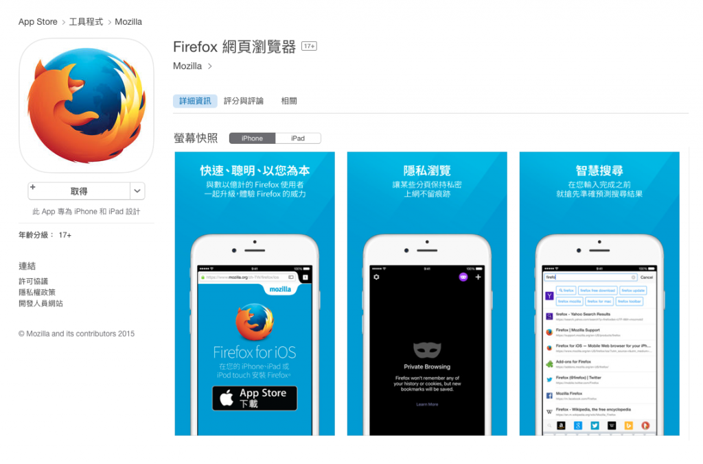

如果你手上有 iPhone、iPad，或 iPod Touch，現在就[到全球的 App Store 下載 Firefox for iOS](https://itunes.apple.com/app/id989804926) 吧！

Firefox for iOS 可讓你隨時隨地使用自己最愛的 Firefox 功能，包含聰明又靈活的搜尋作業、直覺的分頁管理、便利的 Firefox Accounts 同步，當然還有大家所熟知的隱私瀏覽模式。

你同樣能透過 Firefox Accounts 同步自己的分頁、密碼、瀏覽記錄，且珍藏於其他裝置上的書籤亦可匯入至 Firefox for iOS 之內。

- 搜尋建議功能可預測使用者正透過慣用搜尋引擎所尋找的事物。

- 清晰呈現所有分頁，讓使用者能在單一畫面上輕鬆管理多個分頁。

- 隱私瀏覽模式不會留下你的瀏覽記錄，也不會向你造訪的網站分享現有 cookies。

為了能在自己的 iOS 裝置上迅速開啟 Firefox，現在就把 Firefox 拖曳到主畫面底部的快捷列吧！

希望你盡情享受首次發佈的 Firefox for iOS。我們正全力開發多項新功能，期待很快就能提供給大家使用。我很榮幸能帶領整個團隊達到今天的成就，也對未來的進展充滿信心。感謝所有下載 Firefox for iOS 的使用者。

原文連結：[Firefox Users Can Now Choose Their Favorite Browser on iOS](https://blog.mozilla.org/blog/2015/11/11/firefox-users-can-now-choose-their-favorite-browser-on-ios/)
