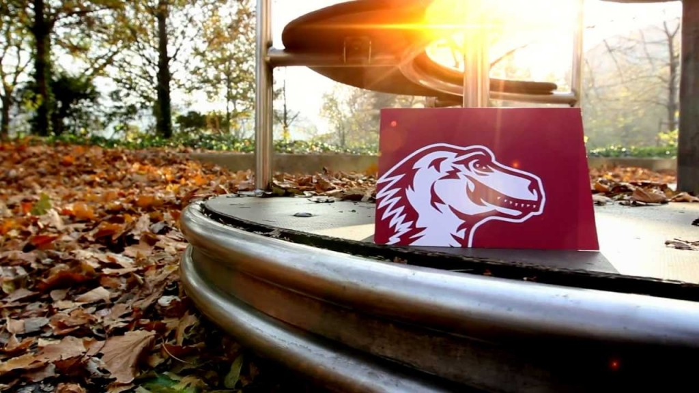

我們生活周遭的用品均逐漸加入連網功能。此趨勢早已開始，且其影響可能遠大於上一次的科技革命，甚至超越智慧型手機所引發的浪潮。目前大家耳熟能詳的「物連網 (Internet of Things，IoT)」將徹底影響所有人。

Mozilla 將以 Firefox OS 專案所開發出的部分技術為基底，形塑此一未來。

為了讓此一轉變更游刃有餘，Mozilla 決定暫停與電信營運商合作打造智慧型手機。

Mozilla 另將透過開放源碼專案的形式，並以使用者的利益與經驗為重心，在連網裝置領域中發掘更多新的使用情境並打造原型。

Mozilla 的產品與技術主軸，將是協助使用者更能輕鬆存取並管理自己的連網裝置，且確保所有人享有更強大的功能、更完善的獨立性與安全性。

Mozilla 對眼前的挑戰與機會躍躍欲試。我們認為 Web 就是連網裝置未來的絕佳平台，也希望未來儘快向所有人分享工作成果。

#### ─ Mozilla 連網裝置資深副總 [Ari Jaaksi](https://blog.mozilla.org/blog/author/ajaaksimozilla-com/)

原文連結：[Firefox OS Pivot to Connected Devices](https://blog.mozilla.org/blog/2015/12/09/firefox-os-pivot-to-connected-devices/)
