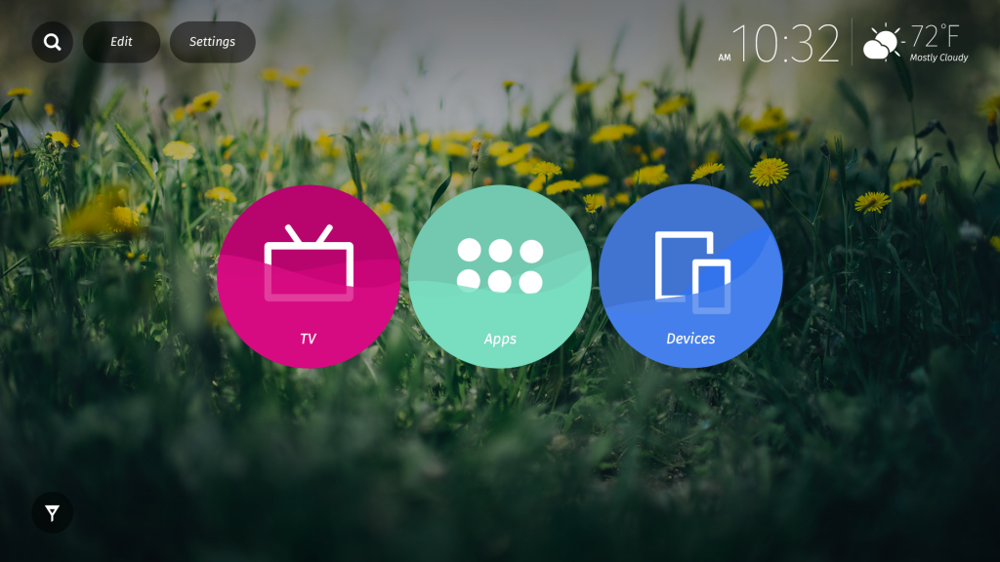

### 松下電器 (Panasonic) 宣佈世界首款搭載 Firefox OS 具 Ultra HD Premium 規格的 LED LCD 電視

Mozilla 在今日展開的 2016 消費性電子展 (Consumer Electronics Show；CES) 展現 Firefox OS 最新成果。[日本松下電器 (Panasonic) 宣佈](https://www.mynewsdesk.com/uk/panasonic-uk/pressreleases/panasonic-launches-world-s-first-official-ultra-hd-premium-tv-at-the-2016-consumer-electronics-show-1286442)並展示搭載 Firefox OS 的新款 Panasonic DX900 UHD 智慧電視，此為世界首款具備 Ultra HD Premium 規格的 LED LCD 電視。

搭載 Firefox OS 的 Panasonic 智慧電視早[已於全球發售](https://blog.mozilla.com.tw/posts/7462/)，可供消費者快速找出自己最愛的內容、影片、網站、電視頻道、應用程式，並將之釘選至電視的主畫面之上。

Mozilla 與 Panasonic 自 2014 年起即攜手合作，旨在提供直覺且最佳化的使用者經驗，使消費者享受 Web 開放平台的優勢。全以 Web 技術打造的 Firefox OS 是第一個真正開放的平台，讓使用者、開發者、硬體製造商得以擁有更多選擇與控制權。

#### Firefox OS 在電視上的新功能

搭載 Firefox OS 的 Panasonic 智慧電視，已具備可高度客製化的主畫面，讓使用者得以在電視主畫面上直接存取自己最愛的影片、網站、內容、電視頻道、應用程式。主畫面本身即預載了「Live TV」、「Apps」、「Devices」共 3 個選項，而使用者可釘選喜愛的內容或應用程式到主畫面之上。

最新版 Firefox OS (2.5) 另添增了多項新功能，並已提供予開發者與合作夥伴取用。搭載 Firefox OS 的 Panasonic DX900 UHD TV 亦將於今年稍晚安裝本次更新。

此次更新除了提供新方法可於電視上尋找、儲存 Web App 之外，更有如 Vimeo、iHeartRadio、Atari、AOL、Giphy、Hubii 等的主流 App 加入，要與 Mozilla 一同在電視上打造最佳化的 Web App。

Panasonic DX900 UHD TV 除了搭載 Firefox OS 之外，更能跨平台同步 Firefox 而達到無縫接軌的經驗，其中並包含「send to TV」功能，可從 Firefox for Android 輕鬆將 Web 內容分享到 Firefox OS TV。

#### Firefox OS 將橫跨連網裝置

連網裝置與系統現正在我們生活周遭快速竄紅。相關概念即構成目前所謂的「物聯網 (Internet of Things，IoT)」，也就是連網資源所串起的網路架構，且與傳統的網際網路甚為類似。但 IoT 更深入實體世界，將透過新穎且有趣的方式，讓我們享受並管理自己的環境。

Mozilla 相信：若要有健康的連網裝置環境，就必須打造開放且獨立的平台作為專利平台的替代選項。我們致力讓大家掌握自己的線上生活，並隨時發掘 IoT 的嶄新使用案例，期能為使用者帶來更優質的經驗。

Mozilla 將持續與開發者、製造商之間的合作，當然也需要社群對外分享我們的開放價值。來自於夥伴的支援和貢獻，就是我們成功的基石。與 Panasonic 合作的 Firefox OS 智慧電視就是我們努力的重要成果。

#### 更多資訊：

- [Firefox OS Smart TV 展示影片](https://drive.google.com/a/mozilla.com/file/d/0B4K8q1qWmtAvZm1jRDZBUXh6cnc/view)

- [Panasonic DX900 UHD 智慧電視](https://www.mynewsdesk.com/uk/panasonic-uk/pressreleases/panasonic-launches-world-s-first-official-ultra-hd-premium-tv-at-the-2016-consumer-electronics-show-1286442)

原文連結：[Firefox OS will Power New Panasonic UHD TVs Unveiled at CES](https://blog.mozilla.org/blog/2016/01/05/firefox-os-will-power-new-panasonic-uhd-tvs-unveiled-at-ces/)
