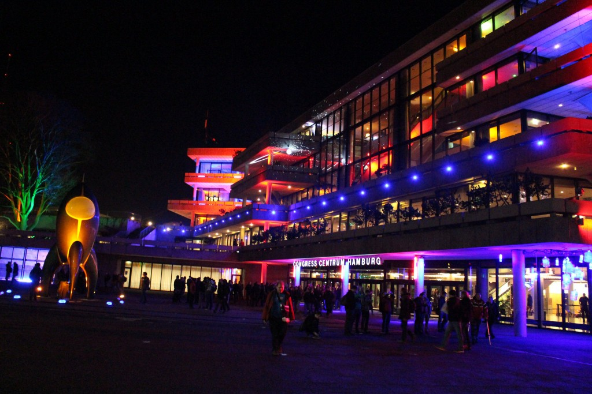
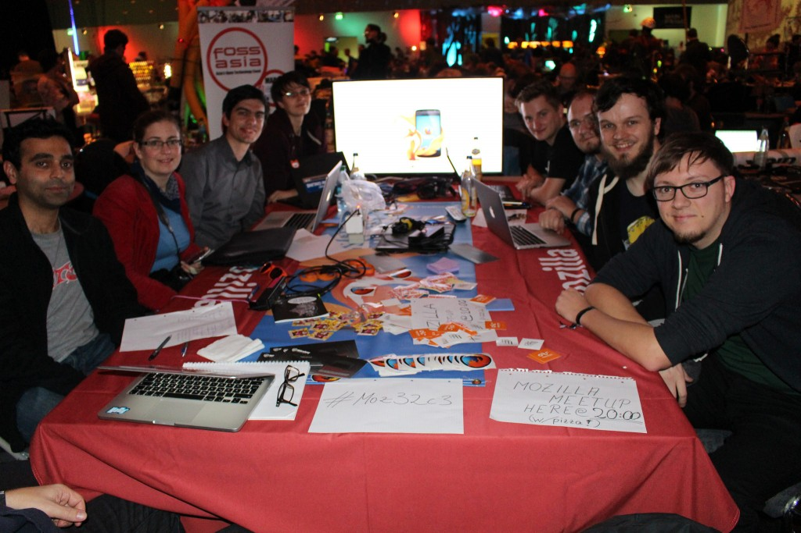
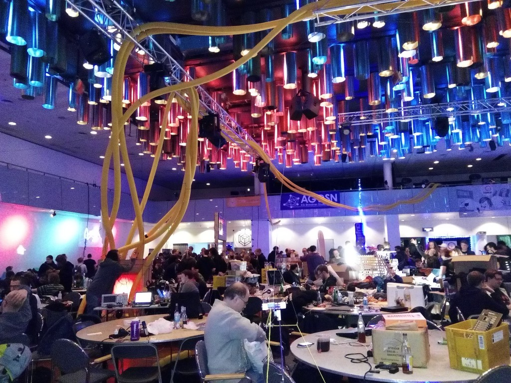

如果你有機會在聖誕節到新年跨年這段期間造訪德國的漢堡會議中心 (Congress Center Hamburg；CCH)，你大概會感覺整個人超乎漢堡所處的歐洲中部時區之外。

你接觸的大多數人都會說他們來自於網路 (夠幽默的會說不同的網際網路)，而且你有好幾天會住在我 (作者 [Valentin Schmitt](https://mozillians.org/en-US/u/Valentin/)，下同) 一個朋友所謂的「混亂時區」：所有人的時區都糊在一起。白天時間不知怎麼的就是很短，你會有一大段時間都暴露在人工光線之下，光靠自己的生理時鐘根本無法調適。活動主持人會好心提醒你「6、2、1」規則：每天睡 6 小時、吃 2 餐、洗 1 次澡；如此即可保身心健康無虞。你遇到的許多人都各有所長，很難決定到底要跟哪個人聊天或參加哪個工作坊。

這就是 [(32nd Chaos Communication Congress；32C3)](https://events.ccc.de/congress/2015/wiki/Static:Main_Page)。歡迎來玩！

32C3 Chaos Communication Congress – 攝影：Mario Behling

#### Firefox OS 還活著呢！

我那時正到處尋找列表機或任何機器，想動手把「Firefox OS is not dead!」印在自己的衣服上。神奇的是，雖然現場有各式各樣的機器，就是沒有一台能幫我完成上述目的。一堆人只要聽到我提到 Firefox OS，幾乎第一反應都是「Firefox OS 不是收掉不做了嗎」，搞得我很想直接把那句宣言印上衣服。我知道你腦袋裡可能也是這個想法，而其實社群提出了許多反饋意見，都將這個結果歸咎於一場「公關災難」。我很清楚 Mozilla 必須在此一議題上繼續積極且嘶吼著溝通，只因為許多科技新聞網站在這當下幾乎不會再幫忙澄清些什麼了。

只要先澄清此項事實 (清喉嚨)，大概所有人都對我接下來提到的專案極有興趣；沒繼續追問下去的就是那些死忠的自由軟體狂熱者。這類人對 Mozilla 最近的策略頗為失望 (像是為新分頁的九宮格加入廣告功能，或是讓 Firefox 桌面版支援 DRM)，不然就是根本不關心軟體自由，或者只希望哪天 iPhone 成為自由的行動作業系統。

Mozilla 與 Firefox 在 32C3 現場的朋友 – 攝影：Mario Behling

#### 「但這就是 Mozilla 啊！」

Mozilla 一直對自由軟體社群有著極崇高的願景。而許多人從未嘗試過 Firefox OS 裝置的主要理由，就是他們根本沒有機會拿到任何一款裝置 (其實在歐洲或美國所行銷的裝置不多，且能移植到主流手機的也不多)。但還好我取得了幾支能「Foxfooding」的裝置。所謂的「[狐狸餵食 (Foxfooding) 方案](https://firefoxos.mozilla.community/foxfooding-faq/)」持續收到頗正面的回應，且大多數的人都很開心能參與測試 Firefox OS、傳送資料回 Mozilla，或提交錯誤。某些人則是喜歡開發 App 並嘗試將 OS 刷進自己最愛用的手機或裝置。

更重要的是，這些人都確實詢問刷機的方式、該到哪裡找到入門文件，又該如何提交錯誤。我另外提供了幾支裝置給開發者，而這些開發者也規劃要和自己的同事、朋友、開發同好分享手上的裝置，同時也很高興拿到實際且不差的硬體，能夠實際反應自己的開發經驗。

#### 哪些問題？

「有 Signal 或其他安全的訊息發送 App 嗎？」

「我能用 Tor 嗎？」

「我能在快取裡面保留 OSM 地圖嗎？」

「有 WhatsApp 嗎？」

這些都是我最常聽到的問題。開發社群正在尋找可靠的隱私工具，頗讓人期待。但我倒有點驚訝最後一個問題還是出現了好幾次。

#### Mozillians 一起來吧！

只要在 CCH 中的一個實際空間 (一般就是許多桌子加上電源插座)，讓大家能聚在一起開發、分享概念、針對特定主題或專案自行舉辦議程的地方，就是 Chaos Communication Congress 所謂的[集會處 (Assembly)](https://events.ccc.de/congress/2015/wiki/Static:Assemblies)。這次的 32C3 共有 277 個地方註冊成為集會處。

在燈光之下的聚會 – 攝影：Hong Phuc FOSSASIA

而不論在 Mozilla 集會處或專屬會議室，我們在 4 天內舉辦了多個議程：

- 多場 Nightly Firefox OS 工作坊，共超過 50 人參加

- Mozilla 社群相見歡共聚集了 20 名與會者

- Thunderbird 議程共有 42 名與會者

- 專屬會議室舉辦的物連網 (IoT) 與 Firefox OS 工作坊，共[湧入 90 名與會者](https://www.flickr.com/photos/fossasia/23485427703/)

平均一直有 15 名 Mozillians 待在集會處，也不時有其他社群的人加入。

其他有 Mozilla 參與的多項專案 ([如「Let’s Encrypt」](https://media.ccc.de/v/32c3-7528-let_s_encrypt_--_what_launching_a_free_ca_looks_like)) 亦成功對多人進行簡報，整個會議室擠滿了人。另由 Mozillians 針對「New Palmyra」舉辦的議程更有 25 人參加。

針對行動或嵌入式作業系統，開發者與自造者社群均有實際且值得一試的想法。我們抱持類似的價值觀並一致認為 Firefox OS 代表絕佳的機會。相信所有人之間的聯繫將更為緊密。

原文連結：[32C3 Report – Chaos Time Zone](https://blog.mozilla.org/community/2016/01/13/32c3-report-chaos-time-zone/)
