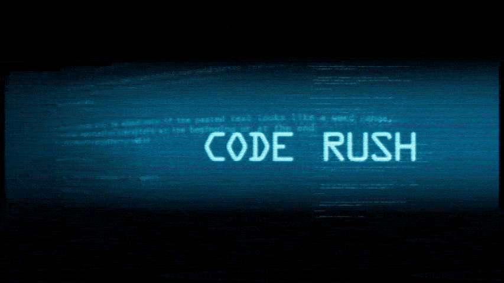

今年的軟體自由日，MozTW 社群將於西門町的真善美劇院播放 Mozilla 紀錄片「Code Rush」。〈Code Rush〉是 David Winton 導演於 1998 年至 2000 年間拍攝的紀錄片，紀錄了矽谷的 Netscape 工程師們將瀏覽器原始碼釋出，成為 Mozilla 專案的經過。歡迎有興趣了解這段歷史，想看看 Mozilla 變身過程的朋友，[上網購票](https://moztw.org/events/sfd2012/)。

時間：2012/09/15（六）12:50-14:20
真善美劇院（台北捷運西門站六號出口正前方，誠品116左方入口進入 7 樓）
活動網站及購票資訊：[http://moztw.org/events/sfd2012/](https://moztw.org/events/sfd2012/)

（圖片與資訊部分來自於活動網站，特此聲明）
