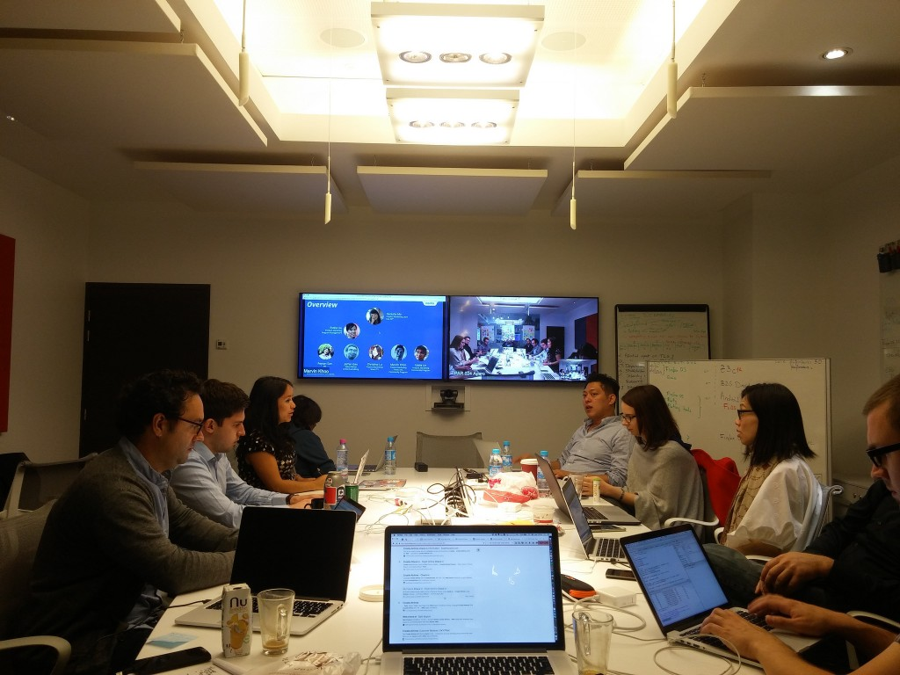
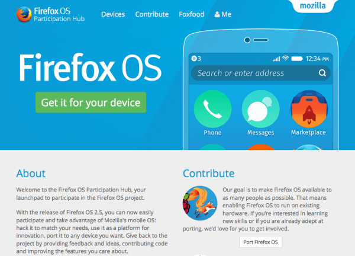

由於 Firefox OS 本身的先天與後天限制，造成其開放程度較低，外部參與的門檻也相對不是太容易。為此，「Participation」團隊特別絞盡腦汁，希望能整合更多貢獻者參與 Firefox OS 的未來。一起和我們了解此團隊所遭遇的難題以及目前的成果。

#### 摘要

在 Mozilla「參與 (Participation)」團隊與 Firefox OS 合作之下，目前已完成許多任務，而重點更在於 Participation 團隊能迅速於作業流程中整合大家的努力。

#### 問題所在

與 Mozilla 的其他專案相較，Firefox OS 的開放程度當然較低，且工程條件的結構更不算完善，能開放外部參與的幅度也較小。而 Participation 團隊認為能對 Firefox OS 有所影響，且團隊內的小型群組更直接深入合作以達目標。在 [Firefox OS 於 2015 年轉換重點](https://blog.mozilla.com.tw/posts/7630/)，從合作夥伴轉為使用者與開發者主導的開發活動之後，「參與」的程度就成為成功與否的關鍵。

#### 解決方式

Participation 團隊審視了參與活動的現有狀態。我們訪問過跨功能團隊成員，並研究目前的貢獻成果。在無任何可靠資料的情形下，我們最樂觀的估算也不到 200 名貢獻者，而技術方面的貢獻者就更少了。全球的「Launch」團隊自 2013 年起就開始貢獻非技術性的功能，而非洲的新社群更協助了「Klif」裝置的發售活動。

根據不同的貢獻範圍 (移植、寫程式碼、「Foxfooding」的刷機體驗與意見反饋活動等)，我們設計了不同權重的準則模型。像是會影響組織目標的準則，就會獲得較高的權重。此模型是希望能找出「參與甜蜜點」，以利我們在縮小參與範圍的同時，卻能讓貢獻者與整個組織提供更高價值。

Firefox OS 的技術貢獻主要為下列五大範圍：

- 「Foxfooding」─ 實體 Android 裝置刷機體驗與意見反饋活動

- 移植

- Gaia 開發

- 附加元件

- 「B2GDroid」─ 實體 Android 裝置免刷機體驗活動

同時我們設立了 Firefox OS 的 Participation 團隊，希望能跨工程、行銷、研究、專案管理，還有更多領域。我們每週固定開會，更透過 IRC 與郵件群組隨時溝通。我們已於 [2015 年 9 月的巴黎會議詳細規劃](https://wiki.mozilla.org/FirefoxOS/Participation/2015Q4_PlanningMeeting)，確認未來所應執行的細節。

團隊會議

#### Firefox OS Participation Hub

隨著會議進行，我們發現應先設立所有活動的「集散地」，因此透過 [Firefox OS Participation Hub](https://firefoxos.mozilla.community/) 網站召集技術方面的貢獻者。其目的可分為兩個階段：

- 為展現並追蹤 Firefox OS 技術方面的貢獻，我們將列出多個領域的參與方式，更會著重於我們所選定的「甜蜜點」範圍。此一概念可不是複製現有的內容，而是要能將之集中。

- 為了協助「Foxfooding」體驗與意見反饋專案，應該設置專區讓開發者註冊自己的裝置並取得可用版本。使用並測試 Firefox OS 的人越多，產品才會變得更好。

Firefox OS Participation Hub 網站

此「Hub」集散地網站已於 2015 年 11 月初上線。

Mozilla 的多項專案一直是以「開放源碼」為其特色，當然也少不了外部志工與貢獻者的心血。但在大家能夠捲起袖子加入我們之前，絕對少不了統整與調度的前置作業。即將上刊的〈Firefox OS「參與」之 2015 年度回顧 (下)〉將讓大家了解 Participation 期間所遭遇的難題與目前成果。

原文連結：[Firefox OS Participation in 2015](https://blog.mozilla.org/community/2016/01/04/firefox-os-participation-in-2015/)
