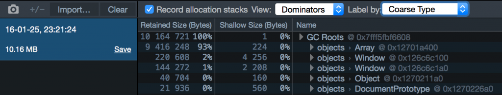
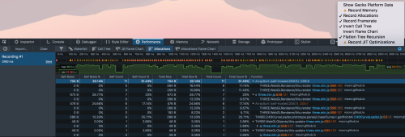
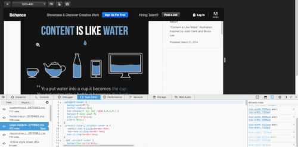

### 增加記憶體工具、提升 @media 側邊列，還有更多

Firefox 46 現已進入開發者 (Developer) 版本釋出頻道！我們添加了更多記憶體管理功能，並提升了其他現有工具。本文將概略介紹其中幾項重大變革。

#### 記憶體工具的「Dominator」檢視模式

記憶體工具現提供新的檢視模式，除了協助除錯之外，更能針對高記憶體用量的 Web App 進行特性描述。「Dominator」能深入了解物件的記憶體分配情形。此累進式的檢視模式，可顯示物件 (shallow) 大小，以及目前已分配的任何參照物件 (retained)。開發者可輕鬆看出特定物件對記憶體的影響。在建構特定物件時，此檢視模式更能讓開發者迅速找出對應的程式碼。可到[這裡](https://developer.mozilla.org/en-US/docs/Tools/Memory/Dominators_view)進一步了解此功能。

「Dominator」檢視模式擷圖

#### 效能工具與 GC 設定

[效能工具](https://developer.mozilla.org/en-US/docs/Tools/Performance)現可將配置 (Allocation) 情形納入記錄之中，進而協助你減少 Web App 中發生的 [GC](https://developer.mozilla.org/en-US/docs/Web/JavaScript/Memory_Management) 數量，以加快反應的速率。只要點擊「設定」齒輪，再找到「記錄配置 (Record Allocations)」項目，即可啟用效能工具中的配置檢視模式。

「配置」檢視模式擷圖

#### Emscripten 的還原 (Demangling) 功能

只要透過 Emscripten 編譯原生程式碼時，可以發現編譯器會修改函式名稱。效能分析器 (Profiler) 的「呼叫樹 (Call tree)」現新支援還原 C 函式名稱，可輕鬆對照原來尚未編譯的程式碼 (可參閱[開發記錄](https://bugzilla.mozilla.org/show_bug.cgi?id=968510))。

#### 樣式編輯器 (Style Editor) 與 @media 查詢

Firefox 開發者工具即提供[適應性設計 (Responsive Design) 檢視模式](https://developer.mozilla.org/en-US/docs/Tools/Responsive_Design_View)，而透過此模式所開發的網站，即可針對不同的螢幕尺寸進行縮放。現在更可搭配[媒體查詢側邊列](https://developer.mozilla.org/en-US/docs/Tools/Style_Editor#The_media_sidebar)，迅速找出目前螢幕尺寸所啟用的媒體規則。另針對「於適應性設計檢視模式中自動調整畫面檢視尺寸」的媒體規則，新版的媒體查詢側邊列更提供快速連結。可在[這裡](https://bugzilla.mozilla.org/show_bug.cgi?id=1029371)查閱開發記錄。

媒體查詢

#### 常開的除錯器 (Debugger)

同樣的，在開啟了工具箱而尚未啟動除錯器面板時，除錯器還是會暫停於 debugger 陳述式之上。可參閱 James Long 的[部落格文章](https://jlongster.com/On-the-Road-to-Better-Sourcemaps-in-the-Firefox-Developer-Tools)了解技術細節。

#### 其他亮點

除了上述改善之外，另外再說一下工具箱的其他部分：

- 可清除記憶體工具中的 heap 快照 (可參閱[開發記錄](https://bugzilla.mozilla.org/show_bug.cgi?id=1215955))

- 提高檢視器資訊列在暗色系頁面上顯示時的對比 (可參閱[開發記錄](https://bugzilla.mozilla.org/show_bug.cgi?id=1228829))

- 現可選擇效能工具的呼叫樹文字 (可參閱[開發記錄](https://bugzilla.mozilla.org/show_bug.cgi?id=1081245))

- 在非同步新增了許多記錄 (log) 時，亦提升了 console.log 的效能 (可參閱[開發記錄](https://bugzilla.mozilla.org/show_bug.cgi?id=1237368))

- 現已不限制儲存空間檢測器中的項目數量 (可參閱[開發記錄](https://bugzilla.mozilla.org/show_bug.cgi?id=1171903))

最後感謝對此開發者版本有所貢獻的人！請立刻下載並安裝[最新版開發者版本](https://mozilla.com.tw/firefox/developer/)，讓我們知道你的寶貴意見！

原文連結：[Developer Edition 46 – More memory tooling, improved @media sidebar and more](https://hacks.mozilla.org/2016/02/developer-edition-46-more-memory-tooling-improved-media-sidebar-and-more/)
