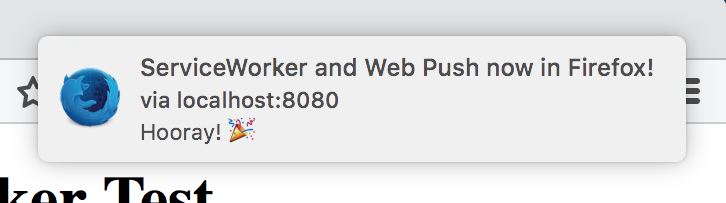
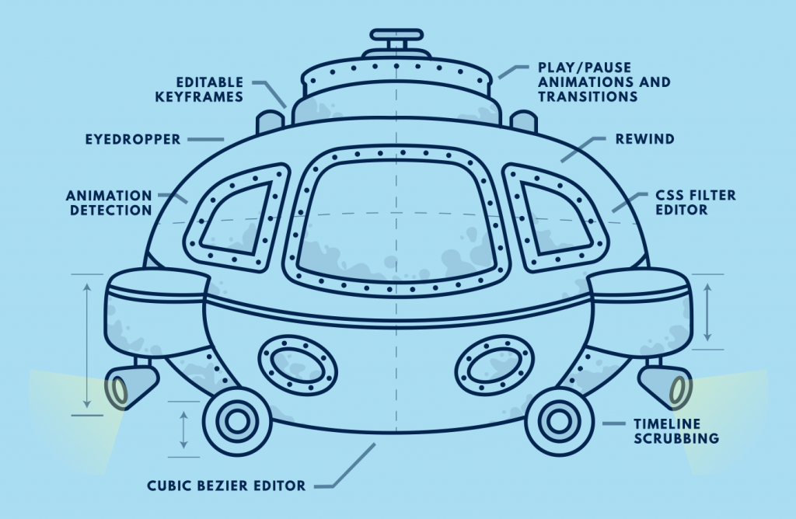
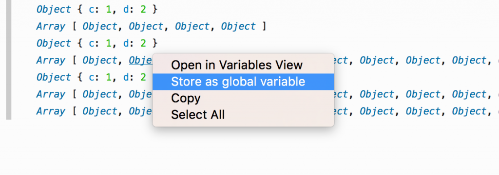

〈Trainspotting〉系列文章將重點提示 Firefox 最新版本的已上線功能。Firefox 現固定[每 6 個星期 (有時為 8 個星期)](https://blog.mozilla.org/futurereleases/2016/02/04/update-on-2016-firefox-release-schedule/) 釋出新版本，而我們稱此種模式為「Release trains」。

新年就該用新版 Firefox！一起來看看最新版本有哪些好料的吧！

#### ServiceWorkers 與 Web Push

ServiceWorkers 與 Web Push 是真正大幅突破的 2 項 Web 技術，可達到之前網頁與 Web App 之前辦不到的事。ServiceWorkers 能讓網站註冊指令碼，進而攔截瀏覽請求、離線快取資料，甚至未開啟網頁時亦可執行。如此可讓 UI 更有所回應、支援更好的離線功能、提供更 App 等級的經驗。

Web Push 則是以 ServiceWorkers 為基礎，配合使用者的需求所建構，可讓 Web 內容接收伺服器所推播的通知並觸發系統通知，即使未開啟瀏覽器分頁亦可提醒使用者該網頁的訊息。

礙於本文篇幅，無法一一詳述這些技術。如果你想進一步了解 ServiceWorkers 與 Web Push，或是親身體驗，可參閱下列連結：

- [Web Push 已登上 Firefox 44](https://blog.mozilla.com.tw/posts/8446/)

- [觀看 Service Worker Cookbook 所提供的範例程式碼與展示](https://serviceworke.rs/)

- [MDN 上的 ServiceWorker 說明文件](https://developer.mozilla.org/en-US/docs/Web/API/Service_Worker_API/Using_Service_Workers)

####

#### Firefox 內的設計工具

我們需要更大的潛艇了。Firefox 44 特別強調能夠提升設計師產能的工具，並有絕妙的動畫檢測器輔助現有的樣式工具。你可透過 [DevTools Challenger](https://devtoolschallenger.com/) 進一步了解這些工具。隨著潛艇進入深海，你將能檢測動畫、即時編輯 keyframes、微調 CSS 篩選器，還有更多。

- [進一步了解 Firefox 44 的視覺工具](https://blog.mozilla.com.tw/posts/8103/)

####

#### 更多開發者工具的好用功能

除了奇妙的水中生物與動畫工具之外，當然還有 [Firefox 開發者工具](https://developer.mozilla.org/en-US/docs/Tools)的新功能。

WebSocket 除錯

[WebSocket 除錯功能](https://bugzilla.mozilla.org/show_bug.cgi?id=1203802)現已成為開發者工具中的 API。目前仍在開發正式的 UI，但你可透過[專用擴充套件](https://addons.mozilla.org/en-US/firefox/addon/websocket-monitor/)立刻開始 WebSockets 的除錯作業。

在「網路主控台 (Web Console)」中使用已記錄的物件

針對已記錄於主控台中的物件，如果你要進一步操作或檢視之，則可透過滑鼠右鍵選單將之指派為臨時變數。

#### 更深入一點

Firefox 44 有許多值得開發者與使用者品味的地方。請參閱[完整的版本說明](https://www.mozilla.org/en-US/firefox/44.0/releasenotes/)或[因應開發者需求的改變明細](https://developer.mozilla.org/en-US/Firefox/Releases/44)。繼續和我們一同搖滾自由 Web 吧！

原文連結：[Trainspotting: Firefox 44](https://hacks.mozilla.org/2016/02/trainspotting-firefox-44/)
