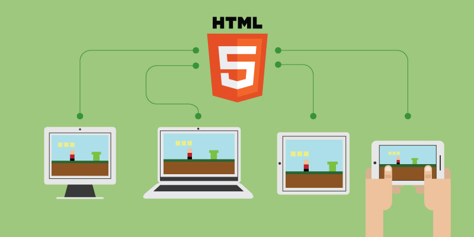

你是否想開發遊戲呢？以下蒐集了一系列介紹影片，讓你能著手開發 HTML 5 遊戲！

圖片來源：http://www.drimlike.com/

#### 使用 HTML 5 的理由

第一支影片解釋「針對 Web 開發遊戲」的幾個理由：作品能突破平台限制，接觸到更多人、自死板的 App 商城中解放、選擇自己愛用的工具與 API 等等。

#### 引擎與函式庫

第二支影片則概述了目前可用以建構遊戲的引擎與函式庫。其中包含完整的 JavaScript 函式庫 (如 [Phaser](https://phaser.io/))，以及可匯出至 HTML 5 (如 [Unity](https://unity3d.com/unity)) 的多平台引擎。

#### Firefox 開發者工具

接著是實機操作影片，將透過 [Firefox 開發者 (Developer) 版本](https://www.mozilla.org/en-US/firefox/developer/)中的[開發工具](https://developer.mozilla.org/en-US/docs/Tools)，對遊戲進行除錯與設定作業。即時修改程式碼、因應不同的畫面尺寸調整遊戲、除錯等等，都在這裡！

#### 參加「Game jam」的秘訣

最後是參加某場「Game jam」的訣竅。這類競賽就是要讓你在一個週末的時間內開發遊戲。我 (作者 [Belén Albeza](https://www.belenalbeza.com/)) 已經參加過好幾場，而且深知 Game jam 的難度與挑戰之處！希望這些秘訣能幫上忙。

當然，等你寫出了 HTML 5 遊戲，可別忘了說一下。我很想立刻去玩！

原文連結：[HTML 5 game development video series](https://hacks.mozilla.org/2016/02/html-5-game-development-video-series/)
