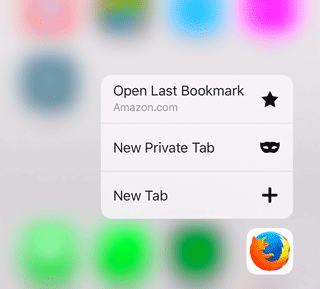
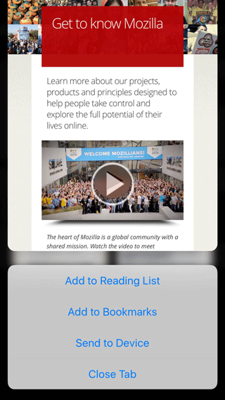

我們日前發表了第一版 Firefox for iOS；除了本身就是極佳的瀏覽器之外，今天還要帶給你更多功能。最新版 Firefox for iOS 將利用最新的 iOS 軟、硬體特色，提供更便捷的瀏覽經驗與更多樂趣。

只要是安裝於 iPhone 6S 與 6S Plus 上的 Firefox for iOS，現已支援其「3D Touch」功能，讓使用者能更快存取常用的功能。只要按壓 Firefox 圖示即可開啟「快速存取 (Quick Access)」選單，其內提供「開啟最近儲存書籤 (Open Last Bookmark)」、開啟「新隱私分頁 (New Private Tab)，或「新分頁 (New Tab)」等捷徑。

Firefox for iOS 現亦支援 3D Touch 的「Peek」與「Pop」功能，讓你只需簡單幾個步驟就能預覽分頁，並執行如「新增至閱讀清單 (Add to Reading List)」、「複製網址 (Copy URL)」，或「關閉分頁 (Close Tab)」等作業。你不再需要點按頁面，等頁面載入完畢，再點按一次才能叫出常用功能。反之，現在只要在分頁選單中輕按分頁就能預覽內容，再往上方滑動就能使用相關捷徑。如果你正要整理許多分頁，此一特別好用的功能還可協助你更快速的編排分頁。

為了在已開啟的分頁中加快搜尋速度，Firefox for iOS 更讓你能在 iPhone、iPad、iPod touch 的「Spotlight」搜尋列中直接鍵入所要查詢的問題。你也可以長按某個文字項目，即可透過「在頁面中搜尋 (Find in Page)」或透過「共享 (Share)」選單，於 Web 頁面中搜尋字串。現在 Firefox for iOS 也能更輕鬆的管理登入資訊了。不論是儲存於本端裝置，或透過 Firefox Accounts 所同步的登入資訊，使用者均可於「設定 (Settings)」中搜尋、篩選、編輯這些已儲存的登入資訊。

最後，只要開啟最新版的 Firefox for iOS，你就會看到頁面列出我們所完成的所有更新作業。希望你享受最新且更快的 Firefox for iOS。

#### 更多資訊：

- [Firefox for iOS](https://www.mozilla.org/firefox/ios/2.0/releasenotes/) 版本說明

原文連結：[Firefox for iOS is Faster with 3D Touch and More](https://blog.mozilla.org/blog/2016/02/17/firefox-for-ios-is-faster-with-3d-touch-and-more-2/)
