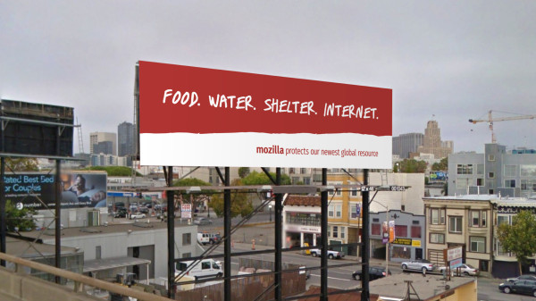
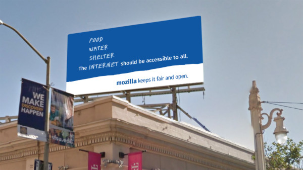

當我 (作者 Mark Surman，下同) 到 Mozilla 上班的第一天時，最先吸引我的就是『宣言』中的這句話：

“The Internet is a global public resource that must remain open and accessible to all.”

「網際網路是全球公用資源，應該保持開放並易於取用。」

這幾個字讓我立刻停下腳步思考。在真正了解其含意之後，就感覺到自己肩頭上擔負了一項任務。

我自己認為，Mozilla 全員所分享並依賴的「網路為全球公共資源」理念，就如同人類生活所必要的水源一樣。我希望自己應保護此一重要資源並全心奉獻。

我們所謂的「保護網路」，並不是到處廣設無線網路，讓大家都能在捷運上玩《糖果傳奇 (Candy Crush)》或類似的連網遊戲而已。網路就像是水一樣，已經是大家目前不可或缺的資源。對 Mozilla 而言，「網際網路」就像是未遭濫捕的健全大海。

我們認為網路健全與否為極重要的議題，對社會的影響甚鉅。開放的網路必須不受阻擋、不受壓抑、不該有付費優先 (Paid prioritization) 的情形，讓每個人不需支付巨款或要求他人同意，也都能夠建構開發自己的夢想。網路應該是所有人都能學習、玩耍、發掘新機會的安全地方。只要網路是開放、屬於所有人的公共資源，上述的理想就有機會達成。

#### 讓網路成為主流議題

當然不是所有人都優先顧慮到網際網路的健全。大多數人認為網路不過是其他事物所連接的「東西」。這些人看不到網路打壓、審查、監控等危機漸行普遍，也沒發現網路利益在全球分配上有多麼不均。Mozilla 希望讓網路健全成為如環保一樣的主流議題。

先談一下環境運動。在 1950 年代，僅有少數戶外運動愛好者與科學家在討論環境的脆弱程度。時至今日，大多數的人都知道應注重資源回收並隨手關燈。許多政府機構負責監督並管理污染製造者；公司法人也致力發展綠色產品，如有機食物到電動車都是。

但這些改變不會自己發生，而是在政府、公司、大眾正視環保議題之前，環保人士已經運作了幾十年之久。這些努力終獲成效，不僅讓環保成為主流議題，也讓大家持續嘗試保護自己的環境。

轉回網路健全的話題，我們目前的處境就好像回到了 50 年代。像 Mozilla、EFF、Snowden、Access、ACLU，及其他許多組織討論網路的脆弱已有幾十年。我們可以信手拈來一堆「為何網路的開放性如此重要」，還有「到底有哪些威脅」的故事。但要讓網際網路成為主流焦點，似乎還有一大段路要走。

我們應該改變此一情形，甚至將之列為 Mozilla 目前最急迫的目標之一。

可參閱我所撰寫的〈[Mozilla Foundation 2020 Strategy](https://marksurman.commons.ca/2015/12/21/mofo2020/)〉部落格文章。

#### 開始辯論吧：數位紅利 (Digital Dividends)

從世界銀行 (World Bank) 最近剛發表的「[2016 世界開發報告 (2016 World Development Report)](https://www.worldbank.org/en/publication/wdr2016)」可發現，我們往正確的方向邁步。前幾年大都聚焦於「工作」這類的問題，但今年的報告就直接點明了「數位紅利 (Digital dividends)」與開放的網路。

據報告所述，由網際網路帶來如融合、效率、創新等優點，並未能平均分配給大家共享。如果我們無法保持開放、安全、易於存取、成本低廉的網路，上述困境就無解。然而：

「保持網路開放與安全更顯困難重重。內容篩選與審查都影響了經濟上的成本。且因大家對線上隱私和網路犯罪的顧慮甚深，也連帶降低相關技術所造成的社會利益。是否大多數的使用者都拿己身隱私換取更流暢的線上經驗？ 內容限制何時才能合法？線上言論自由需考量哪些要點？個人資訊應該如何保持隱私？流通的綜合資料何時才會全然用於公共利益？是否能有任一管理模式確保全球網路的開放與安全？這些都是大哉問，但卻值得全球好好探討並討論。」

—”World Development Report 2016: Main Messages,” p.3

我們當然需要這個活潑的議題。類似的辯論可讓大家更重視網路的開放性；可形成話題；更可讓政府、媒體、公司老闆隨時注意相關風向。這類辯論基礎且必要。Mozilla 正計畫並參與此一活動。

#### 建立公眾對話

當然，我們認為對話應觸及更廣泛的領域，不限於「讀過世界開發報告」的人。如果我們要將「網路開放與否」升級為主流議題，就必須納入所有網路使用人。

我們已有多個能達到上述目標的計畫，其中包含世界銀行以及其他開放網路運動盟友之間的合作。接著將進行多個實驗期能 a.) 簡化「網路是公共資源」的訊息，並 b.) 觀察此一訊息將如何影響整個辯論走向。

第一個實驗就是廣告計畫，旨將網際網路納入大家已經熟悉的分類之中：「食物、飲水、棲身處、網際網路 (Food. Water. Shelter. Internet.)」。大多數人並不如此看待網路。我們想知道一旦開始培養此一觀念，到底會發生什麼事情。

我們已於紐約、舊金山、華盛頓等地啟動此一室外計畫，並透過社交平台傳遞類似的訊息。我們拭目以待將擦出什麼樣的火花，並會於 Mozilla 社交頻道 ([Facebook](https://www.facebook.com/mozilla/?fref=ts) & [Twitter](https://twitter.com/mozilla)) 上開啟對話。

#### 為運動加溫

當然，光是宣傳看板不足以激起運動。我們相信實驗與辯論活動更重要？我們的訊息可能打中人心並引起共鳴，也可能毫無作用。但最終目標就是要發起對話，積極討論「網際網路的健全」，以及「網路是需要大家保護的全球資源」之概念。

而且這不過是許多實驗之一。

我們現正鼓吹網路開放運動並致力使之成為主流議題。除了要以 EFF ([Let’s Encrypt](https://letsencrypt.org/)) 建構簡單易用的加密技術之外，更嘗試透過「[Coral Project](https://coralproject.net/)」，配合紐約時報 (The New York Times) 與華盛頓郵報 (The Washington Post) 達到更完整、更開放的線上對話。另外也安排夥伴與「美國公民自由聯盟 (ACLU)」、「國際特赦組織 (Amnesty International)」、「Freedom of the Press Foundation ([Open Web Fellows Program](https://advocacy.mozilla.org/open-web-fellows/))」合作。相關概念已經於許多平台上蔓延。

說到廣告板，我們想知道大家的想法：

- 現在是讓網路成為主流議題的時候嗎？

- 網路對你而言重要嗎？

- 網路也屬於主要的人類需求嗎？

我希望答案是肯定的。且不論獲得的結果為何，我也都準備好要從中有所收穫。就如同其他重要議題，「保持網路的健全與開放」不會自動發生，也不能讓我們放著等待其自己發生。

我們要鼓吹並激起全民運動。我們需要大家幫忙。

原文連結：[The Internet is a Global Public Resource](https://blog.mozilla.org/blog/2016/02/08/the-internet-is-a-global-public-resource/)
