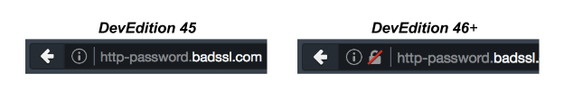
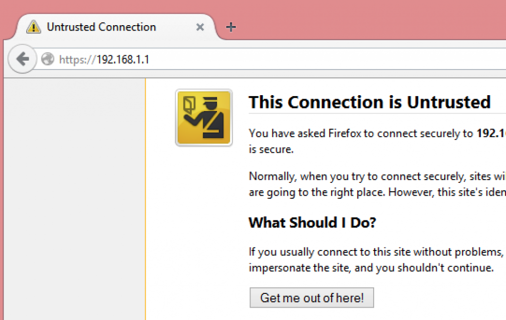

在上網的每個人，幾乎都會用到 1 組帳號密碼來登入某個服務。而只要在不安全的表單中輸入密碼之時，也都幾乎將該組密碼暴露在風險之中。

在 [Firefox 開發者 (Developer) 版本](https://mozilla.com.tw/firefox/channel/#aurora)中，我們為使用者呈現極為顯眼的警示標誌。只要任一頁面的密碼欄位將以不安全的方式送出密碼，Firefox 就會在網址列中顯示以紅線斜槓的鎖頭：

如果你正透過 HTTPS 提交登入表單，當然很好！但可能還不夠。你應該也要用 HTTPS 遞送 (Deliver) 表單。如果沒能以安全管道遞送登入表單，則攻擊者就有機會植入 JavaScript 程式碼竊取使用者的密碼，而且所鍵入的每個字母將無一倖免。

由於開發者最是需要在自己網站上建構安全登入機制，我們已經透過開發者版本釋出此一功能 (目前尚未規劃要在 Firefox Beta 與正式版上顯示此一警示)。我們於[開發者工具的「網頁主控台 (Web Console)」](https://developer.mozilla.org/en-US/docs/Web/Security/Insecure_passwords#Webconsole_Messages)上提供警示效果已有一段時間：即透過網址列中的鎖頭，讓大家能清楚了解目前瀏覽的網站是否安全。

可到[這裡](https://blog.mozilla.org/tanvi/2016/01/28/no-more-passwords-over-http-please/)進一步了解此功能。

原文連結：[Login Forms over HTTPS, Please](https://hacks.mozilla.org/2016/01/login-forms-over-https-please/)
