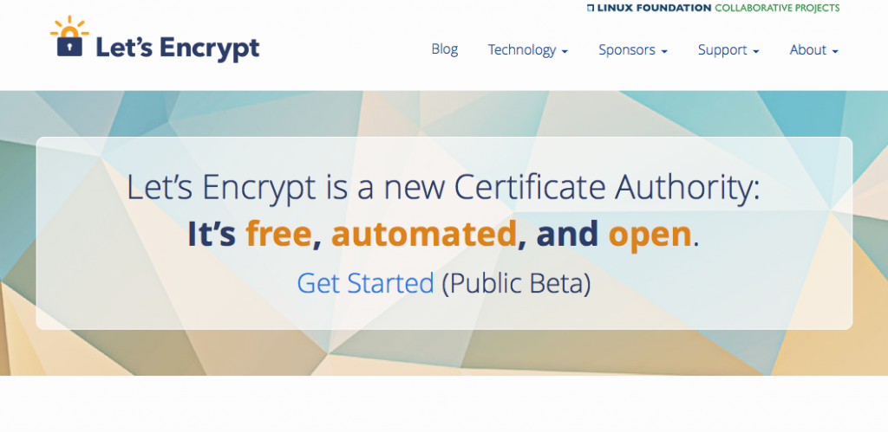

今天，網際網路已經是我們最重要的全球公用資源之一。網路是我們開放、自由日常生活的基礎；供我們進行聊天、遊戲、購物、金融等活動；更是我們創新、學習、組織之處。

我們依賴一系列的核心原則才得以滿足上述所需，如同[「網路上的個人安全與隱私為基本要求」](https://www.mozilla.org/en-US/about/manifesto/)的理念。

Mozilla 堅守這些原則，致力保持網路為全球公共資源，這也代表我們需時時監控任何威脅。最近，開放網路的諸多威脅之一開始發展：有人想要刻意忽略加密的必要性。

「加密」是網路能否健全的關鍵。加密就是為資料編碼，僅限擁有特殊鑰匙的人士才能解鎖，例如該筆訊息的「傳送者」與「接收者」兩方。網路使用者雖然每天都依賴加密功能，但大多數人並不了解此一機制，也不知道加密的絕妙用途。加密能保護我們寄發的電子郵件、曾經搜尋的字串、私密的醫療記錄，也能讓我們在線上安全購物並進行金融活動；同樣的，加密也保護了記者與消息來源、人權活動人士，以及各領域的深喉嚨。

加密並非奢侈品，卻是必需品。這也是 Mozilla 一直認真對待加密的原因。對於我們保護網路開放性並方便大家使用的理念，加密當然屬於其中一環。

然而，全球的政府機構與執法部門均正在推動相關政策，企圖弱化加密機制以侵犯使用者的安全。這些政策的立意往往強調「過強的加密機制將助長居心不良的人進行惡意活動」。但事實是，網路使用者都需要強大的加密功能。Mozilla 當然尊重執法部門的顧慮，但我們認為某些弱化加密機制的提案，特別是那些開後門的需求，都將嚴重影響所有網路使用者的安全。

Mozilla 將持續推動類似專案，如「[Let’s Encrypt](https://letsencrypt.org/)」即為免費、自動化的 Web 認證授權，希望能讓所有人更輕鬆的架設加密網站。Let’s Encrypt 專案即與電子前哨基金會 (Electronic Frontier Foundation)、思科 (Cisco)、Akamai 雲端平台，以及其他許多科技組織所共同開發，要為大家打造更安全的線上生活。

隨著有越來越多政府機構在推動後門法案，光是加密技術已經不敷所需。我們也需要 Mozilla 社群與更廣大的群眾加入。我們需要大家對自己選出的民意代表說明：線上的個人隱私與安全不能妥協。只要能夠強力傳達出此一訊息，Mozilla 就能夠於其中扮演關鍵角色。

Mozilla 知道這是一條艱辛的路。大多數的人根本不知道所謂的「加密」，甚或認為自己對線上隱私使不上力。

也因為如此，我們正啟動公眾教育方案，並交由全球的 Mozilla 社群協助執行。在接下來幾週內，Mozilla 將陸續釋出影片、發佈文章、舉辦相關活動，期能提升大家對加密的理解與認知。 [現在就觀看第一支影片](https://advocacy.mozilla.org/encrypt/)，了解個人資訊控制如此重要的理由。更重要的是，你可透過此影片和親友展開對話，讓他們更注重自己的線上隱私與安全。

如果 Mozilla 能教育數百萬名的網路使用者，讓他們都了解加密的基本概念與其日常生活的關聯性，則一旦適當時機到來，Mozilla 就能立刻掌握絕佳戰略地位，集合大家捍衛自己的權益。我們相信全球已有數個國家即將迎來此一關鍵時間點。只要你能觀看、分享、與他人討論接下來的影片，你也就加入了此一行列。

如果你想進一步了解 Mozilla 的加密教學方案，可至 [mzl.la/encrypt](https://mzl.la/encrypt)。我們希望大家都能廣為散佈加密的概念。

原文連結：[Help Us Spread the Word: Encryption Matters](https://blog.mozilla.org/blog/2016/02/16/help-us-spread-the-word-encryption-matters/)
