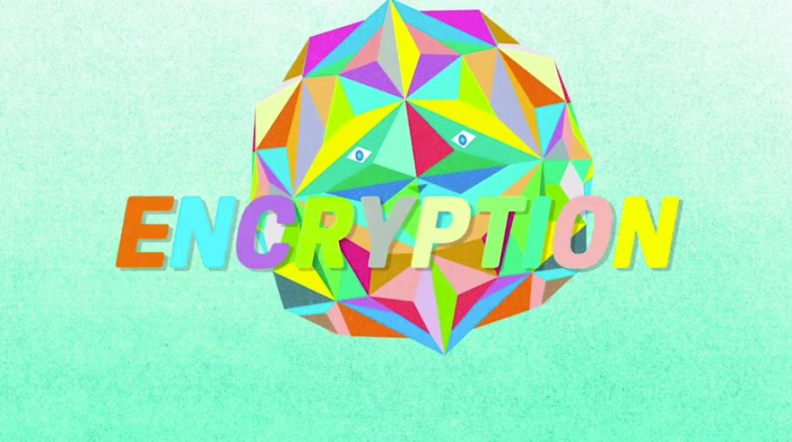

最近有關加密的議題正沸沸揚揚！加密、蘋果 (Apple) 公司、聯邦調查局 (FBI) 的組合，佔據了各大媒體的版面。「安全」與「隱私」成為民眾在餐桌上、電視前的話題，更是網路上的熱門討論串。

對於美國政府要求 Apple 解除其自家的安全防護機制，Mozilla 認為這又是一次越權的行為。且一旦開了此一先例，無疑將對未來的消費者安全形成嚴重威脅；換個角度，此議題更是培養大家加密意識的機會。只要越多人知道「加密」在日常生活所扮演的角色，就越有利於 Mozilla 帶領消費者對未來的可能威脅挺身而出。此外，這個關鍵問題更關係到「網路健全」是否能成為主流訴求。

就在 Apple 與 FBI 事件爆發之前沒幾天，Mozilla 才針對「加密」[啟動公眾教育方案](https://advocacy.mozilla.org/encrypt/)。我們很高興能搭上此熱門議題的順風車，提高整個方案的能見度。

Mozilla 現正發佈公眾教育方案的下個階段：透過短片將加密概念動畫化，解說加密的運作方式及其之所以重要的原因。

我們希望你也能向自己的親友分享此短片，接著與大家討論該議題對未來的可能影響。為了網路的安全與開放，我們必須從現在就開始扎根。即便是家人圍爐時的話題，都有助於大家捍衛己身的網路中立性。這就是開放網路運動的力量！現在是時候再幫我們廣為散佈加密的概念，並保護大家的隱私與安全！

原文連結：[Continuing the Conversation About Encryption and Apple: A New Video From Mozilla](https://blog.mozilla.org/blog/2016/02/24/continuing-the-conversation-about-encryption-and-apple-a-new-video-from-mozilla/)
