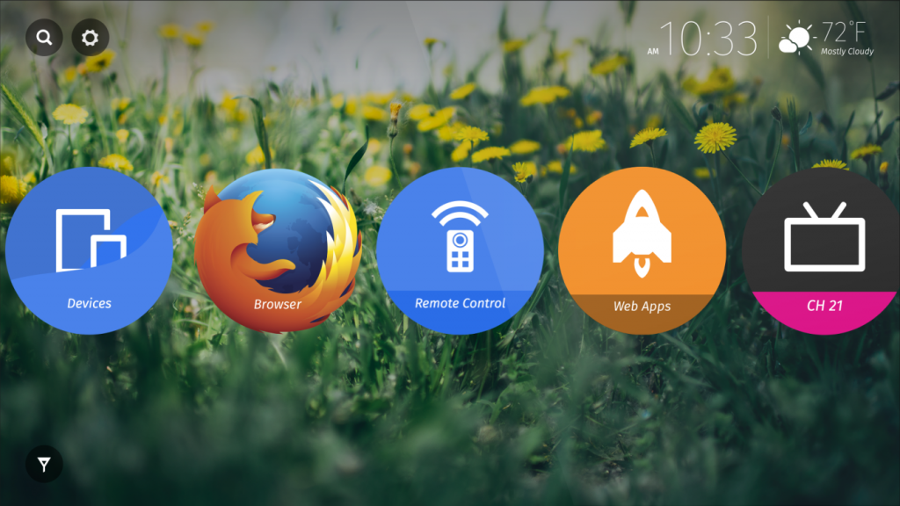

Mozilla 與[松下電器 (Panasonic) 共同宣佈](https://news.panasonic.co.uk/pressreleases/panasonic-unveils-next-generation-of-tv-technology-with-2016-line-up-of-4k-pro-ultra-hd-tvs-1327623) Firefox OS 持續搭載於最新發表的 Panasonic DX 系列全新 UHD 電視。

搭載 Firefox OS 的 Panasonic 電視已於[全球發售](https://blog.mozilla.com.tw/posts/7462)。此款電視具備直覺且可自訂的主畫面，讓使用者能「快速存取 (Quick Access)」如 Live TV、Apps，以及個人的連網裝置。消費者可快速找到自己最愛的電視頻道、應用程式、網站內容等，亦能將任何內容或應用程式釘選到電視的主畫面之上。

#### Firefox OS 為電視準備的新功能

針對此次歐洲首發的全新 DX 系列 UHD 電視，Panasonic 已計劃於今年稍晚將之更新為 Firefox OS 最新版本。透過該次更新，消費者將能以新方式找尋 Web App 並儲存到自己的電視上。Firefox OS 所具備的 Web App 更針對電視環境進行 Web 內容的最佳化，如遊戲、新聞、天氣、隨選影片，還有更多。不須任何安裝動作，使用者也可擁有易用的「隨點即看」經驗，輕鬆發掘自己最愛的內容。

搭載 Firefox OS 的 Panasonic 的 DX 系列 UHD 電視將具備新功能，可跨平台提供一致的 Firefox 經驗。消費者可利用新的「Send to TV」功能，將 Firefox for Android 上的 Web 內容分享到 Firefox OS 電視中欣賞。

Mozilla 與 Panasonic 自 2014 年起即開始合作，致力為消費者提供直覺且最佳化的使用經驗，並享受 Open Web 平台的優勢。

#### 更多資訊：

- Firefox OS Smart TV [展示影片](https://drive.google.com/file/d/0B4K8q1qWmtAvNHZlNTdBb1dDTVU/view?pref=2&pli=1)

- [Panasonic Convention 2016 新聞稿](https://news.panasonic.co.uk/pressreleases/panasonic-unveils-next-generation-of-tv-technology-with-2016-line-up-of-4k-pro-ultra-hd-tvs-1327623)

原文連結：[Firefox OS will Power New Line-up of Panasonic Ultra HD TVs](https://blog.mozilla.org/blog/2016/02/29/firefox-os-will-power-new-line-up-of-panasonic-ultra-hd-tvs/)
