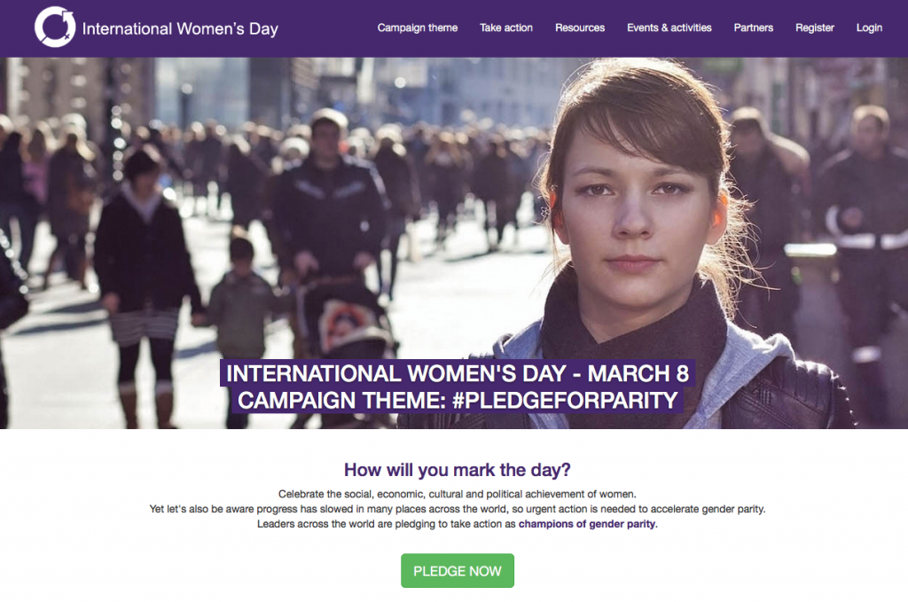

本文作者為 Mozilla 基金會主席 Mitchell Backer 女士

2016 年 3 月 8 日這天也是[國際婦女節](https://www.internationalwomensday.com/)。Mozilla 慶祝截至今天為止所實現的工作成果，但也知道仍有許多基本且關鍵的事情要做。談到提升女性與其家庭的生活與機會，網際網路當然扮演了關鍵角色。也因為如此，我很榮幸能參加美國已於今年 1 月開跑的第一屆「[婦女經濟權能高階小組 (High Level Panel on Women’s Economic Empowerment；暫譯)](https://www.unwomen.org/en/news/stories/2016/1/wee-high-level-panel-launch)」。我期待向小組成員強調科技與開放網路的正面影響，並已經開始蒐集來自於全球的意見，要在相關討論中為大家發聲。

請到[我的部落格文章](https://blog.lizardwrangler.com/2016/03/07/international-womens-day-time-to-take-action/)參閱相關主題，並了解我對「網路將如何提升女性權能」的想法。

原文連結：[International Women’s Day; Time to Take Action](https://blog.mozilla.org/blog/2016/03/07/international-womens-day-time-to-take-action/)
