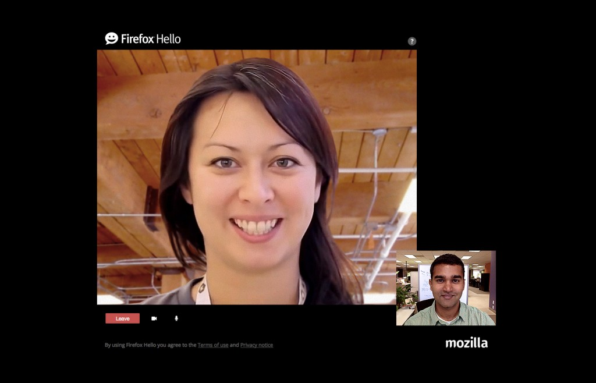

通訊工具 Firefox Hello Beta 可讓你用 Firefox 瀏覽時，同時與他人分享網頁，更能進行視訊或文字對話，且完全不需再登入任何帳戶。而在 Windows、Mac、Linux 上使用 Firefox Hello Beta 之時，可在對話期間分享你所瀏覽的網站，利於多人線上討論並完成決策。像是與親友線上購物、與家人規劃假期去處，或和同事在線上協作辦公，都能更輕鬆、更快速的完成目標。

只要點擊 Firefox 中的 Firefox Hello 圖示 

 並邀請他人進入你的聊天室，Hello 將迅速分享你正瀏覽中的分頁給對方。

Firefox Hello 的對話視窗

在 Windows、Mac、Linux 上運作的 Firefox Hello 桌面版，是 Mozilla 與合作夥伴 Telefónica 一同開發而成。我們現仍努力新增更多功能，包含暫停分享及更多特色。

此外，針對行動上網並非吃到飽的使用者，我們考慮到開啟網頁時可能一併載入太多圖片而導致流量過大。Firefox 行動版 (Firefox for Android) 現已提供[「圖片點了再看 (Click-to-view)」選項](https://support.mozilla.org/zh-TW/kb/firefox-android-wifi/)。只要進入 Firefox for Android 的進階設定，就能選擇要從 Web 下載的圖片，進而節省有限的行動上網傳輸量。

樂意嘗鮮的使用者，可下載 [Firefox 每夜更新版 (Nightly)](https://mozilla.com.tw/firefox/channel/#nightly) 或 [Firefox 測試版 (Beta)](https://mozilla.com.tw/firefox/channel/#beta)，以在 Hello 功能進入 Firefox 正式版本之前就可搶先體驗。

希望你能享受更新過的 Firefox Hello Beta。另外可參閱[本篇部落格文章](https://blog.mozilla.org/futurereleases/)以了解其他新功能。

#### 更多資訊：

- 下載 [Firefox 桌面版 (Firefox for Windows, Mac, Linux)](https://www.mozilla.org/firefox/new/)

- [Firefox 桌面版](https://www.mozilla.org/firefox/45.0/releasenotes/)之版本說明

- 下載 [Firefox 行動版 (Firefox for Android)](https://play.google.com/store/apps/details?id=org.mozilla.firefox&referrer=utm_source%3Dmozilla%26utm_medium)

- [Firefox 行動版](https://www.mozilla.org/firefox/android/45.0/releasenotes/)之版本說明

原文連結：[Updates to Firefox Hello Beta](https://blog.mozilla.org/blog/2016/03/08/updates-to-firefox-hello-beta/)
