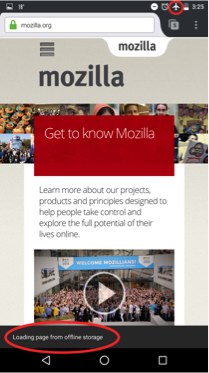

我們現正透過 Firefox for Android 測試版 (Beta)，嘗試於離線狀態顯示某些網頁。

上方小紅圈表示目前為飛航模式；下方紅圈內的文字為「自離線儲存區載入網頁」。

你最近瀏覽了某個網頁，且該網頁於裝置的離線儲存區中留有快取檔案，則 Firefox for Android Beta 將可顯示該網頁的離線版本，而不再顯示「無法顯示網頁」的類似錯誤訊息。使用者不需進行任何設定即可體驗此功能。即使在行動裝置未連上網路的狀態下， 你會發現 Firefox for Android Beta 仍能離線顯示某些頁面。

#### 更多資訊：

- 下載 [Firefox for Android Beta](https://play.google.com/store/apps/details?id=org.mozilla.firefox_beta)

- [Firefox for Android Beta 版本說明](https://www.mozilla.org/firefox/android/46.0beta/releasenotes/)

原文連結：[Viewing Cached Tabs Offline Ready for Testing in Firefox for Android Beta](https://blog.mozilla.org/futurereleases/2016/03/09/viewing-cached-tabs-offline-ready-for-testing-in-firefox-for-android-beta/)
