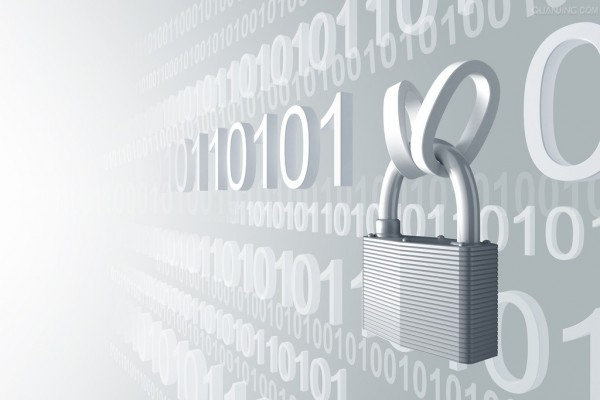

#encryption

「安全」絕對是受信任網路的必備要素。而「加密」又是獲得信任的基礎。最近由蘋果 (Apple) 公司與聯邦調查局 (FBI) 之間的爭議事件若強制執行成功，就將開啟一個危險的先例。Mozilla 對此議題的立場很簡單：FBI 不應該要求科技公司額外開後門，致使多年的安全機制進展反而大開倒車。

圖片來源：www.cbronline.com

即便遵循合法途徑進行的政府監視＼聽活動，也會危及網路與使用者的安全性；且政府的監聽活動往往不會考慮可能的傷害。蘋果事件只是近期的冰山一角。Mozilla 呼籲政府應該根據[基本原則](https://surveillance.mozilla.org/)調控監聽活動，在法治需求與公眾利益之間取得平衡：

- 使用者安全： 政府不應削弱，而是強化使用者的安全；這也包含加密機制在內。

- 最小影響： 政府的監聽活動應該儘量不對使用者的信任與安全造成影響。

- 義務與責任： 監聽活動應另受正當、獨立、透明的監督。

這些原則並非憑空想像而得。[Mozilla 理念](https://www.mozilla.org/en-US/about/manifesto/)即是以使用者的隱私與安全為基礎，堅持網際網路是全球的公用資源，並根據透明程序取得使用者的信任。這些概念不僅套用在我們的產品打造過程中，也能協助政府建立更安全、更值得信任的網路。

那麼你又能做些什麼呢？幫忙我們把這些原則散播出去吧！身為群眾的一份子，你能和別人討論相關問題 (#encryption)、[分享](https://surveillance.mozilla.org/action)這些原則，並要求政府與立法單位嚴肅看待監聽活動對使用者可能造成的傷害。如果你能夠參與政策制定，則可參考[基礎原則](https://surveillance.mozilla.org/)，為大家打造更安全、更受信賴的網路。

原文連結：[Mozilla Introduces Surveillance Principles for a Secure, Trusted Internet](https://blog.mozilla.org/blog/2016/02/25/mozilla-introduces-surveillance-principles-for-a-secure-trusted-internet-2/)
