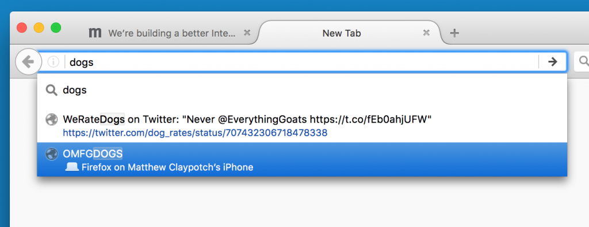
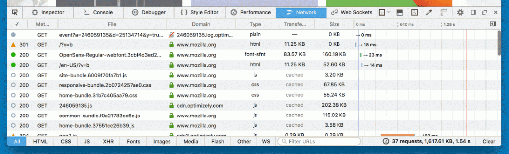
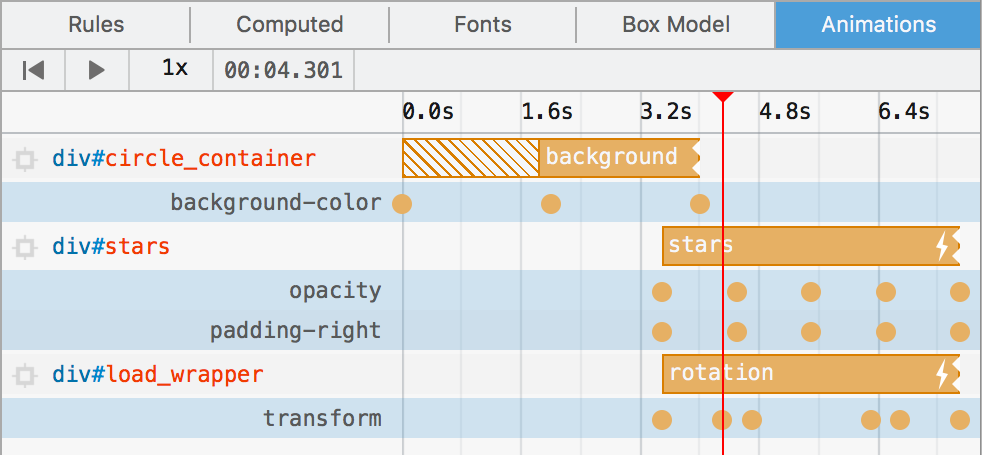
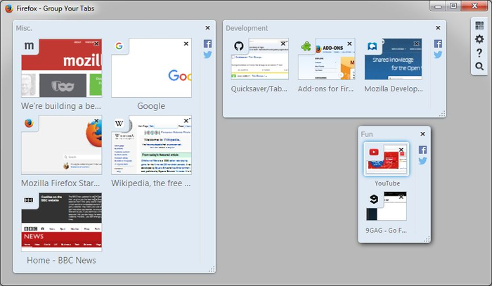

〈Trainspotting〉系列文章將重點提示 Firefox 最新版本的已上線功能。Firefox 現固定每 6 個星期釋出新版本，而我們稱此種模式為「Release trains」。

三月風帶來四月雨，最新版的 Firefox 也跟著春燕來了！一起來看看新版瀏覽器的新功能與變化吧！

#### 分頁同步

針對你在另台裝置的 Firefox 中開啟過的分頁，[智慧位址列 (Awesome Bar)](https://support.mozilla.org/en-US/kb/awesome-bar-search-firefox-bookmarks-history-tabs) 現可自動建議這些網頁，讓你能迅速找回自己留在手機或公司電腦上還沒看過的內容。 另可透過[工具列按鈕選單](https://support.mozilla.org/en-US/kb/view-synced-tabs-other-devices)，找到在其他裝置上開啟過的分頁清單。

#### 開發者工具

從 Firefox 40 開始，就能[依照網址篩選網路請求](https://developer.mozilla.org/en-US/docs/Tools/Network_Monitor#Filtering_by_URL)，但現在可於篩選條件前方加上「-」，藉以過濾不想要的請求。如果是那種需要較長開啟時間且會產生許多請求的單頁面 Web App，此一功能就特別有用。

動畫面板功能強化

「動畫 (Animation)」面板現在又提供許多新功能 (又來？開發者工具實在太多功能了)。現可檢視各組動畫所修改的獨立屬性。針對各組套用特定 CSS 屬性的 keyframe，時間軸的展開檢視功能現能另行標記。

Firefox 45 現更可調整動畫面板中的播放速率，透過慢、動、作的方式微調複雜序列。此功能應可協助加快除錯。

- [到 MDN 上了解動畫檢視器的功能](https://developer.mozilla.org/en-US/docs/Tools/Page_Inspector/How_to/Work_with_animations)

#### 分頁群組

歡送又迎來[「分頁群組 (Tab Groups)」](https://addons.mozilla.org/en-US/firefox/addon/tab-groups-panorama/)！如果你知道 Firefox 的分頁群組功能，大概就代表你是該功能的死忠用戶了。但其實用這個功能的人不多，所以我們移除此功能以簡化 Firefox 程式碼。別擔心！附加元件開發者 [Quicksaver](https://addons.mozilla.org/en-US/firefox/user/quicksaver/) 讓分頁群組的程式碼成為 Firefox 擴充套件了！所有的整理與拖曳方式都跟之前一樣。感謝 Quicksaver 讓死忠粉絲繼續留有愛用的功能！

- [進一步了解分頁群組，並可透過擴充套件重新設定回你慣用的既有群組](https://support.mozilla.org/en-US/kb/tab-groups-removal)

Firefox 45 還有太多功能，每次這種短文根本寫不完。請參閱[版本說明](https://www-dev.allizom.org/en-US/firefox/45.0/releasenotes/)或 MDN 上的[開發者應知道的變更細節清單](https://developer.mozilla.org/en-US/Firefox/Releases/45)。

原文連結：[Trainspotting: Firefox 45](https://hacks.mozilla.org/2016/03/trainspotting-firefox-45/)
