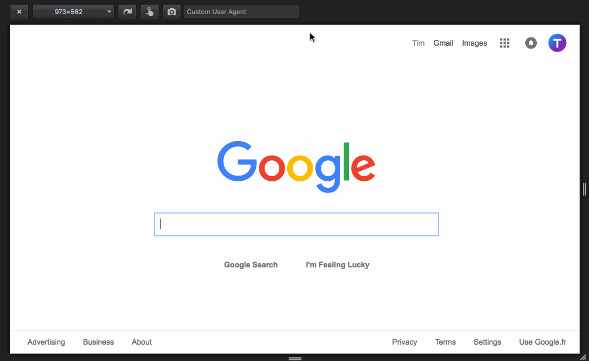
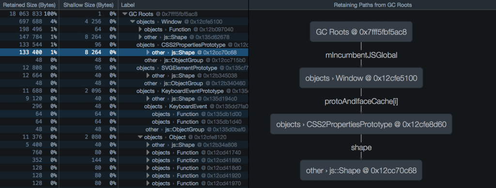
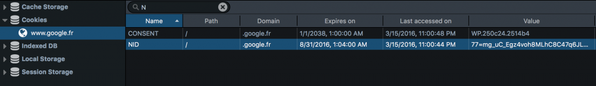
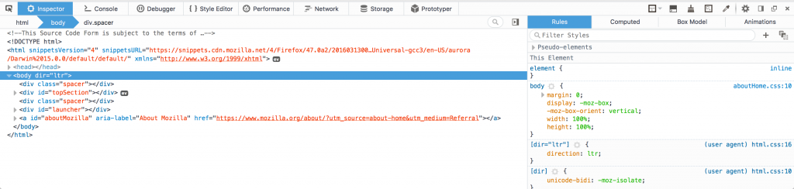
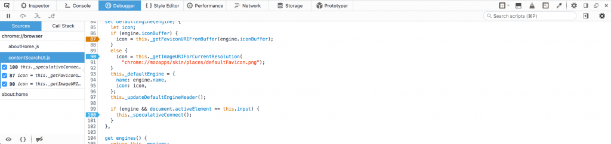
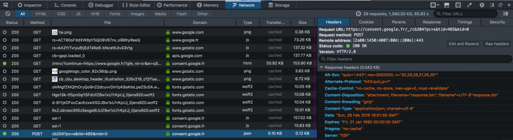

### 模擬使用者瀏覽器、彈出型對話框除錯，還有更多

本週將介紹 [Firefox 開發者版本 (Developer)，也就是 Firefox 47](https://mozilla.com.tw/firefox/channel/#aurora)！另說明了[開發者工具的「Reload」附加元件](https://hacks.mozilla.org/2016/02/introducing-devtools-reload/)，以及 [Service worker 相關工具](https://hacks.mozilla.org/2016/03/debugging-service-workers-and-push-with-firefox-devtools/)，請別錯過相關文章。

#### 模擬使用者的瀏覽器 (User Agent)

現可透過適應性檢視模式，在任何網頁上模擬自訂的使用者瀏覽器。只要在「自訂使用者代理字串 (Custom User Agent)」欄位中鍵入所要模擬的使用者瀏覽器字串，並可藉此檢查某一網站是否能「辨識使用者瀏覽器 (User Agent Sniffing)」。舉例來說，你可鍵入行動瀏覽器的使用者瀏覽器字串，看看該網站在手機上的呈現方式。

下為本功能短片：

#### 以圖表方式呈現保留路徑

我們已為 46 版本新增了「Dominator」檢視模式，可針對較高記憶體用量的 App 協助除錯作業。現 47 版本又為該模式增加了「保留路徑 (Retaining path)」面板，以圖表方式顯示所有節點，避免已選節點被「當做垃圾而回收 (GC)」了。只要你正想找出可能的記憶體洩漏情形進行除錯，此功能就特別有用。可參閱 [MDN 文章](https://developer.mozilla.org/en-US/docs/Tools/Memory/Dominators_view#Retaining_Paths_panel)進一步了解此功能。

下為圖表擷圖：

#### 主控台的多行輸入

現已改善了主控台 (Console) 的多行輸入方式。只要按下「Enter」鍵，主控台將偵測你的輸入是否已完整。若已完整輸入，則按下「Enter」就會執行指令；若輸入不完全，則按下「Enter」就會新增一行供你輸入。如此可輕鬆繼續撰寫指令。

#### 儲存空間檢測器

儲存空間檢測器 (Storage inspector) 現已支援[快取儲存空間](https://developer.mozilla.org/en-US/docs/Web/API/CacheStorage)，可協助對 Service worker 的除錯作業。另請參閱 [Sole Penadés 所寫的部落格文章](https://hacks.mozilla.org/2016/03/debugging-service-workers-and-push-with-firefox-devtools/)，了解 Service worker 的除錯細節。

除了支援快取的儲存空間之外，現更可透過工具列頂端的搜尋欄位來篩選目錄。下為該功能擷圖：

#### 主題變更

我們另小幅度微調了工具箱的視覺效果，如縮減了預設分頁寬度，並新增記憶體工具內的圖示。當然也進行了大幅度的變化，例如徹底改頭換面的「亮」主題，提供更清晰的外觀與感覺。

新的亮主題擷圖：

另更新了除錯器 (Debugger) 的風格：現以橘色強調程式碼行中的條件式中斷點 (Conditional breakpoint)。下為擷圖：

最後，我們把「網路 (Network)」監控器的工具列搬到上方，如此更易於閱讀且與其他工具的配置更為一致。

####

#### 針對附加元件的彈出型對話框除錯

為了準備迎接 [WebExtensions](https://wiki.mozilla.org/WebExtensions)，我們另增多個新功能以簡化附加元件的除錯作業。47 版本可輕鬆檢視彈出型對話框。你現在可鎖定彈出型對話框，且即便點擊其他地方也不會讓彈出型對話框消失。若要使用此功能，須先啟動[瀏覽器工具列](https://developer.mozilla.org/en-US/docs/Tools/Browser_Toolbox)，再點擊工具箱右上角的「四個方塊」圖示。可參閱[這裡](https://developer.mozilla.org/en-US/Add-ons/WebExtensions/Debugging#Debugging_popups)進一步了解該如核對自己的擴充套件進行除錯。

另有短片簡單呈現此功能：

#### 其他重要變更

除了上述改善之處外，還提升了工具箱的其他地方，包含：

- 檢視器現可設定是否要省略＼截斷過長的 DOM 屬性 ([Bug 1225063 開發記錄](https://bugzilla.mozilla.org/show_bug.cgi?id=1225063))

- 現可透過「mdn css」此 GCLI 指令，取得 MDN 上的相關文章 ([Bug 768469 開發記錄](https://bugzilla.mozilla.org/show_bug.cgi?id=768469))

由於 3D 檢視模式會與 Firefox 的多程序 (Multi-process) 版本衝突，我們也移除了此功能。若你仍有需要，可安裝[此一附加元件](https://addons.mozilla.org/en-US/firefox/addon/tilt/)續用此模式。

最後，字型檢視器現已預設關閉。你可透過 about:config 的 devtools.fontinspector.enabled 設定，重新啟動此工具。

感謝對開發者 (Developer) 版本做出貢獻的所有人！請立刻安裝[最新版開發者版本](https://mozilla.com.tw/firefox/developer/)並讓我們知道你的意見。

原文連結：[Developer Edition 47 – User agent emulation, popup debugging and more](https://hacks.mozilla.org/2016/03/developer-edition-47-user-agent-emulation-popup-debugging-and-more/)
