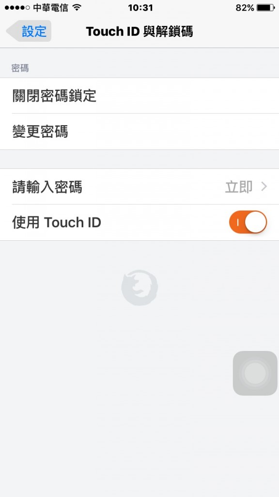

Mozilla 持續努力讓 Firefox 在所有平台上盡善盡美。今天我們為 Firefox for iOS 新增安全保護功能。

Firefox 上的「密碼管理員 (Password Manager)」可針對你瀏覽過的網站，安全儲存其上的使用者名稱與密碼，待使用者日後再度登入時隨即自動填寫資訊。現在 Firefox for iOS 另為密碼管理員新增了 4 位數的密碼，不須重新鍵入登入資訊而加快瀏覽速度，更能進一步保護你的資訊。透過此一功能，即便手機因各種原因離開自己身邊，個人密碼仍保安全無虞。

任何 iOS 裝置只要啟用了 Touch ID 功能，也可透過使用者指紋迅速解鎖已儲存的登入資訊。

一如往常，只要開啟最新版的 Firefox for iOS，使用者就能看到其他所有更新，享受更完善的 Firefox。

#### 更多資訊

- [Firefox for iOS 版本說明](https://www.mozilla.org/firefox/ios/3.0/releasenotes/)

原文連結：[Firefox for iOS adds Security Features](https://blog.mozilla.org/blog/2016/03/30/firefox-for-ios-adds-security-features/)
