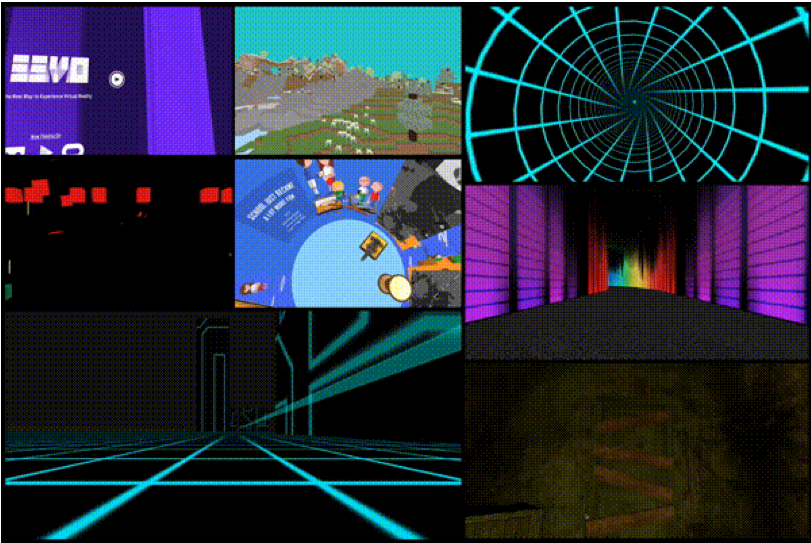

[A-Frame](https://aframe.io/) 可輕鬆針對 Web 打造虛擬實境 (Virtual Reality，VR) 內容，提供了：

- 以宣告式 (Declarative) 的 HTML 打造 3D 場景。

- 因應情境變化的 WebVR 場景可跨多元平台即時運作。

- [「Entity Component System (ECS)」](https://wikipedia.org/wiki/Entity_component_system) 形式可提升相容性並有利於後續擴充。

在有趣又忙碌的 3 個月之後，我們很高興能向大家發表 A-Frame 0.2.0 版本。此版本的核心在於可擴充性 (Extensibility)。為了讓 WebVR 能迅速發展，在目前 VR 仍受到封閉式原生生態系統所支配的這段期間內，A-Frame 必須能開放實驗並快速逐代進化。A-Frame 既有的擴充性已可讓開發者盡情創新，也實際體現了 [Extensible Web Manifesto](https://www.w3.org/community/nextweb/2013/06/11/the-extensible-web-manifesto/) 中所述的 VR 特性。

*如果你尚不熟悉，可先參閱[此篇 Hacks 上的 A-Frame 介紹文章](https://hacks.mozilla.org/2016/03/build-the-virtual-reality-web-with-a-frame/)。

#### 自發佈以來

A-Frame 收到許多正面回應，讓 Web 上的 3D 內容更普及：

- A-Frame GitHub repository 獲得超過 1,500 顆星、共 25 名貢獻者、550 筆版本提交。

- 超過 470 人加入 [A-Frame 社群的「Slack」頻道](https://aframevr-slack.herokuapp.com/)提出問題、展現自己的專案，或進行一般社交活動。

- 在[「awesome-aframe」這個 Repo](https://github.com/aframevr/awesome-aframe) 中列有超過 100 筆絕妙作品。

- 在[「Made With A-Frame」這個 Tumblr](https://aframevr.tumblr.com/) 上展示了超過 50 個專案。

A-Frame 社群成員的某些使用情境：

- 「[DrawVR](https://drawvr.com/)」社群的 [Donovan Kraeker](https://kraeker.com/) 建立了[多間 VR 商店](https://vr.ispystore.ca/)，強化自己現有的電子商務特色。

- 華盛頓大學 (University of Washington) 的博士研究生 [Ryan James](https://drryanjames.github.io/)，將 [VR 效果套用到醫學課程上](https://www.youtube.com/watch?v=eYyuEjhD-k8)。

- Google 軟體工程師 [Don McCurdy](https://twitter.com/donrmccurdy)，根據高人氣的獨立製作遊戲《紀念碑谷 ([Monument Valley](https://sandbox.donmccurdy.com/vr/monument/))》，重新打造出其中的場景。

A-Frame 也由某些備受矚目的專案所採用：

- [國際特赦組織 (Amnesty International)](https://www.amnesty.org.uk/) 與設計公司 [Junior](https://junior.io/) 合作架設了「[360 Syria](https://www.360syria.com/)」網站，讓遭到轟炸攻擊而頹圮的敘利亞城市阿勒坡 (Aleppo) 景象得以展現在世人眼前。

- [華盛頓郵報 (Washington Post)](https://washingtonpost.com/) 架設了「 [Mars: An Interactive Journey](https://www.washingtonpost.com/graphics/business/mars-journey/) 」網站，帶領大家一窺這個紅色星球表面，深入了解太空探險計畫。

#### A-Frame 0.2.0 所提升的擴充性

A-Frame 為 HTML 帶來前述的 [ECS](https://aframe.io/docs/core/) 形式。在[場景 (Scene)](https://aframe.io/docs/core/scene.html) 中的任何物件都是[元件 (Entity)](https://aframe.io/docs/core/entity.html)。此元件就是一般的「容器」物件，且其本身並無其他特殊功能。相關組件 (Component) 則是許多可重複使用的資料與邏輯。將這些組件插入元件之後，就會賦予此一元件的外觀、行為、功能。開發者只要直接取得 three.js 就能寫出自己想要的功能，並將之分享給社群。three.js 有無限可能；A-Frame 也讓 WebGL 有無限可能。

從發佈 A-Frame 以來，我們也大幅調整了 [component API](https://aframe.io/docs/core/component.html)，重新審視組件的建構週期、找出 API 中的限制，再透過修正檔提升 A-Frame。在獲得框架的反饋意見之後，我們找出 A-Frame 的擴充障礙：

- Component API 已經針對屬性類型、描述組態 (Schema configuration)，以及更多週期函式 (pause、play、tick) 而強化過。

- 基本構成元件 (如  這類的簡單元素) 都能利用組件。

此外，我們也開放更多安全沙箱給開發者，讓大家能玩得更深入：

- 定義自訂的屬性類型，獲得更靈活的 component API。

- 註冊 GLSL 著色器或 three.js 材質。

- 註冊基本構成元件 (Primitives)。

- 提供組件的註冊系統，以使用全域範圍與服務。

可參閱 [0.2.0 完整版本說明](https://github.com/aframevr/aframe/releases/tag/v0.2.0)以了解更多細節。

#### 可擴充的 VR Web 之化身

可不斷擴充的 Web 將催化創新想法與 API 的良性競爭。只有大家普遍使用的想法與 API 才有機會儘快標準化；相同道理也有助於 WebVR 的成功。否則又是另一個「Web 太晚加入宴會，好料已經被吃乾抹淨」的案例。 A-Frame 就是這些概念的具體成果。

如之前說過的，透過 ECS 形式所打造 A-Frame，可讓開發者撰寫、分享、插入其他可擴充新功能的組件。如果某項功能尚未問世或不成氣候，也能讓社群先開始著手。整個生態系統已具備社群所打造的元件，可達到遊戲搖桿控制、語意辨識、物理效果。透過此短期創新專案，開發者可迅速測試自己的想法，在協助 A-Frame 進化的同時，也讓 WebVR 更為茁壯。

舉例來說，[Don McCurdy](https://twitter.com/donrmccurdy) 就在自己的 A-Frame Repository 中重製了標準 A-Frame 組件，讓主要 A-Frame 團隊專注開發其擴充性。因此他重構 (Refactor) 並強化了 A-Frame 的控制系統與物理特性。在這些組件通過驗證之後，我們就會將之納入標準 A-Frame 組件之中。

多位社群成員正設法將文字與 HTML 元素繪製成 A-Frame 中的貼圖。學生 [Max Krieger](https://twitter.com/a9_io) 正加快撰寫元件，期能將 <canvas> 元素作為貼圖並能達到文字對齊 (Text wrapping) 的效果。台北辦公室的[謀智台客 DaoSheng](https://tech.mozilla.com.tw/posts/author/dmumozilla-com) 也加入協助此功能。

另外，[SceneVR](https://www.scenevr.com/) 的 [Ben Nolan](https://twitter.com/bnolan) 最近也移植其用戶端程式碼來使用 A-Frame。他所開發的組件可提供高互動性且多位使用者的經驗；這也是 A-Frame 核心團隊期望能在今年稍晚所提供的功能。而且 Ben 另外亦正開發 A-Frame 場景的 [WYSIWYG](https://wikipedia.org/wiki/WYSIWYG) 編輯器。我們也正努力開發此編輯器。

社群開發功能並分享元件所形成的良性循環，將持續推動 WebVR 生態系統成長。與其關起門埋頭緩慢設計，我們更希望讓整個 Web 社群都能參與 A-Frame。我們將廣泛嘗試並專注於可實際運作的物件。

#### 下一步

我們現正打造更多展示範例、提升互動性，並強化相關效能。只要自動補完函式庫 (Polyfill) 穩定下來，就會儘快將 [WebVR 1.0 支援功能](https://hacks.mozilla.org/2016/03/introducing-the-webvr-1-0-api-proposal/)納入 A-Frame。

原文連結：[A-Frame 0.2.0 – The Extensible VR Web](https://hacks.mozilla.org/2016/03/a-frame-0-2-0-the-extensible-vr-web/)
