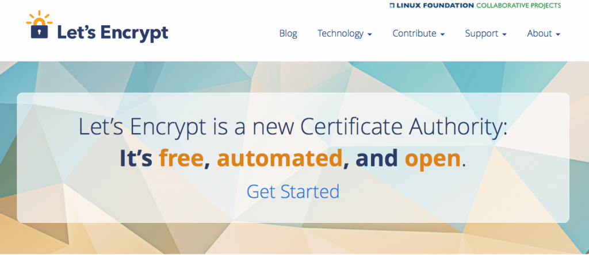

[在 2014 年，Mozilla 即與 IdenTrust、思科 (Cisco)、阿卡邁科技 (Akamai)、電子先鋒基金會 (EFF)、密西根大學 (University of Michigan) 合作設立「Let’s Encrypt」憑證機構](https://blog.mozilla.com.tw/posts/6768/)，期能讓 Web 加密機制更為普及。而我們很高興能在今天宣佈「[Let’s Encrypt](https://letsencrypt.org/)」正式結束其測試階段，也代表此一機制已更為成熟。

「Let’s Encrypt」為免費、開放、自動化的 Web 憑證授權，可協助任一網站更輕鬆的啟動加密機制。Let’s Encrypt 即使用所謂「[ACME](https://ietf-wg-acme.github.io/acme/)」的開放協定，且該協定已於 IETF 完成標準化。ACME 現有超過 40 個獨立實作成果。如 Dreamhost 與 Automattic (即執行 WordPress.com) 等數個架站服務，也都使用 ACME 整合了 Let’s Encrypt 之後達到基本的安全。

用以建構基本 Web 安全的「HTTPS」協定，其實已經問世了一段時間。但截至 2015 年底，只有[約 40% 的網頁瀏覽活動](https://mzl.la/23z19yj)，及[約 65% 的交易活動](https://mzl.la/23z18u8)是透過 HTTPS 進行。如果要 Web 達到大家所期待的隱私與安全標準，上面兩個數字就應該都是 100% 才對。而架設安全網站的最大門檻之一，就是要取得「認證」；也就是可「讓瀏覽器確認自己正與正確網站交涉」的數位憑證。之前取得憑證的過程既繁雜且所費不貲，也因此造成加密機制普及不易。

從 2015 年 11 月以來的六個月內，「Let’s Encrypt」已針對約 2400 萬個網域名稱，發出超過 1700 萬組憑證，且目前平均每天發出超過 2 萬組憑證。而由 Let’s Encrypt 所發出的憑證當中，更有超過 90% 用以保護之前完全不具備安全機制的網站。此外，現已有 20 多間他領域公司加入了 Let’s Encrypt，將真正產生跨業界的影響力。

感謝所有加入 Let’s Encrypt 並努力使其成真的人。「安全性」絕對是構成網路的基本要素，而 Let’s Encrypt 正扮演著關鍵角色，要讓所有人享受更安全的網際網路。

原文連結：[Mozilla-supported Let’s Encrypt goes out of Beta](https://blog.mozilla.org/blog/2016/04/12/mozilla-supported-lets-encrypt-goes-out-of-beta/)
