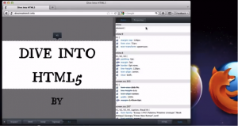

(2011/12/21 台北訊) 致力於網路開放自由的Mozilla，其Firefox瀏覽器在全球擁有數億名愛好者，今日釋出最新版 [Firefox for Windows, Mac and Linux](https://www.mozilla.org/zh-TW/firefox/new/)，新增多個內建開發工具讓網站開發者用Firefox編寫網頁更便利，同時加強版本更新功能，所有附加元件皆預設為相容。

Firefox內建數個新網頁開發工具，開發者可以透過Firefox變更網站外觀並立即顯示(WYSIWYG)。Page Inspector讓開發者可直接利用Firefox瀏覽網頁程式的結構跟版面設計，開發者可以一邊瀏覽網頁元件，同時檢視該頁的HTML語法和文件結構。Style Inspector讓編寫網站風格更加容易，開發者可以直接用Firefox取得[CSS內容](https://developer.mozilla.org/en-US/)並直接對內容進行修改。Scratchpad使用[Eclipse Orion](https://eclipse.org/orion/)編碼器提供語法高亮化…等其它功能，撰寫JavsScript更加容易。

Firefox為網站和網頁開發提供Mozilla全螢幕API (Full-Screen API)，開發者可輕鬆建立網路的全螢幕經驗，包括建立全螢幕遊戲，影音體驗以及豐富的簡報呈現。網路的[全螢幕遊戲體驗](https://hacks.mozilla.org/2011/12/paving-the-way-for-open-games-on-the-web-with-the-gamepad-and-mouse-lock-apis/)與傳統的遊戲主機環境相似，Mozilla對此項成果相當興奮，也歡迎其他瀏覽器跟進導入此功能。

Firefox同時新增支援開放源碼技術來建立3D動態網頁。Mozilla是[WebGL](https://zh.wikipedia.org/wiki/WebGL)技術發展的先驅者，並將其導入Firefox。WebGL是一項在網頁/Web apps呈現3D畫面的技術，採用硬體加速影像處理，而不需透過第三方軟體處理。Firefox最新版支援WebGL的反鋸齒(Anti-Aliasing)技術，開發者可自行建立物件並將其任意混和平滑移動。Firefox也支援[CSS 3D轉換(CSS 3D Transforms)](https://hacks.mozilla.org/2011/10/css-3d-transformations-in-firefox-nightly/)，開發者可用HTML5將2D的元件轉換成3D動畫，無需外掛第三方程式。

Mozilla同時改進了Firefox對所有附加元件的相容性問題，讓Firefox的更新的程序更加簡易，提供優質的Firefox使用經驗。

更多相關資訊：

- [立即下載 Firefox for Windows, Mac, and Linux](https://www.mozilla.org/zh-TW/firefox/new/)

- 大篇幅Release note技術文件
