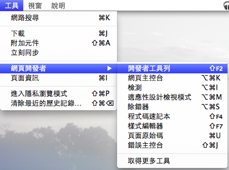

從 Firefox 4 起，我們在瀏覽器裡放入了很多功能不同的開發工具，以方便開發者檢查網頁在 Firefox 上的運行狀況。這些工具包括：

- 網頁主控台 ：提供網路連線狀況、JavaScript 及 CSS 錯誤訊息等資訊

- 網頁檢測工具 ：提供網頁元素檢測、樣式檢測等工具，也可以即時修改

- 程式碼速記本 ：可以即時測試 JavaScript，寫好的程式碼可以分片段執行、也能存檔後使用

- 樣式編輯器 ：可以即時修改網頁樣式，當然也跟程式碼速記本一樣可以另存新檔

- JavaScript 除錯器 （Firefox 15 新功能）：提供一般 Debugger 常見的中斷點、逐步執行等功能

- 適應性設計檢視模式 （Firefox 15 新功能）：適應性設計（Responsive Web Design）是現今網頁設計的顯學，開發者可以為不同螢幕尺寸提供最佳顯示模式。Firefox 新增（目前似乎也是獨家）的適應性設計檢視模式，搭配原先就有的各種工具，可以協助網頁設計師測試不同螢幕下的狀況。可以看一下這段影片從 2:02 開始的片段。

以上工具各有各的用處，也嘉惠不少網頁設計師。不過有一個顯而易見的問題：每個工具各自有一套介面與不同的使用方式，缺乏介面與使用方式上的統整。去年開發工具小組就曾表示以後會進一步整合介面，半年多過去、現在在最新的 Firefox Beta（16）裡，我們終於看到開發工具整合的起步：開發者工具列。

開發者工具列可以在「開發者工具」選單裡找到。點選後，在視窗最下方就會出現一條工具列，其中整合了網頁主控台、檢測工具、除錯工具等。點選網頁主控台，可以發現其色系與位置都配合開發者工具列而有所調整，更有一體感；而頁面檢測工具隨著版本間大大小小的修改，與剛發表的 JavaScript 除錯工具一樣，都已經與開發者工具列有一致的視覺外觀。

除了整合其他工具之外，它也一併包含「用命令列控制 Firefox 」的功能。例如，你可以用 screenshot 這個命令把目前的網頁畫面存為圖片，或者利用 resize 這個指令控制適應性設計檢視模式的尺寸。其他相關命令，可以輸入 help 來查詢。

去年來過台灣的 Paul Rouget 也順勢開發了一個 [JavaScript Terminal 套件](https://addons.mozilla.org/zh-TW/firefox/addon/javascript-terminal/)，整合進開發工具列的介面，讓你可以利用 JavaScript 獲取當前網頁的資訊，甚至修改 Firefox 的行為。

開發工具列作為各種開發工具介面整合之始，後面還會把其他工具放進來、並且也開放介面讓其他社群成員製作的工具也一起放在這裡。或許一陣子之後，大家會習慣先用 Shift + F2 叫出此列，再進一步採用其他工具。究竟 Firefox 的開發工具還能在 Firebug、Opera Dragonfly、Webkit Developer Tool 等工具之外玩出什麼新花樣？且讓咱們拭目以待。
