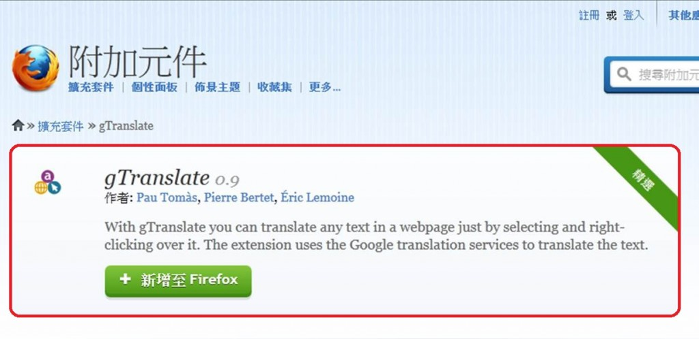
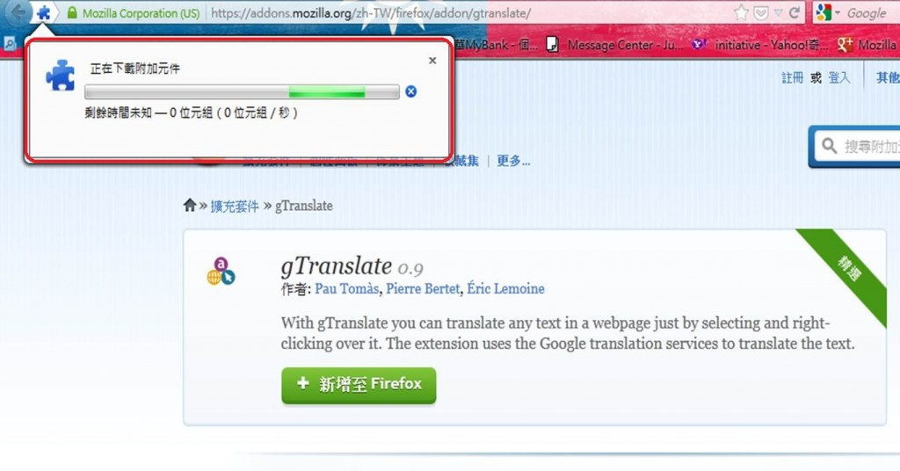
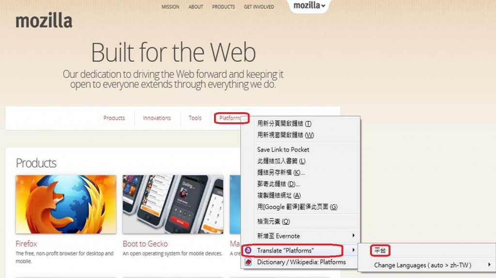
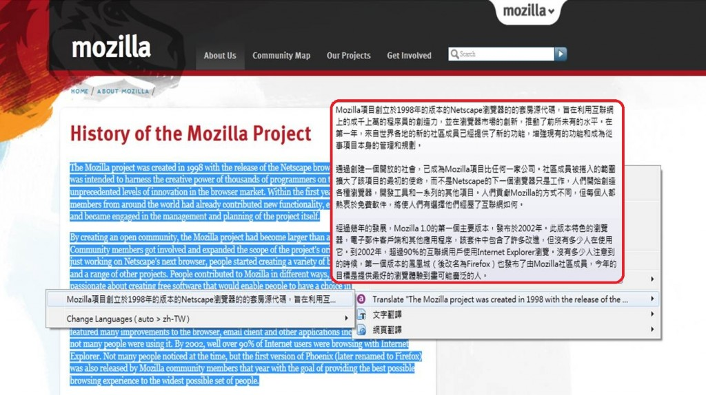

九月開學季，你／妳開始做收心操了嗎？今天要和大家分享一個學生愛用的附加元件「gTranslate」！大家不知道有沒有聽過很早很早以前有一個需付費的翻譯軟體 Dr.eye？「gTranslate」就是一個具備相似功能，但不需付費，安裝也十分簡便的即時翻譯 Add-On！

安裝好 Add-On 後，在逛網頁逛到不懂的語言時，只需就想翻譯的內容→滑鼠點右鍵→右鍵選單中選擇 a “Translate” →啪啦翻譯立即顯示：

如果你想翻譯一個單字：

或是想翻譯一整句：

還是密密麻麻的全文：

可即時翻譯「單字」、「句子」或「全文」的超好用 Add-On 推薦給你！不要以為只通用英文哦，日文、西班牙文…各語系都通呦！有了這個好用工具，包你行走天下沒煩惱！
