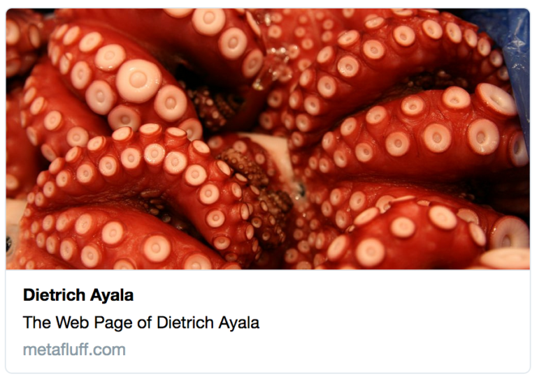
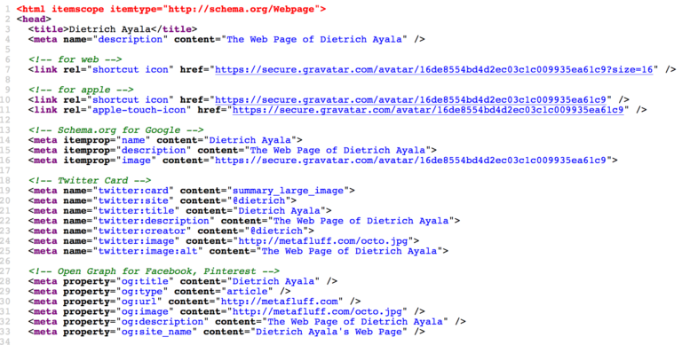
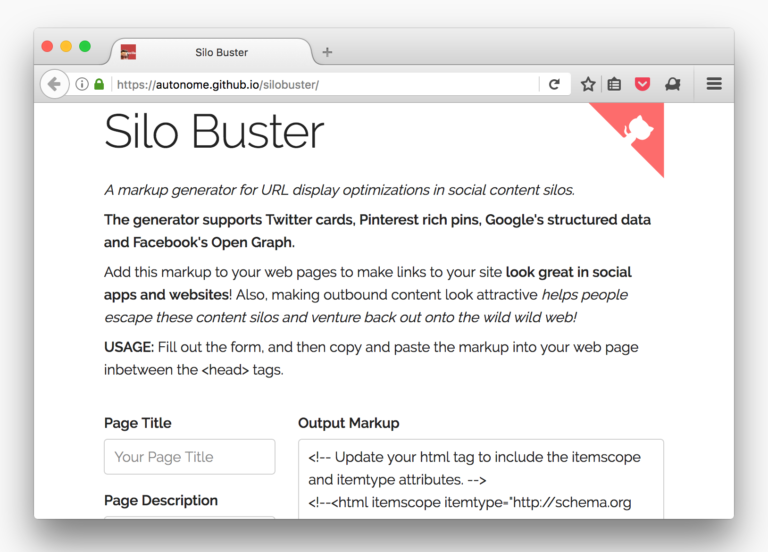

編按：本文所提「圍牆花園 (Walled garden)」意指非開放、受控制的環境，也用來表示消費者被迫只能接受某一種服務。

你可否注意過，Twitter、Facebook、Google、Pinterest 上的某些連結搭配了預覽圖片、文字敘述的摘要，以及其他資訊之後，看起來就好有趣？

為了讓這些連結有更高點擊率，網頁本身原始碼中的後設資料即帶有豐富資訊以呈現相關連結，且這些後設資料更是針對這些網站的內容平台所設計。

對開發者來說，可惜這些網路服務巨擘都已經建構了自己專屬的後設資料格式。像是推特用「[Cards](https://dev.twitter.com/cards/overview)」；Facebook 與 Pinterest 都用了「[Open Graph](https://ogp.me/)」；Google 則用了「[Schema.org](https://schema.org/)」標記結構 (Markup)。

為了這幾個主流的社交網站，開發者往往須寫出這一鍋大雜燴：

這看起來有夠複雜，而且每個網站都不盡相同。但還是有 2 個理由值得這樣做：

首先就是這些有趣的連結可以提高點擊率，為自己的網站帶來更多流量。這當然對你的部落格、業務量，或任何你分享連結的理由都甚有助益。

再來，若能在「圍牆花園」裡達到高點擊率，就代表大家終能擺脫這類桎梏，花更多時間悠遊於野性 Web 中不受限制 。

為此，本文作者 [Dietrich Ayala](https://metafluff.com/) 設計了「[Silo Buster](https://autonome.github.io/silobuster/)」。

簡單易用的「Silo Buster」網站讓你只須輸入少量資訊，就會為你產生這些社交網站所需的程式碼。接著你只要複製這一串程式碼並貼進自己的網頁，或整合到範本＼內容管理系統即可。

反正就先來 [Silo Buster](https://autonome.github.io/silobuster/) 逛逛吧！還能看看自己的分析是否有所變化。你可透過推特發張相片或摘要文字測試以其效果。

如果你想進一步了解這些網站是如何建置本身的後設資料，又是如何對你的連結除錯，可看看 Silo Buster 最後所提供的連結。

如果你自己手上也有其他訣竅，不論好壞都歡迎分享！

原文：[Vaulting Out of Walled Gardens with Fancy Links](https://hacks.mozilla.org/2016/09/vaulting-out-of-walled-gardens-with-fancy-links/)
