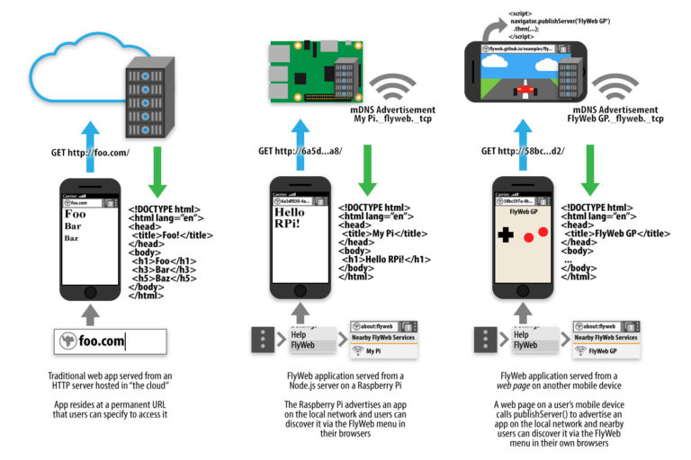

我們潛身於 Mozilla 的「平台 (Platform)」部門之內打造原型，才有目前為實驗性質的「FlyWeb」專案。FlyWeb 本是從去年晚期才開始的附屬專案，當初僅由一個臨時的小團隊負責產出「版本 0」的概念，接著就是花上 6 個月的時間實作，現在總算到了可以向大家談一下成果的時候。特別是 Web 與硬體開發者應該會有興趣。

我們的基本目標是：讓實際位置相近的人或裝置，都能輕鬆的相互連結 App 與內容。我們要讓任一人都能成為「區域網路 Web 伺服器」，而他人只要開啟瀏覽器就能連上此伺服器，再由使用者與開發者決定所要提供的內容。

在你電腦或智慧型手機上載入的網頁，或連上你網路的小型硬體裝置，都能成為 FlyWeb 伺服器。FlyWeb 伺服器並非要連上整個網際網路，而是讓某個區域網路上的使用者 (如實際距離已極為接近) 能相互連線。

FlyWeb 的設計甚為簡單：任一個 FlyWeb 伺服器就是 Web 伺服器，並透過 mDNS 在區域網路中宣告自己的存在。而我們在 Firefox Nightly 中增加了小型的使用者介面 (UI) 元素，可讓你列出區域網路中已宣告的 FlyWeb 服務 (預設關閉，須設定 
			dom.flyweb.enabled  為「true」才能啟動)。當你選擇所要連線的服務時，瀏覽器即針對該服務建立專屬的「UUID 主機名稱 (Hostname)」，並將所有包含該主機的網址都連至該服務。此外，我們更透過新的 
			navigator.publishServer()  函式擴充了 Web API，可讓網頁在區域網路上發佈一組 FlyWeb 伺服器；但須先經過使用者同意。

而此種設計主要支援 1). 瀏覽器之間的互動，以及 2). 複數瀏覽器與「為使用者呈現 UI 的智慧硬體」之間的其他互動。此兩種情形都可透過此一架構處理。

接著將透過〈[「FlyWeb」純正的 Web 跨裝置互動 (中)](https://medium.com/@moz2000tw/flyweb-%E7%B4%94%E6%AD%A3%E7%9A%84-web-%E8%B7%A8%E8%A3%9D%E7%BD%AE%E4%BA%92%E5%8B%95-%E4%B8%AD-3a6eec65245#.hkdvjj684)〉向大家介紹該如何透過 FlyWeb 在瀏覽器之間互動。
