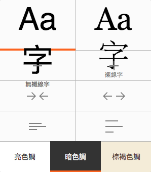
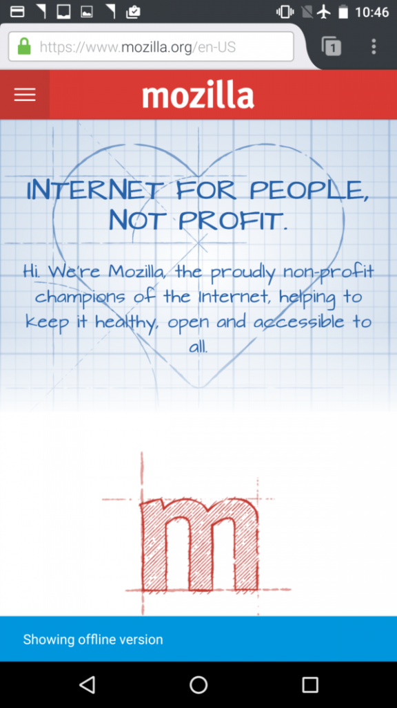

### 桌面版與行動版更添新功能

正值夏秋交替的時節，我們釋出最新 Firefox 桌面版 (Firefox for Desktop) 與行動版 (for Android)，且兩者的更新功能將提供更佳體驗。

#### 擴充支援多程序 (Multi-process) 功能

我們才在上個月啟動了 Firefox 問世以來最大規模的更新，為桌面版添增了多程序功能，讓 Firefox 反應更快、減少延遲時間。根據我們的初期測試，Firefox 整體反應速率提升了 4 倍。

釋出多程序的第一階段，主要是納入未安裝附加元件的使用者。而在此版本中，我們更延伸支援一小部分可相容的附加元件，期能在 2017 年讓所有 Firefox 使用者都能享受多程序的體驗。

#### 桌面版強化了閱讀器模式

本次更新另對「閱讀器 (Reader)」模式進行兩項強化。閱讀器可去除如按鈕、廣告、背景圖片等雜亂的元素，並可更改網頁文字的大小、對比、版面配置，提供更好的閱讀經驗。現在我們更新增了朗讀文字的選項，可直接朗讀你最愛的文章，讓你邊聽邊瀏覽而不致受到其他干擾。

我們另擴充了閱讀器的自訂功能，讓使用者能調整文字與字型，甚至選擇朗讀的聲音。此外，如果你也屬於夜貓子一族，更能調整閱讀器為「暗色調」，讓自己在黑暗中閱讀得更舒適。

#### 行動版可離線檢視頁面

如果你必須離線或連線網路不穩定時，Firefox 行動版現仍可存取之前檢視過的頁面。也就是說，即使你現在無法連線，也還是能與之前檢視過的大部分內容互動。但根據你手上裝置規格的不同，此功能也許不適用於某些頁面。就請你在飛航模式下開啟 Firefox 試試看吧！

我們仍持續開發更多新功能，要提供你更完美的 Firefox 使用經驗。請儘快下載最新的 Firefox 桌面版與行動版，不吝讓我們知道你的意見。

- 下載 [Firefox 桌面版 (Firefox for Windows, Mac, Linux)](https://www.mozilla.org/firefox/channel/#firefox)

- [Firefox 桌面版之版本說明](https://www.mozilla.org/en-US/firefox/49.0/releasenotes/)

- 下載 [Firefox 行動版 (Firefox for Android)](https://play.google.com/store/apps/details?id=org.mozilla.firefox&referrer=utm_source%3Dmozilla%26utm_medium)

- [Firefox 行動版之版本說明](https://www.mozilla.org/en-US/firefox/android/49.0/releasenotes/)

原文連結：[Latest Firefox Expands Multi-Process Support and Delivers New Features for Desktop and Android](https://blog.mozilla.org/blog/2016/09/19/expanded-multi-process-desktop-android-updates/)
