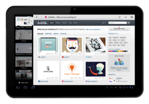

提供平板電腦優化體驗

(2011/12/21 台灣台北) 致力於網路開放自由的 Mozilla，其 Firefox 瀏覽器在全球擁有數億名愛好者，今日發布最新版 Firefox for Android 展現全新設計，特別提供平板電腦優化體驗，讓行動上網更為直覺。Firefox 新工具讓開發者可設計互動式的行動上網體驗。

請按此看影片介紹 [Firefox for Android](https://mzl.la/vU6rXb)

基於平板電腦大螢幕的特性，Firefox for Android的許多熱門功能在平板電腦上得以操作更順暢。Awesome Screen 結合 Firefox Sync (同步功能)，讓使用者更容易取得儲存在各個不同平台的資料，無論是在桌機或手機內的Bookmark、History、Password、Open Tabs，甚至是網站密碼都可相互同步存取，無須在不同裝置上為了進入同一個網站而重複輸入密碼，而有更多時間享受上網樂趣。

Tabs (分頁) 以縮圖的方式呈現在左視窗，讓您可在快速切換的同時繼續在右視窗瀏覽網頁，只需將手指向左滑動即可隱藏分頁進行全螢幕瀏覽。

Firefox 讓您的網路經驗最佳化，使用平板電腦瀏覽網頁無論直看或橫看都舒適。在直看時分頁會排列在上方選單，當您不想看到分頁同樣也只需滑動手指便可輕鬆隱藏。

全新 Action Bar 選單 (在 Awesome Bar 旁邊) 內含 Firefox 最愛清單、附加功能、下載檔案… 等等，並新增回上頁、回下頁、書籤按鈕，讓操作更簡便。One-touch (一觸加入) 儲存書籤功能可將網站圖示放置在 Android 首頁，讓您輕鬆存取最愛的網站以及Web apps，開啟Web apps就像開啟OS內部程式一樣簡單無障礙。

網站開發者將愛上 Firefox 內建的最新 HTML 5 工具，因為在網站上開發有趣的互動式行動網路體驗變的十分容易。HTML 5 Input Tag for Camera Access功能讓開發者的網站和Web apps更強大而具互動性。開發者可透過該工具開發一套讓使用者在瀏覽網站的同時可用Android手機或Android平板電腦內建的Camera來拍照、讀取條碼…等功能。

Firefox for Android 支援 HTML5 Form Validation API，可自動驗證網站form fields (表格欄位)，例如數字、Emails、URL，開發者不需另行設計程式或使用第三方資料庫。

如需更多產品資訊：

[Download Firefox](https://www.mozilla.org/firefox/)

[Long, technical release notes](https://www.mozilla.org/en-US/firefox/9.0/releasenotes/)

[Future of Firefox](https://www.mozilla.org/firefox/channel/)

[Firefox for Android](https://market.android.com/details?id=org.mozilla.firefox)
