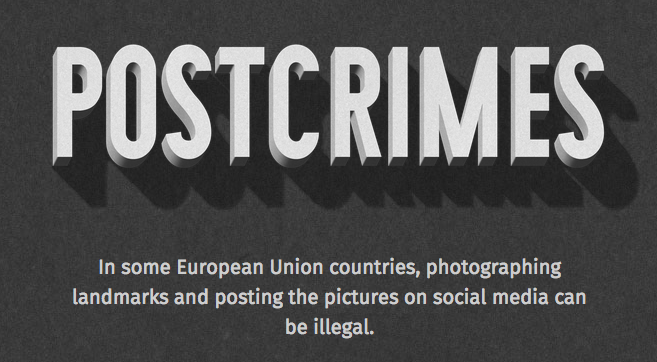

### 寄張違法的自拍照到歐洲議會 (我是認真的！)

歐盟目前的著作權法革新提案仍原地打轉，也讓許多已是日常的線上創作活動依然違法。高限制性的法律依舊扼殺著創新與科技業務等活動。請加入我們簽署 Mozilla 的請願書、觀看並分享影片，並開心拍張觸法的自拍照吧！

歐盟執行委員會 (EU Commission) 已於本月稍早宣佈了著作權法改革提案。Mozilla 藉由〈[to take a rebellious selfie and send that doctored snapshot to EU Parliament](https://postcrimes.org/)〉一文對上述提案做出回應，也希望你可先讀過此文章。看出可笑之處了嗎？如此過時的法案，竟然禁止在巴黎鐵塔的夜景前拍自拍照，甚至哥本哈根的美人魚雕像前自拍也是觸法的！

當然，目前為止應該沒人真的因為自拍了上述場景而去坐牢。但是類似的基本線上日常行為在技術上卻是違法的，這也成為這次著作權法改革提案的致命缺點。如 Mozilla 的 Denelle Dixon-Thayer 在其〈[提議法案革新](https://blog.mozilla.org/blog/2016/09/14/commission-proposal-to-reform-copyright-is-inadequate/)〉提過的，本次改革提案完全忽略了「解放創新與創造力的現代化改革」的目標。舉例來說，提案並未提到街頭取景 (Panorama)、詼諧仿作 (Parody)，甚或重新合成 (Remixing) 等行為，相關條文亦未開放非商業性的作品轉換 (如混搭或重新合成)，也沒提到開放標準或公平交易的使用者彈性條文。

誰來翻譯翻譯？網路梗的延伸創作或惡搞圖片還是違法的！

文字與資料探勘活動，僅限公共機構才能合法進行。這當然會扼殺新創公司在線上尋找資料並進行創新業務的行為。另外還有危險的「鄰接權 (Neighbouring right)」，即類似德國與西班牙的附屬著作權法 (明顯也都是[失敗](https://fortune.com/2016/03/24/eu-ancillary-copyright/)的法律)。這個內容偏差的部分提案，將讓線上內容供應商保有「新聞出版」的著作權最多 20 年，並可既往追溯。到底有誰適用此新的鄰接權，模糊的用字並未能明確定義。

最後還有另項不清楚的條文，即要求任何「能為使用者存取『大量』作品」的網路服務，必須一併提供仲介合約予作品的所有權人，確認對方同意提供其作品的使用、保護等權利 ─ 這代表未來可能透過「有效內容識別 (Effective content recognition)」技術，還須搭配嚴格的監控與篩選技術，才得以識別及＼或移除具著作權的內容。

這些改革提案一旦成真，將會影響歐盟境內的許多新創公司、獨立工程師、創作家、藝術家；當然也會危害網際網路在引領經濟成長與創新時的健全。

Mozilla 當然不是在鼓吹剽竊或盜版。創作者理應享有公平的對待，更應藉由其創作作品獲得對等的收入。我們希望能提升所有人的著作權，因此個人的創作、創新不該遭到打壓。

Mozilla 推動的議題並非孤掌難鳴：已超過 50,000 人[連署了我們的請願書](https://changecopyright.org/)，要求制定更符合時宜的著作權，以協助培養線上的創意、創新、機會。

隨著歐洲議會在今年秋天修改提議書之後，我們將需要更進一步的行動，將召集熱血的網民一同訴求更好、更現代的法律。Mozilla 現正啟動公眾教育方案來支援該運動。

在某些歐盟國家中，拍攝地標照片並貼在社交媒體上就可能違法。

Mozilla 已設計了 App 來強調某些過時著作權法的荒謬。你可試試「[Post Crimes](https://postcrimes.org/)」。根據這些「管很大」的著作權法，在著名的歐洲地標＼景點 (如巴黎鐵塔的夜景或丹麥的美人魚雕像) 前面自拍，你技術上就違法了。

接著將你的自拍照以明信片的形式，寄給你所屬地區的議會議員。讓這些官員了解著作權法到底過時到什麼程度，也促使他們制定更前瞻性、對創新行為更友善的著作權法。

我們另錄製了 3 組短片，強調法條革新的重要。影片看來有趣、頗富教育意義，甚至有點弔詭，但都傳達了嚴肅問題：過時且高度限制的著作權法，現正影響著我們的創造力與網路的開放性。我們希望在你欣賞影片過後也動手分享出去。

Mozilla 需要你起身相挺更好的著作權法。只要你[連署請願書](https://changecopyright.org/)、拍張自拍照，或分享了上述影片，你就是和大家一同支援線上的創造、創新、機會！

原文連結：[Help Fix Copyright: Send a Rebellious Selfie to European Parliament (Really!)](https://blog.mozilla.org/blog/2016/09/26/help-fix-copyright-send-a-rebellious-selfie-to-european-parliament-really/)
