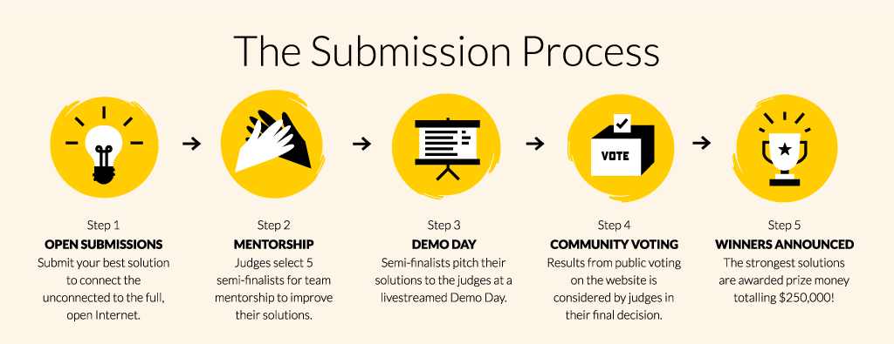

Mozilla 正式啟動「公平費率創新挑戰賽 (Equal Rating Innovation Challenge)」，將頒發總獎額 25 萬美金並提供專業導師從旁協助，期能發掘更多新方法以讓更多人享受網路。

Mozilla 相信，不論性別、收入、所處的地理位置，只要每個人都能在平等立足點上參與網路，就能成就最強大的網際網路。但是「數位落差 (Digital divide)」仍是目前最明顯且難以打破的現實情況。根據〈[世界經濟論壇 (World Economic Forum)](https://www3.weforum.org/docs/WEF_Internet_for_All_Framework_Accelerating_Internet_Access_Adoption_report_2016.pdf)〉指出，至今仍[超過 40 億人](https://www3.weforum.org/docs/WEF_Internet_for_All_Framework_Accelerating_Internet_Access_Adoption_report_2016.pdf)，也就是全球超過 55% 的人口尚未能連上網路，其中許多居住在貧困或鄉村地區的人連基礎建設都缺乏。即便是快速架設型的有線或無線 (Wifi) 網路，也僅能觸及 30% 的鄉村地區。另外還有人根本不認為自己的語言已有足夠的數位內容可用。而根據全球資訊網基金會 (World Wide Web Foundation) 的調查指出，女性使用或接觸網路的比例亦偏低 ─ 目前有 37% 的女性使用網路；低於男性的 59%。

單就只是「存取」網路也還不夠。由特定供應商所規劃的特定內容與「圍牆花園 (Walled garden，意即非開放、受控制的環境)」，也正破壞著如民主、可供多人參與等的網路本質。[Mozilla 基金會主席 Mitchell 已於 2015 年的部落格文章中提過「公平費率 (Equal rating)」](https://blog.lizardwrangler.com/2015/05/06/zero-rating-and-the-open-internet/)。 此外，Mozilla 已於[美國](https://blog.mozilla.org/netpolicy/2015/02/09/victory-for-net-neutrality-lets-take-it-across-the-finish-line/)、[歐洲](https://blog.mozilla.org/netpolicy/2016/06/20/eu-users-can-stand-up-for-net-neutrality/)、[印度](https://blog.mozilla.org/netpolicy/2016/07/01/protecting-the-open-internet-in-india/)等地成功參與了為網路中立性立法的宣達活動。而我們的「開放創新 (Open Innovation)」團隊正嘗試要將實際且行動導向的新思維，注入上述的許多努力成果。

因此，我們很高興能啟動全球性的「公平費率創新挑戰賽」。此一競賽希望能激發大家的創造力，協助下一批十億人口連上網路。 挑戰賽目前重點先放在高創意的新解決方案，期能讓未連線的人開始上網。相關解決方案可以是消費性產品、新奇的行動服務、新的商業模式，甚至基礎建設的提案等。Mozilla 除了將頒發總額 25 萬美金的獎金之外，也會提供專業的導師機制來落實這些解決方案。

Mozilla 希望能接觸全世界更多的企業、設計師、研究者、創新人員，藉以[提出更高創造力、交流性、更能靈活延伸的想法](https://equalrating.com/your-submission/)，希望進一步培養眾人的數位素養，並提供親民費率的上網方案，最後讓大家都能接觸 Open Web。特別一提，我們歡迎針對當地民情與專業知識所設計的提案，最後目標是能擴及全球的 App。

總額 25 萬美金將分為 3 個獎項：

- 整體最佳 (關鍵評分：可擴充性)

- 整體次佳

- 最具創意解決方案 (關鍵評分：透過實驗獲得潛在的高回報率)

此金額或許足以供團隊實際產出消費性產品並上市；若是基礎建設專案，或許可提供足夠資源直到下一輪募資。

正式提案期間從 11 月1 日到 1 月6 日為止。所有提案將交由專業評審團於 1 月中開始審查。晉級團隊在 3 月初示範自己的概念之前，Mozilla 就會指派專業導師加入專案，最後於 2017 年 3 月底選出贏家。

1. 提案 2. 導師輔助 3. 示範成果 4. 社群票選 5. 宣佈贏家

我們也架設了「[www.equalrating.com](https://equalrating.com/)」網站，提供挑戰賽的相關教學內容與背景資訊。你可在網站上找到 [3 個關鍵框架](https://equalrating.com/overview/)，應有助於你從不同的面相了解此專案，另可參閱[關鍵統計數據](https://equalrating.com/key-facts/)，以更人性化的方式了解上網問題，並看看網路連線是如何影響性別動態關係 (Gender dynamics)、教育、經濟，以及其他多樣的社會問題。[報告區塊](https://equalrating.com/key-facts/)則是針對目前議題深入不同觀點。在接下來數週內，我們另將舉辦一系列的網路研討會，讓有意願的參賽者獲得更多挑戰賽細節，也希望這些網路研討會能引來更多機會與值得討論的問題。

讓未能上網的人升級為網民，是 Mozilla 目前最大的挑戰之一。還沒有任何一個組織能獨自解決此一難題。請幫我們將訊息傳播出去。[提交你的想法](https://equalrating.com/your-submission/)，協助我們設計創新的方式，讓下一批十億人，再另一批十億人陸續成為日常網民。請加入我們一起克服挑戰。

進一步資訊：[www.equalrating.com](https://www.equalrating.com/)

聯絡窗口：[equalrating@mozilla.com](mailto:equalrating@mozilla.com)

原文連結：[Bringing the Power of the Internet to the Next Billion and Beyond](https://blog.mozilla.org/blog/2016/10/13/bringing-the-power-of-the-internet-to-the-next-billion-and-beyond/)
