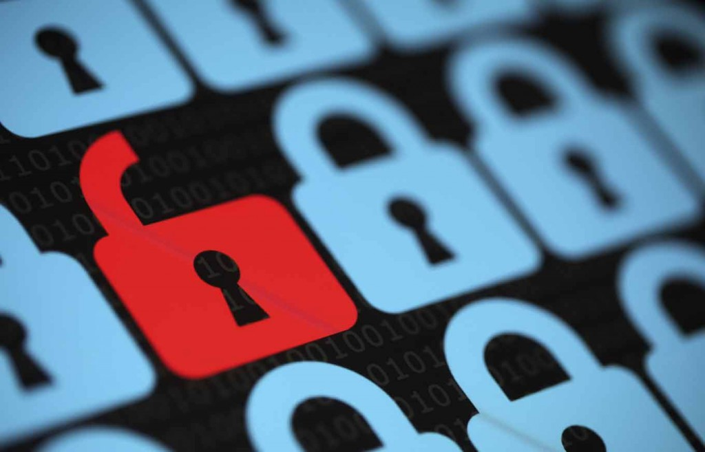

Mozilla 發現中國的「沃通 (WoSign)」[憑證授權機構 (Certificate Authority；CA)](https://wiki.mozilla.org/CA:FAQ) 發生許多[技術與管理上的錯誤](https://wiki.mozilla.org/CA:WoSign_Issues)。最嚴重的一點，就是其他 CA 為安全性考量，已經自 2016 年 1 月 1 日起停止核發 SHA-1 SSL 憑證，但我們[竟然發現](https://docs.google.com/document/d/1C6BlmbeQfn4a9zydVi2UvjBGv6szuSB4sMYUcVrR8vQ/edit?usp=sharing)沃通[竄改](https://wiki.mozilla.org/CA:WoSign_Issues#Issue_S:_Backdated_SHA-1_Certs_.28January_2016.29)了該 SSL 憑證為較早日期，藉以規避此一[停止核發日期](https://mozillacaprogram.secure.force.com/Communications/CommunicationActionOptionResponse?CommunicationId=a04o000000M89RCAAZ&Question=ACTION%20%233:%20After%20January%201,%202016)。此外，我們[還發現](https://groups.google.com/d/msg/mozilla.dev.security.policy/0pqpLJ_lCJQ/z69lmZ88DwAJ)在沃通併購同業「StartCom」並完整取得其經營權之後，也未依照 Mozilla 政策而公開揭露此一併購行為。在彙整相關有效資料證實我們所言非虛之前，沃通與 StartCom 的負責人更對上述情事一概否認。基於公司負責人展現的欺瞞行為，Mozilla 決定不再信賴此兩間公司的根憑證 (Root certificate)。

圖片來源：http://www.cpapracticeadvisor.com/

Mozilla 為此採取下列行動：

- 針對 2016 年 10 月 21 日之後所頒發的憑證，及其相同根憑證的憑證串鍊，現一律取消其信任。如果再發現其他日期竄改行為 (不論以何種方法造成) 欲規避此一控制方式，Mozilla 將立刻且永久撤銷受影響的根憑證。 此一改變將自[Firefox 51 版本起生效](https://wiki.mozilla.org/RapidRelease/Calendar)。

- 程式碼將透過下列[主體唯一識別名稱 (Subject Distinguished Names)](https://en.wikipedia.org/wiki/X.500#X.500_data_models) 來識別根憑證，因此控制行為亦將套用到這些根憑證的[互簽憑證 (Cross-certificates)](https://en.wikipedia.org/wiki/X.509#Certificate_chains_and_cross-certification)。 CN=CA 沃通根证书, OU=null, O=WoSign CA Limited, C=CN

- CN=Certification Authority of WoSign, OU=null, O=WoSign CA Limited, C=CN

- CN=Certification Authority of WoSign G2, OU=null, O=WoSign CA Limited, C=CN CN=CA WoSign ECC Root, OU=null, O=WoSign CA Limited, C=CN

- CN=StartCom Certification Authority, OU=Secure Digital Certificate Signing, O=StartCom Ltd., C=IL

- CN=StartCom Certification Authority G2, OU=null, O=StartCom Ltd., C=IL

- 先前所發現與相關根憑證串連的[日期竄改 SHA-1 憑證](https://bugzilla.mozilla.org/show_bug.cgi?id=1309707#c2)，均列入 [OneCRL](https://blog.mozilla.org/security/2015/03/03/revoking-intermediate-certificates-introducing-onecrl/)。

- 不再接受安永香港 (Ernst & Young Hong Kong) 的稽核報告。

- 未來將擇期自[Mozilla 根憑證資料庫](https://wiki.mozilla.org/CA:Overview)中移除受影響的根憑證。如果沃通的新根憑證[達到可接受的標準](https://wiki.mozilla.org/CA:How_to_apply)，Mozilla 可能根據沃通的規劃來調整移除憑證的確切日期，以利將其客戶整合至新的根憑證。否則 Mozilla 得以於 2017 年 3 月之後的任一時間移除根憑證。

- Mozilla 保留所有更進一步或其他替代行為的權利。

如果你在 2016 年 10 月 21 日之後，接收到此兩間 CA 之一所核發的憑證，則該憑證將於 Mozilla 產品 (如[Firefox 51 或以後的版本](https://wiki.mozilla.org/RapidRelease/Calendar)) 中失效，直到此兩間 CA 以不同的主體唯一識別名稱提供新的根憑證為止。你可[手動匯入](https://wiki.mozilla.org/CA:UserCertDB#Importing_a_Root_Certificate)憑證所串連的根憑證。在 Mozilla 的根憑證資料庫納入新的根憑證之前，貴網站的消費者亦必須手動匯入新的根憑證。

如 [Bug #1311824](https://bugzilla.mozilla.org/show_bug.cgi?id=1311824)、[Bug #1311832](https://bugzilla.mozilla.org/show_bug.cgi?id=1311832) 分別對沃通以及 StartCom 所述，此兩間 CA 均可重新申請加入新的 (替代) 根憑證。

我們認為相關回應動作與 Mozilla 政策甚為一致。若其他 CA 也透過類似的欺瞞手法，企圖規避[Mozilla 的 CA 憑證策略](https://www.mozilla.org/en-US/about/governance/policies/security-group/certs/policy/)、[CA/Browser Forum Baseline Requirements](https://cabforum.org/baseline-requirements-documents/)，或是 Mozilla 負責人的直接詢問，我們均將採用相同的回應方式。

─ Mozilla 安全團隊

原文連結：[Distrusting New WoSign and StartCom Certificates](https://blog.mozilla.org/security/2016/10/24/distrusting-new-wosign-and-startcom-certificates/)
