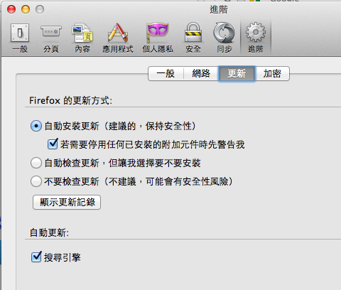

Firefox 的快速開發週期已經跑了一年多，除了版號之外其實功能與效能上也都有不錯的進展。本來快速開發週期就是為了在更短的時間內，讓大家能享受新科技帶來的方便，不過相對來說也產生了一些後遺症。這些所謂的「後遺症」為使用者帶來些許不便，也導致罵聲連連，但有了各位的回饋、新版的 Firefox 裡已經把許多問題解決、改善了。你還覺得 Firefox 升級後套件會全掛點嗎？我們新推的「自動升級」是否是強迫你一定要升級呢？看完這篇就知道：

### Firefox 升級後套件全掛

在過去一年多才更新一次大版號的時代，每次改版都有許多介面與功能上的調整，也可能會有許多套件沒來得及修改、因而失效無用。為了避免套件失效後反而對使用者帶來更慘烈的影響（例如，讓你的瀏覽器完全無法使用），過去我們會檢查套件作者所設定的「相容版號」，且在版本升級時會停用所有相容版號不符的附加元件。

打個比方，如果附加元件 AdBuster Plus 的作者將相容版號設定為 1.5-3.6，那麼在你升級到 Firefox 4 以後，這個套件就會自動停用。若作者檢查套件，並且更新相容版號為 1.5-3.6，則在套件更新之後又會重新啟用了。

這過去也造成某些不便，畢竟總是有些附加元件其實功能十分單純，不必修改任何東西就能相容新版，還要要求作者去檢查一次並且更新版號，總是得花點功夫。不過畢竟一年多才一次，大家縱有抱怨也還在能接受的範圍，就此相安無事地過了幾年。但這麼和平的日子，在快速開發週期實施後就消失了 — 每六週改版一次，不就是要求套件作者每六週檢查一次版號嗎？這也太煩人啦！

所以從年初發表的 Firefox 10 開始，附加元件的檢查機制已經有所改變，現在更新 Firefox 時、絕大部分的附加元件都能正常使用。詳情可見 [Firefox 10 起，附加元件將一律預設為相容](https://blog.mozilla.com.tw/posts/70/firefox-10-%E8%B5%B7%EF%BC%8C%E9%99%84%E5%8A%A0%E5%85%83%E4%BB%B6%E5%B0%87%E4%B8%80%E5%BE%8B%E9%A0%90%E8%A8%AD%E7%82%BA%E7%9B%B8%E5%AE%B9)一文。

當然還是有些套件或許無法順利相容：你知道的，Firefox 附加元件可以修改的範圍在眾瀏覽器中最為全面，有些比較複雜的東西仍然會因為 Firefox 改版而有所影響。但無論如何，這個問題已經大大改善，值得你再回頭試試看！

### 「自動升級」不能停用？

你可能知道，這兩個月的 Firefox 已經開始實施[「自動升級」制度](https://blog.mozilla.com.tw/posts/399/mozilla-firefox%E6%9B%B4%E6%96%B0%E7%89%88%E6%9C%AC%E5%85%A8%E6%96%B0%E9%87%8B%E5%87%BA%EF%BC%8C%E8%87%AA%E5%8B%95%E5%8D%87%E7%B4%9A%E5%8D%B3%E5%88%BB%E7%94%9F%E6%95%88%EF%BC%81)。Firefox 會在盡可能不打擾你的狀況下幫你升級新版，搭配剛剛提到的「擴充套件預設相容」機制，能讓 Firefox 永遠保持在最佳狀況。

不過或許你有其他考量，希望能停用這「自動升級」的功能。可能有人跟你講過別的瀏覽器很難停用這種自動升級機制，不過在 Firefox 裡其實非常簡單，這個選項就放在偏好設定（選項）裡的「進階 / 更新」裡。你可以選擇讓 Firefox 自動更新，或自動檢查、手動更新（跟以前的版本一樣），甚至不檢查也不更新，都沒有問題。

當然，這樣子經常更新整體來說也是為了大家好，但這時代最精采的地方之一，就是你可以決定什麼對自己最好。所以若你仔細考量過，了解停用更新會有什麼壞處，那麼你還是有選擇的。

若您是企業網管，停用 Firefox 更新的原因是不堪每六週一次的軟體相容測試，那或許你可以考慮使用[延長支援版](https://blog.mozilla.com.tw/posts/157/mozilla-%E5%B0%87%E6%8F%90%E4%BE%9B-firefox-%E5%BB%B6%E9%95%B7%E6%94%AF%E6%8F%B4%E7%89%88)，至少會比不更新更安全。
