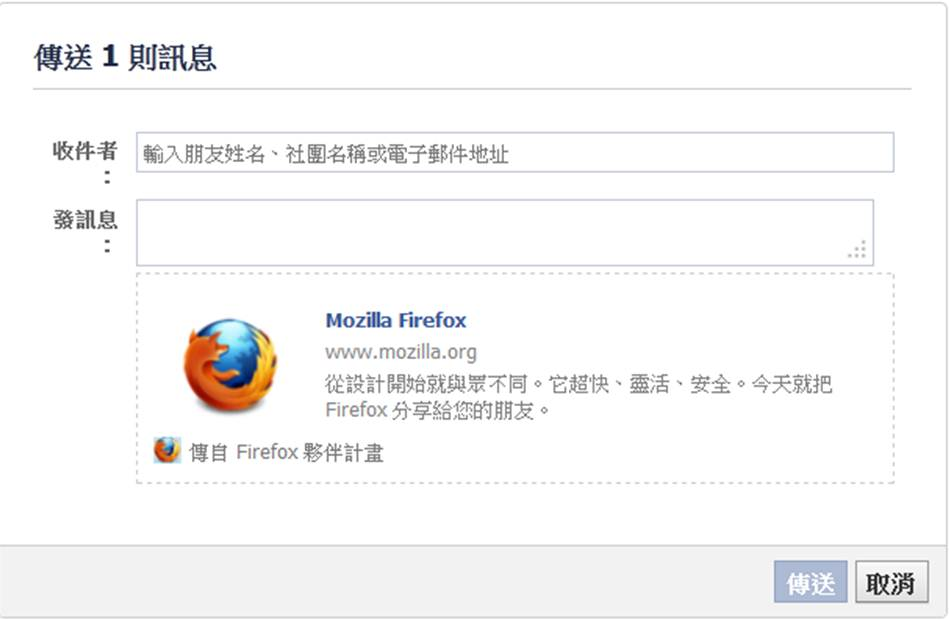

地圖不可用

	活動時間

	日期 2012/09/12 - 2012/12/31

	地點

	

Firefox 邀請您參與全球『Firefox 夥伴計畫 App』，請即刻按下連結：[https://apps.facebook.com/fxaffiliates/](https://apps.facebook.com/fxaffiliates/)！Firefox 夥伴計畫 App 讓您輕鬆製作 Firefox 廣告小圖，並將分享到您的 Facebook 個人塗鴉牆，鼓勵你的親朋好友下載 Firefox。只要你的廣告小圖有夠多的點擊數，就有機會成為 Firefox 在臉書上的廣告代言人。

Firefox 讓你與全球社群一同攜手，與朋友和家人分享下載最強大、尖端、好用的 Firefox，與全世界串連，加入並感受最獨一無二的社群體驗！

不只是分享，更增添競賽趣味

『Firefox 夥伴計劃 App』在您加入並分享 Firefox 廣告小圖後，便會自動計算參加者的點擊數，歡迎你常回來看看自己的積分狀況。而積分最高的前幾名夥伴將會被列於我們的領先者名單，此外，只要你選擇願意，你所製作的 Facebook 廣告小圖就有機會由 Firefox 贊助，成為 Facebook 在全球的付費廣告，榮耀加倍。

現在，請跟著以下操作步驟，一步步完成！首先，請選擇您想要放到 [banner builder](https://affiliates.mozilla.org/fb/banners/new) 裡面編輯的橫幅設計，您也可透過「常見問題」和「領先者名單」以及右側的「統計概要」了解目前的最新動態！

接著，請新增您為什麼喜愛 Firefox 的理由，並點下「分享」。這樣將會把橫幅張貼到您的 Facebook 時間軸當中。當您的橫幅有修改時，您的時間軸上也會同步更新。 若要將您在 affiliates.mozilla.org 的帳號連結到此應用程式，請使用「我的橫幅」頁面中的連結精靈。連結帳號後，我們將會傳送確認信給您。若您想要註冊帳號，請到 [affiliates.mozilla.org](https://affiliates.mozilla.org) 註冊。

您也可邀請家人朋友一起下載 Firefox！

請分享到自己的時間軸，Happy Sharing~

『Firefox 夥伴計劃 APP』支援繁體中文、英語、法語、德語、西班牙語等多國語系！台灣地區習慣閱讀繁體中文的狐迷好友，如果你慣用的 Facebook 是英文界面，請記得到你的 Facebook 臉書帳號設定，把語言設定改成中文(台灣)喔，閱讀完整的訊息喔！

