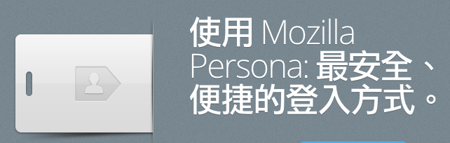

香蕉人又登場了，今天要來教大家使用 Persona 囉！這是什麼? 能吃嗎?! 是新口味的香蕉嗎？！ 有在發落[Mozilla Taiwan 部落格](https://blog.mozilla.com.tw/main)的捧油應該不陌生啦，新朋友別緊張啦~ Persona 的詳細介紹可以看 [http://blog.mozilla.com.tw/posts/1061/安全可靠-persona-網路身份認證系統-beta-版首度釋出！](https://blog.mozilla.com.tw/posts/1061/)簡單來說，Persona 是一種安全，簡單又快速的登入方式，全新體驗保障使用者的隱私哦！

Persona 除了使用者登入方便以外，香蕉人發現開發起來也是輕鬆寫意啊，只要簡簡單單的三個步驟，就可以在你的網站上或是web app上加入Persona。馬上就來看第一步：

#### Step 1.

因為 Persona 還未內建在任何的 Browser 裡，所以請在你的網站加上~ Persona 的Library [https://login.persona.org/include.js](https://login.persona.org/include.js)

#### Step 2.

請在你的網站上加上兩個按鈕，分別是「登入」及「登出」的按鈕

其中在「登入」的按鈕中加上 onclick 的事件：

var signinLink = document.getElementById("signin");

if (signinLink) {
 signinLink.onclick = function(evt) {
 // Requests a signed identity assertion from the user.
 navigator.id.request({
 siteName: "網站名稱",
 siteLogo: "/logo.png",
 termsOfService: "/tos.html",
 privacyPolicy: "/privacy.html",
 returnTo: "/welcome.html",
 oncancel: function() { alert("我害羞，不要登入！"); }
 });
 };
}

					123456789101112131415

						var signinLink = document.getElementById("signin"); if (signinLink) { signinLink.onclick = function(evt) { // Requests a signed identity assertion from the user. navigator.id.request({ siteName: "網站名稱", siteLogo: "/logo.png", termsOfService: "/tos.html", privacyPolicy: "/privacy.html", returnTo: "/welcome.html", oncancel: function() { alert("我害羞，不要登入！"); } }); };}

另外「登出」的按鈕也加上下面的事件

var signoutLink = document.getElementById("signout");

if (signoutLink) {
 signoutLink.onclick = function(event) {
 event.preventDefault();
 navigator.id.logout();
 };
};

					12345678

						var signoutLink = document.getElementById("signout"); if (signoutLink) { signoutLink.onclick = function(event) { event.preventDefault(); navigator.id.logout(); };};

#### Step 3.

最後我們要在網站放一隻「看門狗」，來確定使用者是不是成功登入了。

var user_email = <!--?php echo $email; ?-->;
navigator.id.watch({
 loggedInUser: user_email, //註1
 onlogin: function(assertion) {
 // 使用者已經登入囉~ 你可以做些事情
 // 1. 將assertion 送至 Persona檢驗並建立 Session
 // 2. 更新你的UI
 },
 onlogout: function() {
 // 使用者已經登出囉，你可以做些事情：
 // 清除session囉~
 }
});

					12345678910111213

						var user_email = <!--?php echo $email; ?-->;navigator.id.watch({ loggedInUser: user_email, //註1 onlogin: function(assertion) { // 使用者已經登入囉~ 你可以做些事情 // 1. 將assertion 送至 Persona檢驗並建立 Session // 2. 更新你的UI }, onlogout: function() { // 使用者已經登出囉，你可以做些事情： // 清除session囉~ }});

哈哈~~~三步驟 Persona 已經完成了嗎!? 沒錯，只要經過這三個步驟，你已經在 Persona 的舒適圈裡了。但是，香蕉人還有些事想說，傳說中的 One more thing 來了，使用者登入後，最重要的就是取得使用者的資料啦~ 在 Persona 裡唯二需要使用者填入的資料就是 Email 跟 密碼，當然也只有在使用者的同意(登入)下，網站才有辦法取得 Email了！那揪~~~竟要怎麼取得使用者的 E-mail 呢?! [オンライン カジノ](https://www.theinnocents.org/)  這就要看看「看門狗」這邊的奧妙了，在 onlogin 這裡我們會取得一組驗證碼 assertion，這就是我們取得使用者的 E-mail 的關鍵！！香蕉人用 php 當範例吧，在 onlogin 裡我們透過 ajax 將 assertion 送至 verify.php 裡程式碼如下：

$audience = "http://example.com"; //輸入你的網站
$postdata = "assertion=" . urlencode($assertion) . "&audience=" . urlencode($audience);

$ch = curl_init();
curl_setopt($ch,CURLOPT_URL,"https://verifier.login.persona.org/verify"); //輸入 persona 的認證網址
curl_setopt($ch, CURLOPT_RETURNTRANSFER, true);
curl_setopt($ch,CURLOPT_POST,true);
curl_setopt($ch,CURLOPT_POSTFIELDS, $postdata);
$result = curl_exec($ch);
curl_close($ch);

/* 將取得的JSON解密吧~
$result_info = json_decode($result);
$result_info["email"] // 使用者 email
$result_info["status"] // 認證狀態，如果拿到 okay 的話就成功啦!!
這裡可以加上建立 Session的程式碼哦~
$_SESSION["loging"] = $result_info["status"];
$_SESSION["email"] = $result_info["email"];
*/

echo $result; // 回傳 json 格式

					123456789101112131415161718192021

						$audience = "http://example.com"; //輸入你的網站$postdata = "assertion=" . urlencode($assertion) . "&audience=" . urlencode($audience); $ch = curl_init();curl_setopt($ch,CURLOPT_URL,"https://verifier.login.persona.org/verify"); //輸入 persona 的認證網址curl_setopt($ch, CURLOPT_RETURNTRANSFER, true); curl_setopt($ch,CURLOPT_POST,true);curl_setopt($ch,CURLOPT_POSTFIELDS, $postdata);$result = curl_exec($ch);curl_close($ch); /* 將取得的JSON解密吧~$result_info = json_decode($result);$result_info["email"] // 使用者 email$result_info["status"] // 認證狀態，如果拿到 okay 的話就成功啦!!這裡可以加上建立 Session的程式碼哦~$_SESSION["loging"] = $result_info["status"];$_SESSION["email"] = $result_info["email"];*/ echo $result; // 回傳 json 格式

嘿嘿，就這樣完成透過 Persona 登入並取得使用者的Email資料啦~~ 是不是輕鬆寫意，非常簡單呢？如果想知道更完整、更新的 Persona API 的資訊， [MDN](https://developer.mozilla.org/en-US/docs/Persona)上面通通有囉~

最後，香蕉人再告訴大家一個小祕技，在 MDN 上 Persona 還貼心的放上 「登入」按鈕的 [CSS 檔案](https://developer.mozilla.org/en-US/docs/persona/branding)，供開發者下載，Mozilla 是不是揪甘心的呢~~

註1.

在這裡特別說明 Step 3 程式碼中的 loggedInUser: user_email 這段參數，這裡的 email 可以是 null，但如果你已經有取得 user的 email 時，就可以把他填入， Persona 會自動幫你確認這個 email 是否有被 Persona 認證過，[原文在此](https://developer.mozilla.org/en-US/docs/DOM/navigator.id.watch#Parameters)。
