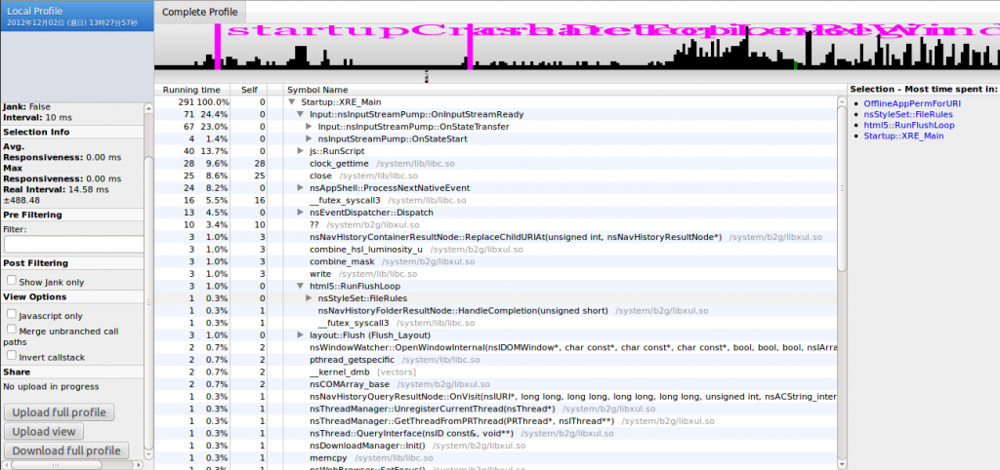
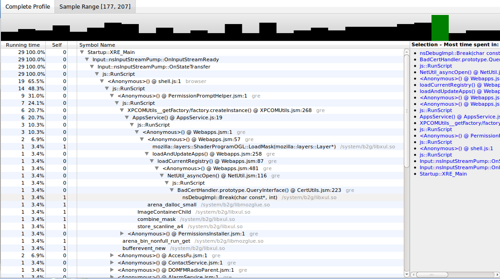

Profiling 這個技術可以提供系統執行時的歷程，讓我們評估並找出系統效能的瓶頸。Firefox OS 目前提供了 built-in profiler， 我們可以利用 profile.sh 這個 script 來幫助我們從 device 擷取 profiling information，並且利用 cleopatra 這個工具來分析 profiling information。在我們開始使用 profiler 之前，我們需要 Firefox OS 的 local build，並且需要將你的 device 接到電腦上，並確定你可以使用 ADB 這個工具從 device 上傳和下載資料。一切就緒後，就讓我們開始使用 profile.sh 來擷取系統的 profiling information 吧。

我們可以在 Firefox OS 原始碼的根目錄下找到 profile.sh，這個 script 目前提供了下列這些功能：

./profile.sh start 
./profile.sh ps 
./profile.sh capture [pid or name] 
./profile.sh stop 
./profile.sh ls 
./profile.sh signal [pid] 
./profile.sh pull pid [NAME [HHMM]] 
./profile.sh symbolicate filename 
./profile.sh help
我們可以利用 profile.sh help 這個指令來取得詳細的說明。

在這些指令當中，最常用的就是 profile.sh start 及 profile.sh capture 指令。profile.sh start 指令可以重新啟動 Firefox OS 並且開始記錄系統執行時的歷程，當我們下了這個指令後，FireFox OS 就會啟動 built-in profiler，然後記錄系統執行時的 profiling information (program counter (PC), stack pointer (SP) , frame pointer (FP) 及 timestamp) 。利用這些資訊及 symbol table，我們就可以知道系統執行過那些 functions 及其執行的次數。目前 built-in profiler 是利用 Periodically Sampling 及 Static Instrument 這兩種方式來記錄系統執行的歷程。Periodically Sampling 的方式跟 Oprofile 的想法是類似的，Firefox OS 在啟動 built-in profiler 時會產生一個新的 Thread，這個 Thread 會定期的產生 SIGPROF signal 給 Firefox OS process， Firefox OS process 收到 SIGPROF signal 後，透過 signal handler來記錄 profiling information。我們也可以利用 Static Instrument 的方式，在 performance critical 的 function 加上 SAMPLE_LABEL (name space, function name) 來記錄 profiling information。在得到了 profiling information 後，我們可以利用 profile.sh capture 這個指令將 profiling information 從電話拷貝到 host PC。其命名格式為 profile_HHMM_PID_NAME.txt。接下來我們需要利用分析工具來幫助我們分析 profiling information。我們可以將 profiling information 上傳到下面這個網址。

http://people.mozilla.com/~bgirard/cleopatra/

接下來，我們就可以得到 cleopatra 分析的結果了。

我們還可以針對可能的 performance bottleneck 作細部的分析如下圖，

眼尖的讀者可能會發現，我們的 profiling information 還有包括 Javascript 喔，是不是很 Cool 呢 ？

[1] [https://developer.mozilla.org/en-US/docs/Performance/Profiling_with_the_Built-in_Profiler](https://developer.mozilla.org/en-US/docs/Performance/Profiling_with_the_Built-in_Profiler)
