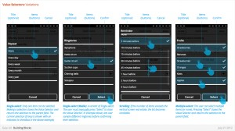
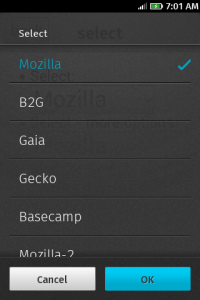
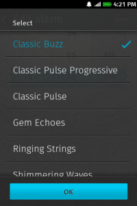

在開發網頁程式時，當我們想要提供一個選單，可以讓使用者能在選單中選取他們想要的選項，基本上會非常直覺地想到 <select> 標籤。相同的，當我們在 Firefox OS 上開發 APP 有類似的需求時，也會直覺地想用 <select> 標籤來實作這一個功能。原有 Firefox UI control 僅適用於 Desktop 版本，所以我們必須重新實作一個適用於 Mobile OS 的 UI control。而後來決定在 Gaia 中實作 Value Selector，可以沿用原有HTML5 架構。同時 UX team 設計了一個全新的頁面，以一個全版的畫面，上面有著「Option(s)」、「Cancel」、「Select」（如圖一，Value Selector）來提供給使用者。然而，許許多多的問題都在開發的過程中一一浮現出來。

圖一

當我們開發出第一版的 Value Selector（如圖二）後，第一個棘手的問題隨即而來，在關閉 Value Selector 後，會無法再次開啓，主要原因發生在關閉 Value Selector 後，當時的 focus 仍然停留在標簽上，因此會無法再次觸發 Value Selector 的 focus event，在觀察了眾家瀏覽器在 mobile platform 上的行為後，似乎在 Value Selector 關閉的時候發一個 onblur event，會讓整個使用界面流程變得更合理，也能解決這一個惱人的問題。

圖二

第二個問題發生在最近開發鬧鐘的新功能：鈴聲預覽。在使用者設定鬧鐘，並進入鬧鈴選單頁面時，我們為了要在鬧鈴選單（Value Selector）收到使用者點選選項的行為，為此提出了三個方案。方案一，讓 Gecko 可以發送標籤上的 onclick event，這一個方式似乎只有 Firefox desktop version 有支援這情況的事件發送[1]。方案二，客製化另一個 Value Selector（外觀一致另外實作 option handler），但這方案會造成重複的程式碼散佈在應用程式裡。方案三，試圖讓 onchange event 發生在使用者點選不同的選項上（原本的 onchange event 發生在使用者點選「OK」後），但這方案會使得 User Interface 要作適度的改動，無法再有「Cancel」按鈕，而「OK」的按鈕實際功能是關閉 Value Selector 而已。在大家的討論下採取了方案三（圖三），但似乎有其它開發者不這麼認為這樣的改動，畢竟它影響到 User Interface Follow，就會影響 User Story 在某些應用程式的行為上可能不太適合。相信在未來的開發路上，還會有許多問題要討論與克服。

圖三

參考資料:

[1]: [範例測試](https://jsfiddle.net/L6kNE/3/)

[2]: [https://wiki.mozilla.org/Gaia/Design/BuildingBlocks#Value_Selector](https://wiki.mozilla.org/Gaia/Design/BuildingBlocks#Value_Selector)
