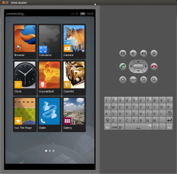
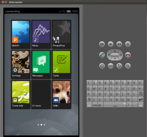
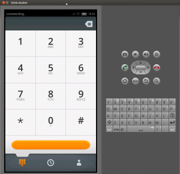

各位對 Boot to Gecko 有興趣的 Developers/Hackers：

如果您有參加上週六的JSDC或是四月中的 OSDC ，有逛到 Mozilla 的攤位，或者是 OSDC 當天有去聽 Thinker 介紹 Boot to Gecko 的演講，想必對 Boot to Gecko 已經有初步認識了吧？但對一般開發者而言，並不是每個人都有一隻 Android 的手機可以來跑 Boot to Gecko，這對開發人員來說是一大苦惱。但或許你不知道，Boot to Gecko 也和一般的 Android 一樣，有著跑在 Qemu 上的模擬器呢（emulator）！而本篇文章，就是來介紹 Boot to Gecko on Emulator，並且針對初期開發的人員常遇到的問題或疑難雜症來一一作說明。

首先，先說明目前 B2G 的 emulator 有兩個版本，一個是 B2G 一開始的 Gingerbread branch，而另一個是最近開始的 Ice Cream Sandwich (ICS) branch。Emulator 的開發環境主要是 Ubuntu 11.10 64-bit 的版本，至於為什麼要 64-bit 的原因，是因為目前 Boot 2 Gecko 主要的 emulator 開發已逐漸開始移至 Ice Cream Sandwich (ICS) 上的版本，而這個 ICS 上的 emulator ， 是從 Android ICS 的 AOSP fork 出來的。而 Android 在 ICS 之後的 AOSP，都只能用 64-bit 來開發，所以 Boot to Gecko 的 emulator 在開發環境上，也採取一樣的作法。如果你的電腦是採用 32-bit 的話，那目前就只能使用在 Gingerbread 上的 emulator 。筆者家裡的電腦也是 32-bit 的，也是有成功的 build emulator 過，但目前 Gingerbread 的 emulator 上，有發現一些底層的問題 [1]，所以導致Gingerbread 上的 emulator 比較不穩，在此筆者仍舊比較建議大家可以先使用 ICS 的 emulator，若遇到問題的話，比較容易與人討論與找到答案。因為關於 Ubuntu 的版本，目前也是已經有人在用 Ubuntu 12.04 上作開發了，所以假如你已經升級到 Ubuntu 12.04，只要是 64-bit 的，也是可以來作 Boot to Gecko 的開發，不用特地還原到之前的 Ubnutu 11.10 。

第一步，當然是先去 Github 把 B2G 的Source code 抓下來嘍。

		
		

git clone https://github.com/andreasgal/B2G.git
			
				
					
				
					1
				
						git clone https://github.com/andreasgal/B2G.git
					
				
			
		

然後進到B2G 的folder 裡，便可看到裡面有個叫 INSTALL 的檔案。

		
		

B2G$ ls
 ADVICE.md  automation  boot  config  emu-ics.sh  emu.sh 
 fake-jdk-tools  gaia  gecko  glue  INSTALL  Makefile  marionette 
 README.md  repo  toolchains  Unicode.h  WIFI.md
			
				
					
				
					1234
				
						B2G$ ls ADVICE.md  automation  boot  config  emu-ics.sh  emu.sh  fake-jdk-tools  gaia  gecko  glue  INSTALL  Makefile  marionette  README.md  repo  toolchains  Unicode.h  WIFI.md
					
				
			
		

打開這個 INSTALL 的檔案，裡面有如何開始的詳細步驟。但若只是要 build emulator 的話，其實就是四個步驟:

如果是想要 Gingerbread 的 branch 的話

- make sync 1 make sync

- make config-qemu 1 make config - qemu

- make gonk 1 make gonk

- make 1 make

如果是 ICS branch 的話  只要把第二步的

		
		

make config-qemu 改成
			
				
					
				
					1
				
						make config-qemu 改成
					
				
			
		

		
		

make config-qemu-ics  就可以了
			
				
					
				
					1
				
						make config-qemu-ics  就可以了
					
				
			
		

在此說明，如果是第一次的話，這四個步驟會跑一段時間，因為他會去把整個 Gecko 與 Android 的 source code 抓下來並編譯，而這段時間會依據您的網路速度跟電腦 CPU 的快慢來決定時間的長短。另外在第三個步驟裡有看到 Gonk 這個字。Gonk 就是 Gecko 底層的 Abstraction Layer ，而在目前的架構上，它其實就是 Android 的 AOSP。

而在上面的步驟都成功的結束後，想必這時候的您已經開始躍躍欲試了吧!! 這時可以到 B2G 的目錄下，看您當初選擇的是哪一個 branch ，如果是 Gingerbread 則是執行 emu.sh ，是 ICS 的話，就是執行 emu-ics.sh 這個 script 。

例如。執行 ICS 的 emulator :

		
		

B2G$ ./emu-ics.sh
			
				
					
				
					1
				
						B2G$ ./emu-ics.sh
					
				
			
		

這時就可以看到 emulator 的畫面嘍！

關於 emulator 其他的討論，也可以在 MDN  上找到 [2]。

最後，如果您發現什麼 Bug ，或者是有什麼想法，也可以到 B2G 的 Github 上 [3]

或者是到 B2G 的 Google Groups [4] 作討論。

如果想直接用中文跟 Mozilla Taiwan 的開發者討論的話，也歡迎到 Mozilla Taiwan 的 IRC 來詢問問題喔~~~

Happy Hacking !!

參考資料:

[1] https://github.com/andreasgal/B2G/issues/265

[2] https://developer.mozilla.org/en/Mozilla/Boot_to_Gecko/Building_B2G_for_QEMU_Emulator

[3] https://github.com/andreasgal/B2G

[4] http://groups.google.com/group/mozilla.dev.b2g
