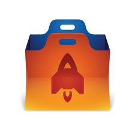

今天要來聊聊在 Firefox OS App 的測試，在開發前期，大部分的測試還是仰賴測試人員進行手動測試，然而，大量進行重覆測試其實是很消耗時間的。為了節省開發和測試上的時間，我們也開發了對應的測試工具，以提升開發的效率。

在網路上，你可以找到有關 marionette automation framework 的介紹，這是由 Mozilla 內一個叫做 Automation Team 的團隊所開發，特別為了測試 Firefox OS 而特別開發的一套自動化系統。 Malini Das 和 Jonathan Griffin 投入了大量的精力在這套自動化測試系統上。

Marionette 的特色是以另一套著名的網路自動化系統 Selenium 加以延伸。簡單的說，Marionette Server 在安裝時 Firefox OS 就必須被同時安裝進去，藉由預先留好的 socket port 啟動 JavaScript Remote Debugger。透過這個預留好的 Port，就可以編寫好的 JavaScript 自動化測試藉由這個 port 對 Firefox OS 進行測試。

然而，Marionette 並不能針對 web content 進行自動化測試。為了加強對於 content 的支援度，Jonathan Griffin 另外用 Python 撰寫了一套 gaia-ui-tests 的套件，這個套件也同樣使用 Marionette 和預先安裝的 marionette server 進行溝通。 Gaia-ui-tests 的特色是它實做了判斷 HTML element 是否存在，以及它的屬性、參數等等資料。並且結合 Marionette 的框架，使得 Firefox OS Server 端不需要再做其它的更動。

在實做 gaia-ui-test 時，最開始的 setup 必須先指定要被喚起的 App

    # launch the app
    self.app = self.apps.launch('Browser')
接下來，就是等待指定的 element 出現在畫面上，然後再對 element 進行對應的動作

    # Firefox/chrome locators
    _awesome_bar_locator = ("id", "url-input")

    # Find awesome bar
    awesome_bar = self.marionette.find_element(*self._awesome_bar_locator)
    awesome_bar.click()
    awesome_bar.send_keys('http://mozqa.com/data/firefox/layout/mozilla.html')

    self.marionette.find_element(*self._url_button_locator).click()
重覆這個動作，就可以進行 UI 介面的實體操作了。

當完成一系列的指令之後，可以用 Assert 驗証結果是否正確，並將結果傳回 Marionette 的框架。

    heading = self.marionette.find_element('id', 'page-title')
    self.assertEqual(heading.text, 'We believe that the internet should be public, open and accessible.')
藉由這個方式，就可以開始有效率的替自己寫的 App 做自動化測試，或是用這個工具來完成一些 UI 的自動指令。在開發的同時能夠有效率的幫忙開發者做大量的測試，測試的過程、結果，都是所見即所得，可以降少開發過程中不必要的 regression bug。

