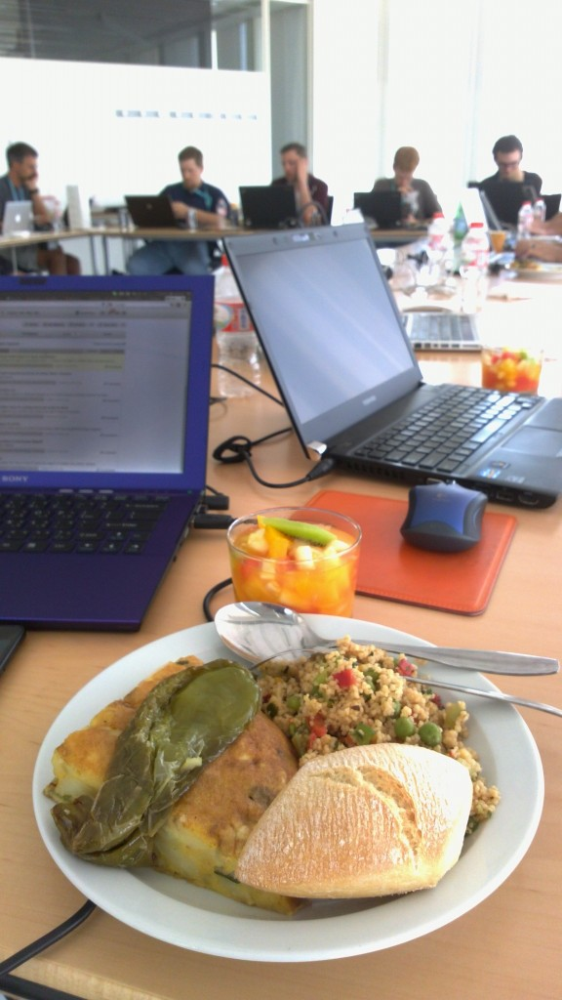
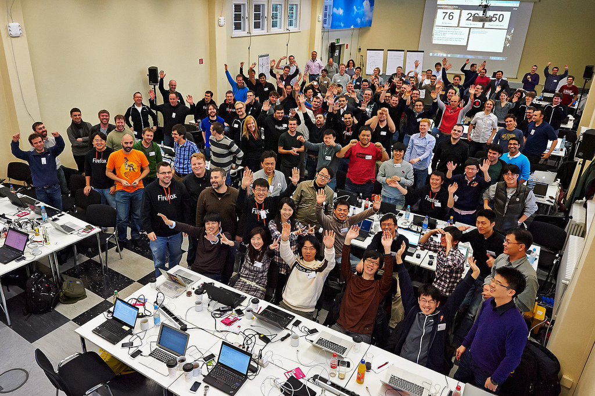

大家一定很好奇，Firefox OS – 這個由 Mozilla 世界各分部所共同打造的行動 OS，在開發的期間都是工程師們各自默默的坐在辦公室埋頭苦幹，每天只靠 E-mail 或是視訊討論問題嗎？

如果你這麼想就小看在 Mozilla 工作的迷人之處了！在 Firefox OS 開發的過程中，每個軟體專案都會有不同階段所要達到不同的目標，因此每兩到三個月都會有一次的工作週（Work week），讓所有參與專案的人員聚在一起研究、討論所遭遇到的問題。

那麼 Work week 的內容到底是什麼呢？顧名思義就是把大家聚在一起到國外進香工作一個禮拜的聚會。每次的 Work week 都會在不同城市舉行，並且有著不同的主題，例如 Spec 的討論、UX 的行為定義、API 的設計方向甚至是到目標市場當地測試訊號…等，當然也少不了讓 RD 又愛又恨的解 bug 過程。在這五個工作天內，平時因為時差和距離的因素而無法清楚溝通的問題，都可以利用每次 Work week 的機會來做深入的討論。另外也是讓每個同事們互相交流開發心得及技術的最好時機，像是 graphic rendering、performance tuning 還有 profiling 等，都是熱情的同事曾經在 Work week 分享過的主題。

別郎係呷飯配電視，穩係吃飯配電腦

既然都大費周章的把大家從世界各地集合到 Work week 來，除了見面三分情，讓大家工作起來更有默契之外，每位同事其實都想知道專案是不是有什麼重大的突破，因此每次在 Work week 最後一天的下午，按照往例都會安排一個輕鬆的 live demo，只要是想展現在這段期間努力成果的同事，都可以自由登記參加，而每次的 Work week 也都在這種歡樂的 demo 時光中結束。

Work week 一景

辛苦的 Work week 當然不會只有work work work，既然都來到不同的國家，給每個參與人員最好的 bonus 當然是當地的美女美食及美景囉！像是多明尼客在 Work week 緊繃了一整天之後，每天最期待的大概就是晚餐可以品嚐到當地道地的食物，享用完之後會覺得辛苦一整天都不算什麼，明天又可以再戰一整天呢！有時候因為需要調整時差的原因，大家會提早一兩天到飯店適應當地的環境，話說最有效的調整時差方式就是曬太陽，所以如果時間充足的話，大夥也會相約一起到戶外走走，到當地著名的景點參觀，順便感受一下當地的人文風情。

調時差？曬太陽就對了啦！

其實每次的 Work week 都是超級充實的一整個禮拜，不論是工作上或者是娛樂上的，但回到台灣卻會懷念在當下那種緊湊且充滿挑戰性的時光。俗話說的好，Work hard，play hard – 我想這應該是參與開發 Firefox OS 過程中最貼切的形容吧！
