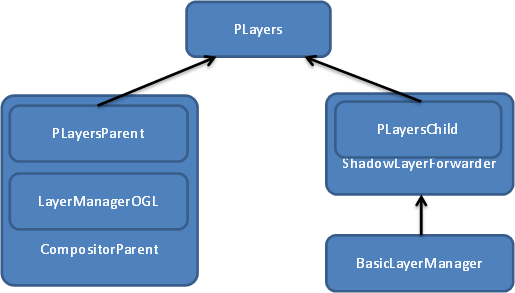
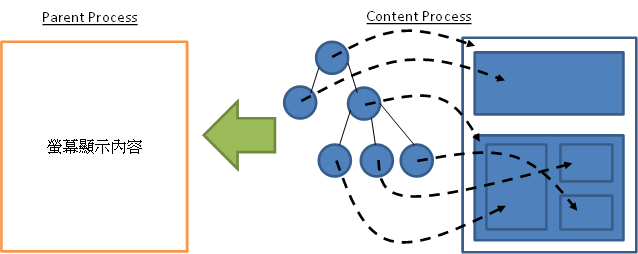

今天搶先和大家聊聊 Firefox OS 的畫面顯示的流程。Firefox OS 是基於 Android BSP (Board Support Package) 的系統而又有很多不同。而我們的顯示部分也跟 Android 所採用的 SurfaceFlinger 完全不同。

首先我們先來看看簡化很多的類別圖，以及幾個簡單的概念：

在現行的 Gecko 引擎當中，所有的繪圖動作都會作用在稱之為 Layer 的物件上面。每個 Layer 基本上就是一張點陣圖，並包含了他應該要怎麼被顯示在螢幕上的基本資訊。要注意的是：每一個 webapp 只負責把他的每個 Layer 內容準備好，並不會把他們合併畫在一起。

每一個 webapp 最終可能是由許多 layer 的 tree 結構所組成，像下圖這樣：

最終由 CompositorParent 把收集來的所有 Layer 疊在一起，才形成整個畫面。

知道了這樣的基本想法之後，大致上我們就可以把 Firefox OS 上面的顯示流程分為幾個步驟：

- 排版：Gecko 引擎基於 HTML 以及 CSS 把整個網頁內容作排版。

- 繪製：將排版完的內容畫到各自的 Layer 裡面。

- 合成：把所有的 Layer 疊加在一起顯示到畫面上。

有了這些概念，我們就可以回頭看第一張圖表：

- PLayers 是一個用來輔助 IPC 的 class，這類的 class 會有兩個子代，分別代表 Parent 以及 Child。相關的細節不在這篇討論，有興趣的觀眾可以看[這裡](https://developer.mozilla.org/en-US/docs/IPDL/Tutorial?redirectlocale=en-US&redirectslug=IPDL%2FGetting_Started)。

- BasicLayerManager 是用來管理 webapp 這邊的 Layer，以及繪製所有的 Layer 的管理員。

- ShadowLayerForwarder 則是擔任把 Layer 的樹狀結構遞送到 Compositor 端，以準備合成的重要任務。

- CompositorParent 則利用 LayerManagerOGL 把所有收集到的 Layer 合成出來。

到這邊 Firefox OS 畫面的繪製與合成工作就完成了。接下來把畫面顯示到螢幕上的流程就跟 Android 大同小異囉。
