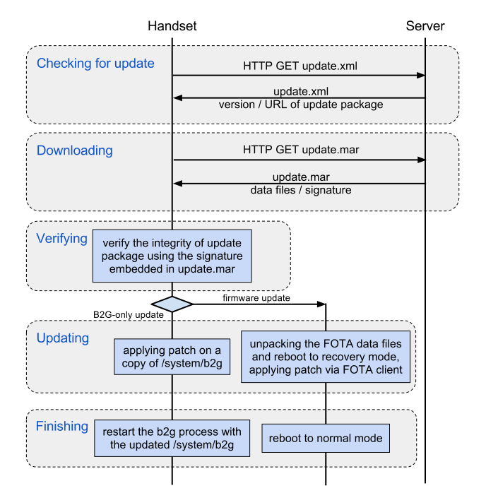

一個好的軟體會隨著時代的變遷不斷的演進，為的就是帶給所有用戶『更新、更好、更強大』的使用經驗，因此自動更新機制便是現今軟體不可或缺的功能。Firefox OS 運用了 Firefox 的核心程式碼，自然繼承其自動更新機制，以下就來詳細介紹一隻搭載了 Firefox OS 的手機如何進行更新。

Firefox OS 的升級包都會包裝在一個 MAR ( Mozilla ARchive) 的特殊壓縮格式中，檔案中包含了更新系統用的資料檔與驗證升級包來源的數位簽章。手機透過定期詢問更新伺服器來取得對應版本的更新資訊，更新資訊會以 XML 的格式提供升級包的版本資訊，下載路徑，以及驗證升級包的資訊，系統確認該升級包的版本資訊且經過使用者同意後，就會在背景程序中下載升級包。而下載完成後就會提示使用者進行系統更新。下圖展示了從檢查更新到完成安裝的細部流程。

Firefox OS 使用的自動更新機制相當簡單明瞭，而且透過標準的HTTP/HTTPS與伺服器端進行溝通，因此伺服器端的開發也能使用一般 Server-side Web Application 來實作，甚至使用靜態網頁伺服器就能夠架設最基本的 Update Server 呢！

References:

[1] [https://wiki.mozilla.org/B2G/Updating](https://wiki.mozilla.org/B2G/Updating)

[2] [https://wiki.mozilla.org/Software_Update:updates.xml_Format](https://wiki.mozilla.org/Software_Update:updates.xml_Format)

[3] [https://wiki.mozilla.org/Software_Update:MAR](https://wiki.mozilla.org/Software_Update:MAR)
