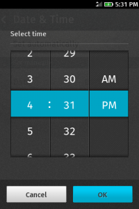
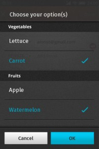
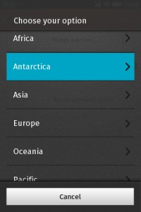

HTML5 中引入了許多全新類型的 input field，讓開發者能夠輕易地利用 type，自定這個 input 是用來輸入 email、URL 又或者是時間等等的資訊。

- 輸入網址：

- 輸入email：

- 輸入日期：

- 輸入時間：

詳見 [MDN –  type Attribute](https://developer.mozilla.org/en-US/docs/HTML/Element/input#attr-type)

同時，瀏覽器也能針對不同的類型，呈現不同的介面以方便使用者輸入。例如：下圖就是我們在 Firefox OS 中所實作的 time picker 。

Time Picker in Firefox OS

不同種類的 input 當然也會被應用在 Firefox OS App 的開發上，讀者可參考下圖中 Browser App 上方的 Awesome bar。Awesome bar 結合了輸入 URL 和搜尋兩者功能，所以一開始我們就是選用 type="url" 來實作這個功能。但，這時問題來了，因為它同時也是搜尋框，但就一般實作而言，URL type 的鍵盤是不會提供空白鍵的，於是，使用者便無法輸入多個關鍵字來做搜尋。

Awesome bar in Firefox OS Browser App

這時可能有人會認為，只要在 URL 鍵盤上加上空白鍵，問題就能順利解決了？不過，由於 UX (User Experience) Designer 的堅持，認為加上空白鍵對於使用者會造成混淆，所以這個方案就沒有採用了。

好吧！既然這樣那就得發明一個新的 type，可能是 type="search+url" 之類的如何？如此一來，我們可以在 Firefox OS 中新增一個鍵盤 layout 對應到這個 type，如此一而不但可以放入空白鍵，也可以將常用的 “.com” 鍵等等加上去。既不需更改 type="url" 鍵盤的 layout，也滿足了 UX 的需求，看來是一個兩全其美的方法。儘管如此，在經過漫長的討論後，遵循 Web 標準，仍是我們的最高指導準則 (至少就這個問題上)，而引入新的 type 並不全然符合這樣的規範。於是，我們最終還是回到原點，使用 type="text"，也就是一般的 input field 來實作 Awesome bar 的輸入框。

在以上這個問題之後，我們仍陸陸續續遇到不少這類 Web Standard 與 UX 間遊走的問題，而有時我們會選擇偏向標準，有時我們仍會想方設法讓 UX Design 得以實現。例如，下面便是 UX Designer 所提出針對 <select> element 呈現不同的 UI，一則是巢狀的選單，而一則是由 subheader 分隔的選單。這裡所隱含的問題是，並沒有一個標準語法能夠讓瀏覽器知道，應該選用那一種 style 才是適當的。

以 Subheader 分隔的選單

以巢狀形式呈現的選單

針對此問題的解決方案尚未出爐，我想這也是 Firefox OS 專案如此迷人有趣的地方，每一個設計、每一個決定，往往是眾人意見的統合，而不是由任何一個單一勢力所能左右。如果有讀者對以上的 UX 問題，抑或是其他 Firefox OS 相關問題有任何意見，也歡迎提出，也許在 Firefox OS 正式問世時，你會發現其中的某個設計/作法，有你的心血在其中哦！
