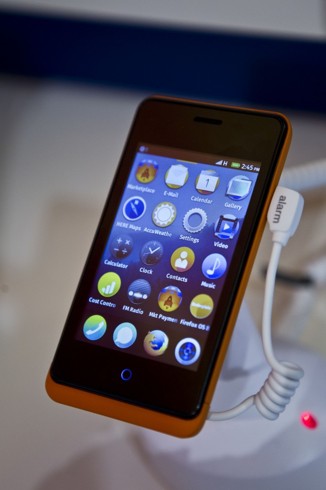

目前 Gecko 已經有實作相當多的事件，可供一般 Web 程式開發者使用，但如果在開發 FireFox OS 應用程式時，需要在 DOM  物件中，傳遞新的事件給 web application，如系統電量變化、使用者開關螢幕、耳機插拔等等行為，開發者該如何用最有效率的方式，傳遞這些資訊給應用程式端呢？本篇技術分享將介紹如何在 DOM 物件，新增一個自定的 event 事件：在此以 MediaRecorder 的 dataavailable 為例。

1. 在物件的 webIDL 加入

		
		

[SetterThrows]
attribute EventHandler ondataavailable;
			
				
					
				
					12
				
						[SetterThrows]attribute EventHandler ondataavailable;
					
				
			
		

2. 因為 Event Handler 是以字串當作識別與 JavaScript Engine 溝通，如果新加的事件名稱在 EventNameList 沒有定義，則需要修改以下三個檔案

content/base/src/nsGkAtomList.h

		
		

GK_ATOM(ondataavailable, "ondataavailable")
			
				
					
				
					1
				
						GK_ATOM(ondataavailable, "ondataavailable")
					
				
			
		

wizdget/nsGUIEvent.h

		
		

#define NS_DATAAVAILABLE        (NS_MESSAGE_EVENT_START +1 )
			
				
					
				
					1
				
						#define NS_DATAAVAILABLE        (NS_MESSAGE_EVENT_START +1 )
					
				
			
		

content/events/public/nsEventNameList.h

		
		

NON_IDL_EVENT(dataavailable,
  NS_DATAAVAILABLE,
  EventNameType_None,
  NS_EVENT)
			
				
					
				
					1234
				
						NON_IDL_EVENT(dataavailable,  NS_DATAAVAILABLE,  EventNameType_None,  NS_EVENT)
					
				
			
		

3. 修改 DOM 物件

3.1 加入 nsDOMEventTargetHelper 繼承

3.2 在 public function 處，加入

		
		

IMPL_EVENT_HANDLER(dataavailable)
			
				
					
				
					1
				
						IMPL_EVENT_HANDLER(dataavailable)
					
				
			
		

3.3 在需要回傳 event 處，加入傳遞 event 的相關函式呼叫如下

		
		

NS_ABORT_IF_FALSE(NS_IsMainThread(), "Not running on main thread");
nsresult rv = CheckInnerWindowCorrectness();
if (NS_FAILED(rv)) {
  return NS_OK;
}

nsCOMPtr<nsIDOMEvent> event;
rv = NS_NewDOMEvent(getter_AddRefs(event), nullptr, nullptr);
NS_ENSURE_SUCCESS(rv, rv);

rv = event->InitEvent(NS_LITERAL_STRING("dataavailable"), false, false);
NS_ENSURE_SUCCESS(rv, rv);

event->SetTrusted(true);

return DispatchDOMEvent(nullptr, event, nullptr, nullptr);
			
				
					
				
					12345678910111213141516
				
						NS_ABORT_IF_FALSE(NS_IsMainThread(), "Not running on main thread");nsresult rv = CheckInnerWindowCorrectness();if (NS_FAILED(rv)) {  return NS_OK;} nsCOMPtr<nsIDOMEvent> event;rv = NS_NewDOMEvent(getter_AddRefs(event), nullptr, nullptr);NS_ENSURE_SUCCESS(rv, rv); rv = event->InitEvent(NS_LITERAL_STRING("dataavailable"), false, false);NS_ENSURE_SUCCESS(rv, rv); event->SetTrusted(true); return DispatchDOMEvent(nullptr, event, nullptr, nullptr);
					
				
			
		

在應用程式端，則可以用 object.ondataavailable = func(e) 去捕捉此事件並實作相對應的處理

需要注意的是

1. 在實作擲回 Event 的 DOM 物件中，必須能夠取得 Context 物件，並在主程序中執行

，否則事件無法被正確擲回

2. 以上實作範例只有通知上層目前有一個 dataavailable 事件發生，但傳遞的事件本身並無夾帶額外資訊，如果需要夾帶資訊，則需要使用相對應的的 NS_NewDOMXXXEvent (如NewDOMMessageEvent/NewBlobEvent)，在應用程式端則在事件處理函式中，藉由取得 e.data 屬性來取得 DOM 物件所傳遞資料內容。

