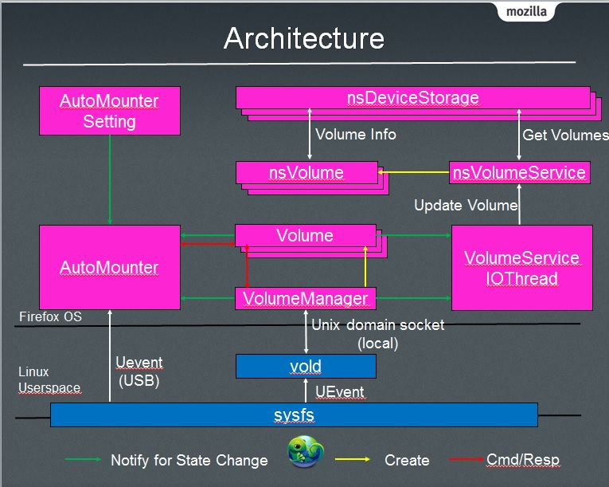

在一些低階的手機中，由於內部多使用僅 512 MB 的 Nand Flash 當作儲存空間，因此無法切割出一塊專門供使用者存放檔案的空間，這時就需要仰賴外部儲存的支援，也就是外接 SD Card。一但有了這項支援，OS 就必需提供一個機制用來偵測並自動掛載插入的外部儲存裝置。另一方面，為了方便使用者將其置入手機的 SD Card 能與像 PC 這樣的外部裝置做互相的分享，OS 也需提供一個方式使得使用者能透過 PC 將 SD Card 裡的檔案取出或將 PC 上的檔案存入，目前 Firefox OS 只支援 mass_storage 的方式而還沒有支援 MTP (Media Transfer Protocol) 的協定。現在就讓我們來看看 Firefox OS 是如何做到的吧。

在我們執行任何自動掛載或分享的動作之前，我們必需先確認一些條件，第一項就是 SD Card 何時被使用者插入手機中，根據該條件，我們啟動自動掛載的機制；第二項就是 USB Cable 何時用於連接手機與 PC 之間，其為觸發分享的源頭，而這一切都來自於 UEvent 事件的監聽，從架構圖上可以看出，Linux Kernel 透過 Netlink Socket 進行廣播，向 Userspace 發出 USB 或者 SD Card 狀態變換的通知，進而由 Userspace 相關負責的元件開始做相對應的動作。其中 vold (Volume Daemon) 便是用來監聽 SD Card 是否被插入或被取出，另一方面 AutoMounter 用於監聽 USB Cable 是否有被連接於手機與 PC 之間。然而 vold 更負責接收指令並實際向 Linux Kernel 下命令的角色，例如 Mount/Share/Format 等。另外 vold.fstab 檔案則被用來設定哪一個 Block Device 需要被掛載在哪一個路徑。

接下來我們來到 Gecko 的部分，這裡我們利用一個例子來做搭配以幫助讀者了解；假設某個 Device 中存在了二個可利用的儲存裝置並各命名為 sdcard 與 ext_sdcard (該資訊存於 vold.fstab)，那麼在開機過程中，VolumeManager 會向 vold 查詢目前所有可用的儲存裝置有哪些，根據我們的例子其將會有二個可使用，因此 VolumeManager 便產生二個 Volume 以用來對應 sdcard 與 sdcard1 並初始其狀態為 STATE_INIT；接下來我們假設 VolumeManager 已從 vold 得知到 sdcard 裝置已處於可用狀態，藉由更新相對應的 Volume 到 STATE_IDLE，AutoMouner [casino online](https://www.svenskkasinon.com/)  便能經由收到 State Change Event 的方式，得知此一改變並發起對該 Volume 下達掛載的指令，該掛載指令一路經由 AutoMounter -> Volume -> VolumeManager 最後由 vold 執行該指令，一但成功後將回傳該 Volume 的狀態已轉換至 STATE_MOUNTED (vold -> VolumeManager -> Volume -> AutoMounter)。

Gecko 的第二部分，是關於如何啟動分享儲存裝置至 PC 上的流程並延用上一段的範例，首先使用者必需從設定應用程式中選擇將分享的功能啟動，而 AutoMounterSetting 便是用來監控此一設定並回報給 AutoMounter ，接下來使用者將 USB 線連接於 PC 與 Device 之間，從第二段中提及 AutoMounter 會負責監聽 USB 線的狀態，一旦其發現已連接上，那麼三個啟動分享的條件就都已成立 ( 1. 設定應用程式 2. USB 連接 3. 儲存裝置已於 STATE_MOUNTED )，而分享的指令便會由 AutoMounter 發起並一路經由與掛載指令相同的路徑來到 vold 並且被執行，並一樣的將 Volume 的狀態轉換為 STATE_SHARED 並一樣的一路回傳。

最後由於使用者是透過 DeviceStorage 的 Web API 來存取檔案，因此我們透過 VolumeServiceIOThread (以上介紹的元件通通運行於 I/O thread 上以避免影響 main thread 的運作) 來將 Volume 的狀況回報給 nsVolumeService，並由其維護一份 Volume 的 ”狀態” 在 main thread 中，這也就是 nsVolume 的作用。因此 nsDeviceStorage/nsVolume/Volume 的對應為１對１的關係，至於 DeviceStorage 如何選擇相對應的 nsVolume 便不在本文的探討範圍內了，由於 nsVolume 裡會存在著其掛載的路徑，因此 DeviceStorage 便可以將使用者要求的動作執行並限制在該路徑下了。

Architecture Overview
