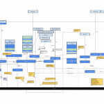

在桌面版本的網頁開發中，我們可以透過 HTML5 的 page visibility API 來知道目前的網頁是否為使用者焦點，或者目前不可為使用者所見，來達成某些目的：如停止 UI 更新，資料交換…等，範例程式如下：

		
		

function handleVisibilityChange() {
  if (document.hidden) {
  // Pause UI update
  } else {
  // Begin UI update
  }
}
document.addEventListener("visibilitychange",
  handleVisibilityChange, false);
			
				
					
				
					123456789
				
						function handleVisibilityChange() {  if (document.hidden) {  // Pause UI update  } else {  // Begin UI update  }}document.addEventListener("visibilitychange",  handleVisibilityChange, false);
					
				
			
		

我們將這個 API 帶到 Firefox OS 中，並賦予了它更深一層的意義：

- 應用程式判斷自己在前景/背景的依據，類似 android 的 onPause/onResume

- 系統底層 Low Memory Killer 的參數之一：背景應用程式在可用記憶體過低時會優先被 kill

- 在電力消耗變成一個必須優先考量要點的手持裝置上，透過進入背景時停止更新 UI 對電力節約有很大幅度的幫助。

然而，在手機系統上，並不像在桌面瀏覽器一樣單純的是透過頁面切換 (onPageShow/onPageHide) 來決定要不要對某個 web page/app 做前景背景切換，而是要根據系統 UI hierarchy 以及當前介面中層級較高的其他元件的狀態來維持 visibility 的協調性。聽起來很抽象嗎？先來張系統模組介面架構圖：

[](https://docs.google.com/drawings/d/18DnhTgQBK3M0KBeLGJkWW1hfiYBB6GgTmfdbUnT2SLs/edit?usp=sharing)Gaia System Architecture Diagram (source from https://docs.google.com/drawings/d/18DnhTgQBK3M0KBeLGJkWW1hfiYBB6GgTmfdbUnT2SLs/edit?usp=sharing)

簡單的說，手機系統介面在特定狀態下會將目前已經是前景的 app 設定為背景狀態，其優先層級如下：

- Screen off (螢幕關閉)

- Call screen (電話中介面)

- Lockscreen on (手機鎖定介面啟動)

- Inline activities (app內嵌 web activities 作用中)

- App transition end (app 切換結束)

- Back to home (回到 homescreen)

而這些事件又可能會同時發生而產生互相影響，如：inline activity 作用時電話打進來，多重 inline activities 中第一次產生的 activity frame 會被第二次的 activity frame 蓋掉…等。

這些決策發生在哪呢？與桌面瀏覽器不同，決定這一切的是發生在 Gaia，也就是 Firefox OS 的 UI 層：換句話說，是以 JavaScript 撰寫的噢。而實現的方式是系統中各個模組對各個底層 moz-*  API 的 callback 重新包覆並以 custom event 的形式通知其他模組，最後集中給 system app 中的 Window Manager 來做統一管理。

這樣做最大的原因是：只有 Gaia 本身最了解與 UI 相關的一切，而既然 Gecko 將 API expose 出來，只要你對 API 夠熟悉，想要自己用 JavaScript/HTML 實現一個瀏覽器是可能的。

這部份我們可以用一個實例說明：

「裝置從進入閒置狀態，到使用者按下電源鍵，之後解開鎖定螢幕 (LockScreen)」對 visibility 影響的過程：

- Screen is off by idle timeout: (Gaia) [Screen Manager] mozPower.screenEnabled = false (Gaia) [Screen Manager] send custom ‘screenchange’ event (Gaia) [Lockscreen] get ‘screenchange’ event, check the settings of “lockscreen.enabled” and dispatch custom ‘lock’ event (Gaia) [Window Manager] get ‘lock’ event, and then set visibility = false for current app(focused one). (Gonk) [/sys/power] See mozPower.screenEnabled is modified and send ‘sizemodechange’ to simulate the content window is minimized . (Gecko) [shell] Get ‘sizemodechange’ event, set visibility = false for the whole system app

- Turn on screen: (Gecko) Get keypress event of sleep-button, and then send mozChromeEvent to gaia (Gaia) [Hardware Button Manager] Get mozChromeEvent with type = “sleep-button-press”, wrap the event to ‘wake’ event (Gaia) [Screen Manager] mozPower.screenEnabled = true (Gecko) [shell] Get ‘sizemodechange’ event, set visibility = true for the whole system app *NOTE* the current app is still invisible now, but the system app is visible.

- Unlock the lockscreen: (Gaia) [Lockscreen] Send custom ‘unlock’ event. (Gaia) [Widow Manager] Get ‘unlock’ event and turn on the active app’s visibility.

對 App 開發者來說，其實你只要適當地註冊 visibilitychange event handler 去分別處理前景與背景的任務，而維持 visibility state 的正確性與一致性則是作業系統的責任，這也是開發 website/web application 與 web-based OS 之間最大的不同吧：必須同時考慮到過去（已經存在的網頁）/現在（我們正在開發中的內建app）/未來（即將到來的 FirefoxOS app）。想要看到 Javascript / Web 更多的可能性嗎？歡迎加入 Firefox OS 開發團隊！
