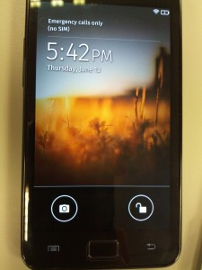

雖然 Firefox OS 以 Android 無法深入開拓的低階手機為第一波市場主打，但這可不表示 Firefox OS 只能在小螢幕上執行。目前 Firefox OS 已初步支援 HVGA (320×480)、WVGA (480×800)、qHD (540×960) 三種解析度。以 Web 技術作為使用者介面的 Firefox OS 如何實踐這些解析度的支援？讓我們來看一些在 Gaia 中實作的軌跡。

Firefox OS on Galaxy S-II, 480 × 800 (WVGA)

##### HIDPI 參數

在高解析度下，就要有對應的高解析度圖片來獲得理想的畫質。在 Gaia 中可以看到很多圖片是成對的，舉例來說向左的箭頭有 arrow-left.png 跟 arrow-left@2x.png 兩個圖檔。聰明的讀者應該已經猜到，後面以 @2x 結尾的圖片就是用在高解析度螢幕，它的長寬各是前者的兩倍。當我們以 HIDPI=1 為環境變數安裝 Gaia 的時候：

$ HIDPI=1 make install-gaia

Makefile 就會自動將 @2x.png 的圖片置換進去，便是支援高解析度裝置的第一步。

##### 字體與版面的縮放：rem

當裝置解析度改變，字體跟圖片也需要跟著縮放至合適的大小。為了將不同的大小套用至整個程式，直到不久之前的做法，是使用 rem 這個單位。 rem 是相對於 <html> 的字型大小，舉例來說，若我們設定<html>的 font-size 為 10px ，則 1.5rem 就是 10px × 5 = 15px 。在 Gaia 中的 CSS 幾乎全部都是以 rem 為單位：

#scan-title {

position: absolute;

top: 3rem;

left: 5rem;

right: 0;

height: 2rem;

line-height: 1.9rem;

padding-left: .5rem;

font-size: 1.4rem;

…

}

這樣一來，只要改變 <html> 的 font-size 僅管使用 rem 是至今為止的作法，但如後面將說明的 CSS Pixel 跟的 Device Pixel Ratio 已正式實作之際，現已可不必特意全部使用 rem。

##### Background-size

另一方面，為了讓高解析度的圖片能在不同解析度上對應的尺寸都正確，圖片的大小也一律預先指定。像是如下的樣式：

background: url(images/wallpaper_edit.png) no-repeat 25rem 11.5rem / 4.5rem;

後方的 / 4.5rem，即 background-size 的縮略寫法，就是將圖片的大小預先指定好，好讓一份圖片在不同的裝置上能正確縮放到對應的大小，就算使用的圖片跟對應的螢幕的尺寸不一樣也沒關係。

##### Responsive.css

最後一步就是要得知該使用多大的 font-size 了。要判別不同解析度的螢幕，便是 Media Query 派上用場的時候。目前為止在 Gaia 上的 App 皆引入 Responsive.css 這個檔案來偵測 App 該使用的字型大小。舉一段例子：

 /*Portrait*/

@media all and (min-device-width: 480px) and (max-device-width: 540px) and (max-device-aspect-ratio: 1/1) {

html { font-size: 94%!important; }

}

…

上面所節錄的條件，是用來設定在解析介於 WVGA (480×800) 但不到 qHD (540×960) 的裝置的 font-size 為 15px (100%為16px，故取94%=15.04px) 。對應到的是垂直方向螢幕。這個檔案算是暫時的解決方案，往後透過下述的 CSS 像素比例跟密度支援，將不再需要引入這個檔案。

##### CSS 像素比例 (CSS Device Pixel Ratio) 與像素密度 (Device Pixel Density)

Gecko 偵測行動裝置 CSS 像素比例的能力在最近已經完成。意即 1px 實際對應到的長度，要視裝置的像素密度而定。譬如說，在 CSS 像素比例是 1.5 的 Galaxy SII 上，我們寫在 CSS 裡的 1 個 pixel ，實際上會在裝置上畫出 1.5 個 pixel 。 responsive.css 的存在，便是想在 Gecko 完成這個功能前代勞這件事，兩者是等價的。往後 Gaia 就能用更簡潔的方式來達成 Responsive Design，使用以往的 px 跟 background-size 即可，不再需要特地保留 rem 跟 responsive.css 。
