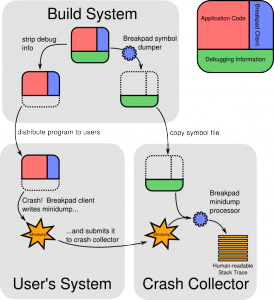

在 Firefox OS 系統中，若 b2g process 發生 crash 時，一般來說是透過 gdb debugger 來除錯，但現實生活中並不是每次系統 crash 都有機會知道複製步驟，能夠將問題重新複製。因此事後針對 gecko crash 分析對於 platform 工程師來說是相當重要的課題。Firefox OS 支援產生 crash dump，本文將介紹將 stack backtrace 功能開啟，以及解析 stack backtrace symbol 的方法作簡單介紹。

breakpad 是由 library 以及強大的工具組合而成，整體概念分為 build system、user"s system 以及 crash collector。

本篇主要簡述 build system 以及 user"s system 這兩個區塊。由於篇幅關係，User"s System 至 Crash Collector 這段會在未來篇幅描述。若欲觀看 b2g crash 統計可至網頁:  [https://crash-stats.mozilla.com/home/products/B2G](https://crash-stats.mozilla.com/home/products/B2G) 了解詳情。在 bugzilla bugreport 流程中，若遇到 crash 問題，通常會附上 minidump 資料，以便有效的讓開發者得到 crash 資訊，以便有效率的 debug。[Bug 851664](https://bugzilla.mozilla.org/show_bug.cgi?id=851664) 便是一很好的範例。

圖片來源：[GettingStartedWithBreakpad](https://code.google.com/p/google-breakpad/wiki/GettingStartedWithBreakpad)

Firefox OS 本質上是倚靠 google breakpad 來產生 stack backtrace 存成 minidump 檔案格式，breakpad 使用 minidump [オンライン カジノ](https://www.theinnocents.org/)  格式原因如下：

(a)  傳統 core file 檔案容量過於龐大難以透過網路有效率地回報問題

(b)  Windows 先天不支援 core file，而 minidump 格式是 Microsoft  定義，在難以說服 Windows 支援 coredump 情況下，選擇用 minidump 格式是比較簡單的作法

(c)  breakpad 只需要支援 minidump，簡化實作複雜度

細節如 Breakpad"s symbol 格式請見 [[5]](https://code.google.com/p/google-breakpad/wiki/SymbolFiles)

Build System

以下簡述開啟 minidump  的方法：

實際上nighly/release build 會預設啟用 crashreporter，若是 dev build 則要手動啟用 crashreporter。

(1) 強制啟用 Crashreporter

簡單來說，可以從/system/bin/b2g.sh 加上環境變數啟動 crashreporter 機制

例如執行：

		
		

MOZ_CRASHREPORTER="1" /system/b2g/b2g.sh
			
				
					
				
					1
				
						MOZ_CRASHREPORTER="1" /system/b2g/b2g.sh
					
				
			
		

(2) 在 b2g 目錄下更新 build symbol：

		
		

. setup.sh && make buildsymbols
			
				
					
				
					1
				
						. setup.sh && make buildsymbols
					
				
			
		

symbol 會存放於 objdir-gecko/dist/crashreporter-symbols，並在該目錄下儲存 symbol files 路徑於  <filename>-<platform>-symbols.txt

User"s System

(3) 當 crash  發生

每當 b2g process 遇到 Segmentation Fault，dmp and extra 檔案會被存放於

/data/b2g/mozilla/<path_to_profile_dir>/minidumps。

其中 <path_to_profile_dir> 命名在此範例像是 “80htzzs8.default”

而/data/b2g/mozilla/Crash Reports 資料夾下的 LastCrashFilename  則會顯示最後一次 crash 的 stack dump。

註：後來的gecko版本將 minidump存放於 /data/b2g/mozilla/Crash Reports/pending

(4) 取出 minidump：

		
		

adb pull /data/b2g/mozilla/80htzzs8.default/minidumps minidumps/
			
				
					
				
					1
				
						adb pull /data/b2g/mozilla/80htzzs8.default/minidumps minidumps/
					
				
			
		

(5) 解析 minidump：

		
		

minidump_stackwalk <dmpfile> objdir-gecko/dist/crashreporter-symbols/ > dmp_result.txt
			
				
					
				
					1
				
						minidump_stackwalk <dmpfile> objdir-gecko/dist/crashreporter-symbols/ > dmp_result.txt
					
				
			
		

Note：minidump_stackwalk 可從此處下載或自行編譯 breakpad

[http://hg.mozilla.org/build/tools/file/tip/breakpad/](https://hg.mozilla.org/build/tools/file/tip/breakpad/)

(6) 檢視 dmp_result.txt 便可得到完整的 stack backtrace

References:

[1] [http://code.google.com/p/google-breakpad/wiki/GettingStartedWithBreakpad](https://code.google.com/p/google-breakpad/wiki/GettingStartedWithBreakpad)

[2] [https://developer.mozilla.org/en-US/docs/Environment_variables_affecting_crash_reporting](https://developer.mozilla.org/en-US/docs/Environment_variables_affecting_crash_reporting)

[3] [http://code.google.com/p/google-breakpad/wiki/MozillaBrownBagTalk](https://code.google.com/p/google-breakpad/wiki/MozillaBrownBagTalk)

[4] [http://code.google.com/p/google-breakpad/wiki/StackWalking](https://code.google.com/p/google-breakpad/wiki/StackWalking)

[5] [http://code.google.com/p/google-breakpad/wiki/SymbolFiles](https://code.google.com/p/google-breakpad/wiki/SymbolFiles)
